# 015：打印输出 📝

在本节课中，我们将要学习Python中最基础的功能之一：使用 `print` 命令向控制台输出信息。我们将从最简单的打印开始，逐步了解如何控制输出的格式。

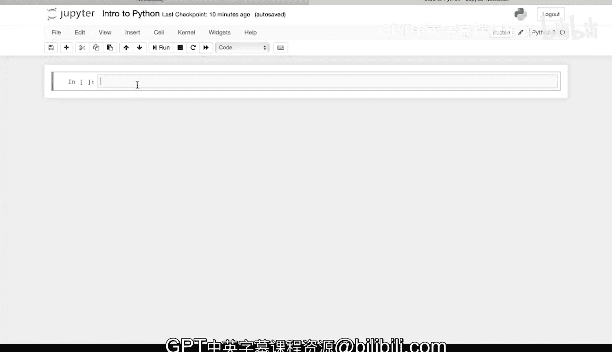

---

## 基础打印命令

让我们从最基本的Python `print` 命令开始，向控制台输出信息。

我将输入 `print` 和一个消息。

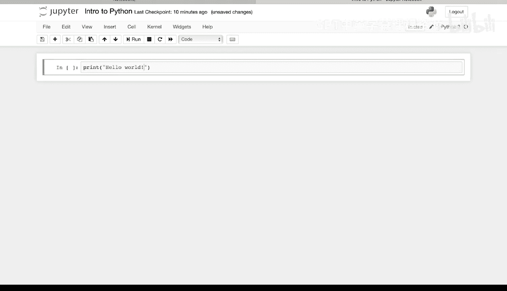

```python
print("Hello")
```

运行这段代码。我按下 `Shift + Return` 来执行代码。它将这条消息打印到了控制台。

我也可以使用单引号。

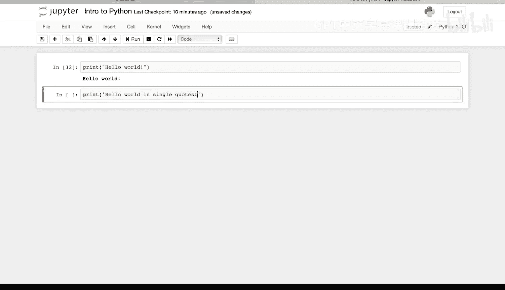

```python
print('Hello')
```

Python以相同的方式处理它，并将该消息打印到控制台。

双引号或单引号都可以使用。

---

## 连接字符串

上一节我们介绍了如何打印单个字符串，本节中我们来看看如何将多个字符串连接在一起。

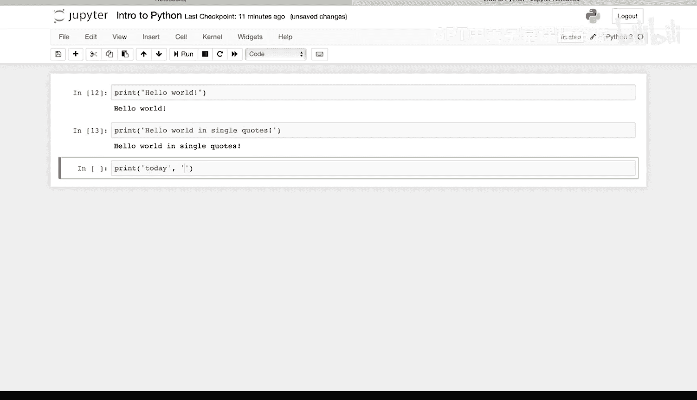

我可以使用 `print` 命令连接或链接字符和字符串。

以下是具体方法：在 `print` 函数中，用逗号分隔多个字符串。

```python
print("Hello", "World")
```

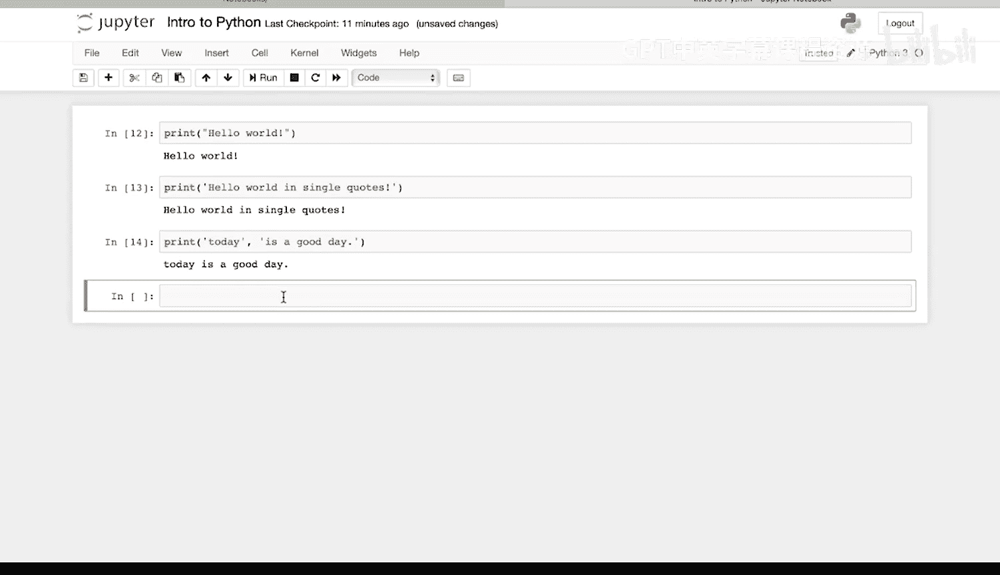

如果我运行它，Python会将它们并排打印在一起，即连接或链接在一起。

输出结果为：`Hello World`。

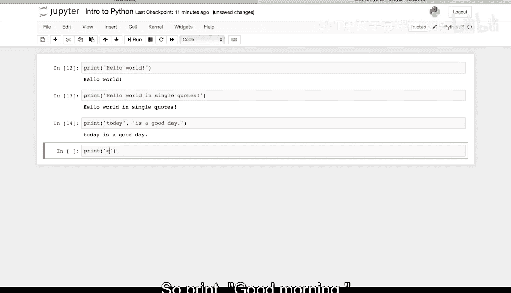

---

## 控制行尾字符

我可以改变 `print` 语句的结束符。

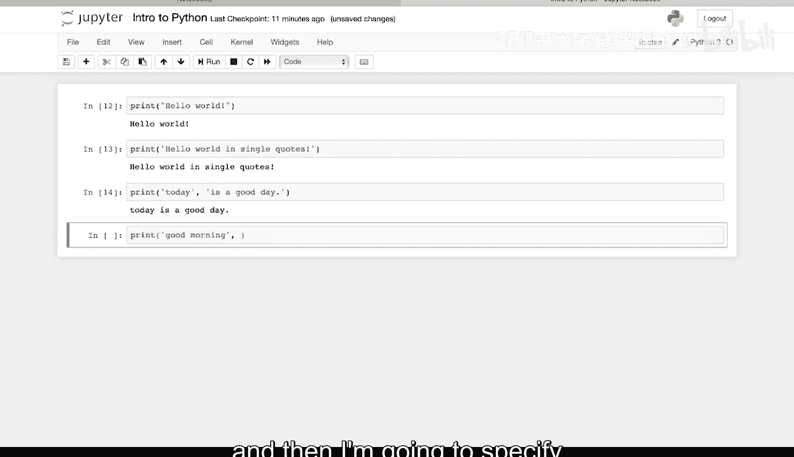

例如，输入：

```python
print("Good morning", end=" ")
print("Brandon")
```

这里，我指定了 `end` 参数为一个空格字符 `" "`。

这将打印 `Good morning`，后面跟着一个空格。然后我打印 `Brandon`。

所以最终输出是：`Good morning Brandon`。

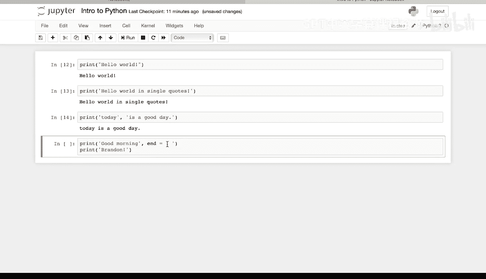

---

## 指定分隔符

我还可以为 `print` 命令的参数指定分隔符。

以下是具体方法：使用 `sep` 参数来定义参数之间的分隔符。

```python
print("Good night", "Brandon", sep=", ")
```

这里，分隔符 `sep` 被设置为 `", "`（逗号加空格）。

所以它会打印 `Good night`，后面跟着 `", "`，然后是 `Brandon`。

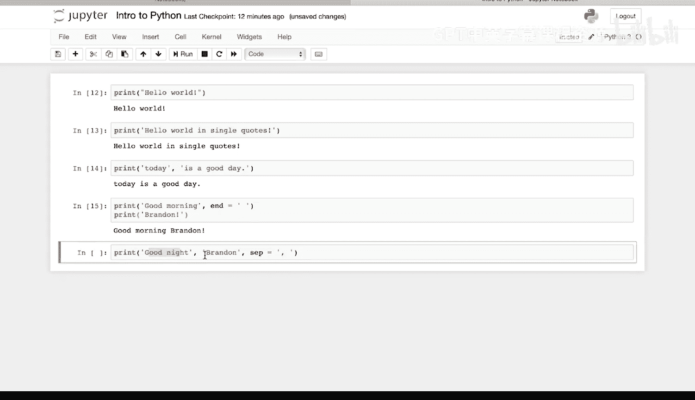

输出结果为：`Good night, Brandon`。

---

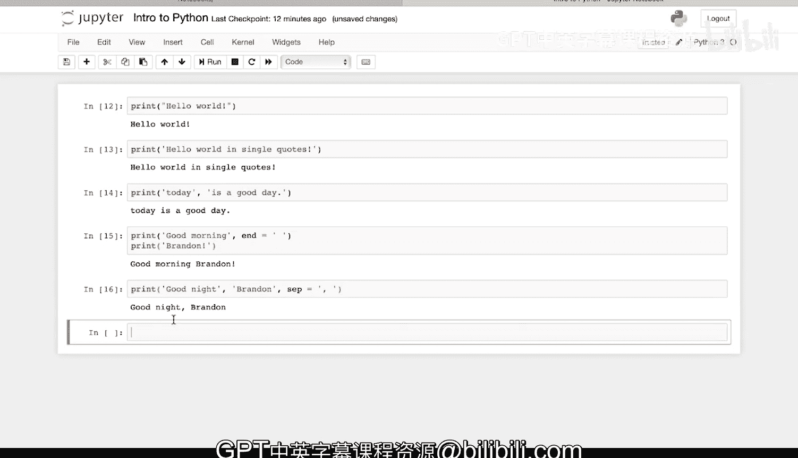

## 总结

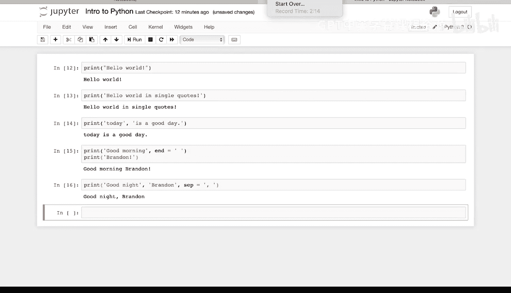

本节课中我们一起学习了Python的 `print` 函数。我们从最基本的打印字符串开始，学会了如何使用双引号和单引号。接着，我们探索了如何通过逗号分隔来连接多个字符串。然后，我们学习了如何使用 `end` 参数来控制打印结束后的字符，以及如何使用 `sep` 参数来定义多个参数之间的分隔符。这些是控制程序输出的基础且重要的技能。