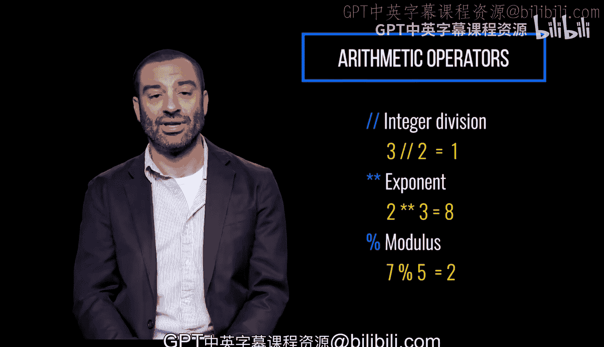
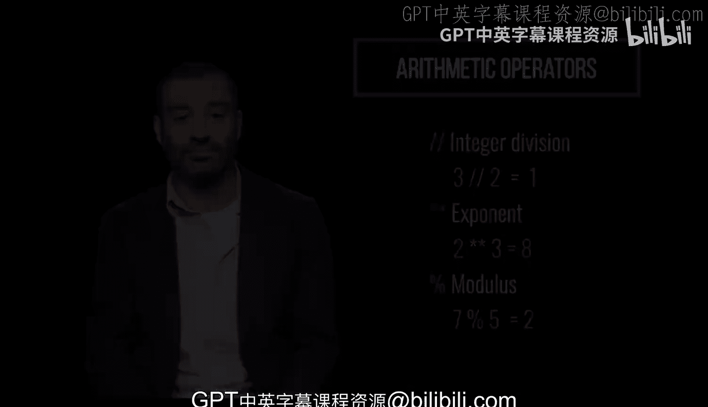

Python编程入门：1-2：算术运算符 🧮

在本节课中，我们将要学习Python编程语言中的算术运算符。这些运算符用于执行基础的数学运算，是编写任何涉及计算的程序的基础。

上一节我们介绍了编程的基本概念，本节中我们来看看如何让计算机进行数学计算。

算术运算符用于执行数学运算。加号 `+` 表示加法，减号 `-` 表示减法。

星号 `*` 用于乘法，而正斜杠 `/` 用于除法。

以下是除法运算符的示例：
```python
result = 10 / 2  # result 的值为 5.0
```

双斜杠 `//` 用于整数除法。它执行除法运算，但只返回商的整数部分，丢弃小数部分。

以下是整数除法运算符的示例：
```python
result = 3 // 2  # result 的值为 1
```

双星号 `**` 用于幂运算，即计算一个数的另一个数次方。

以下是幂运算符的示例：
```python
result = 2 ** 3  # result 的值为 8
```

百分号 `%` 表示取模运算。它执行除法运算，但返回的是余数，而不是商。

以下是取模运算符的示例：
```python
result = 7 % 5  # result 的值为 2
```







本节课中我们一起学习了Python的六种基本算术运算符：加法`+`、减法`-`、乘法`*`、除法`/`、整数除法`//`、幂运算`**`和取模`%`。理解这些运算符是进行更复杂编程的第一步。