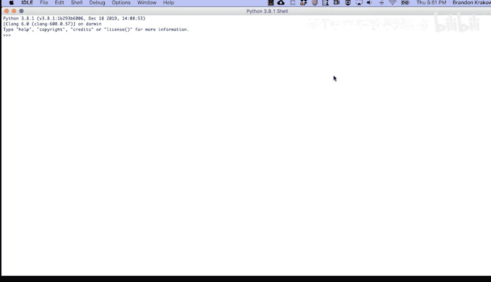
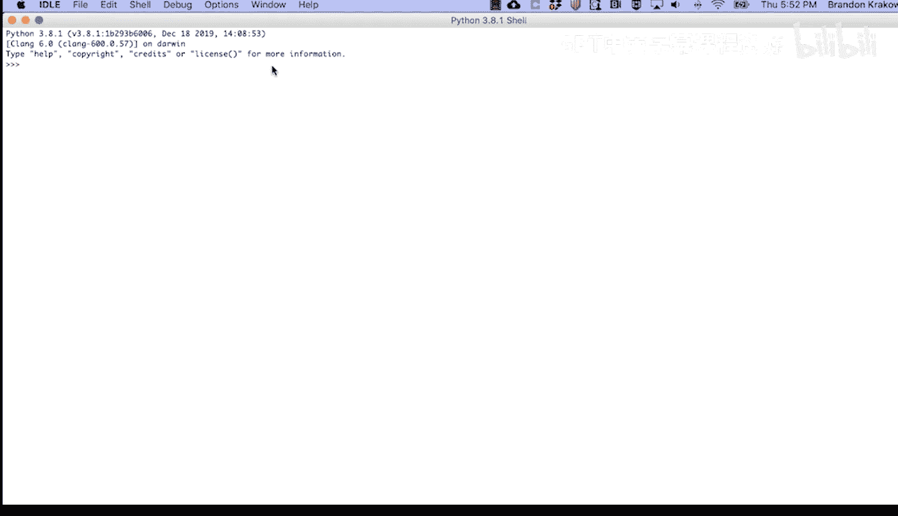
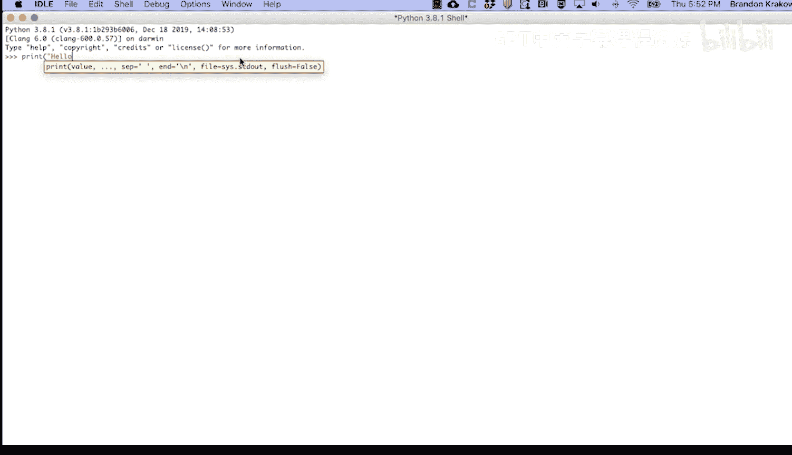
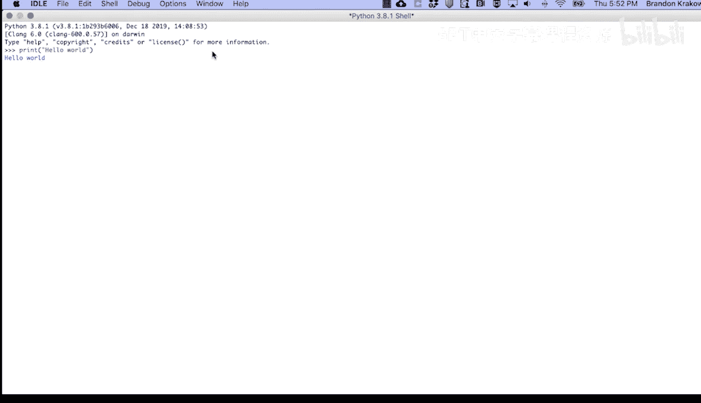
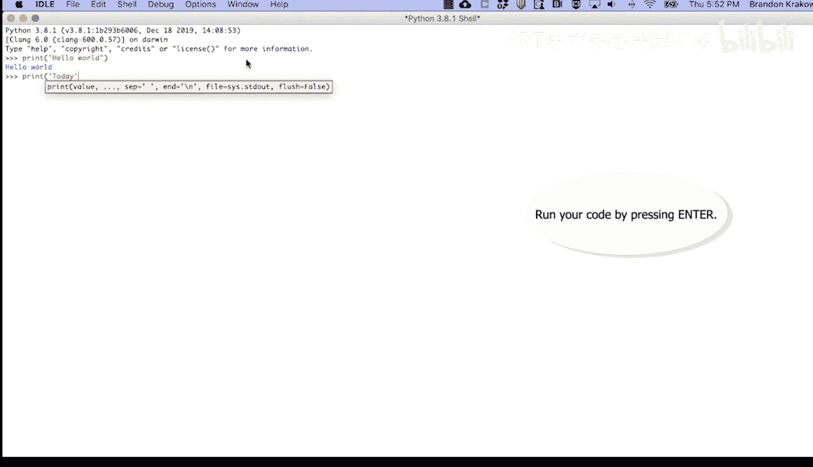
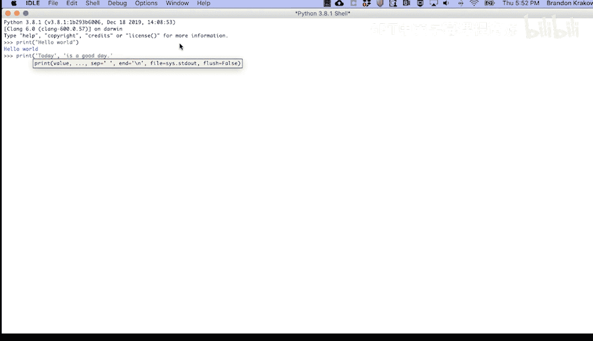
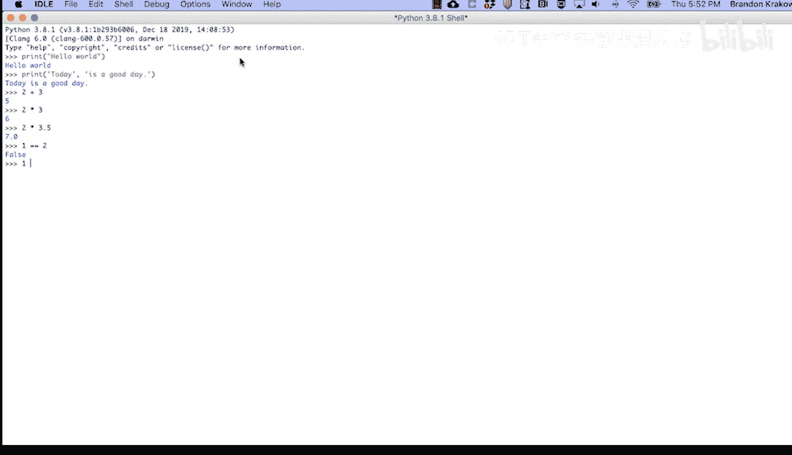
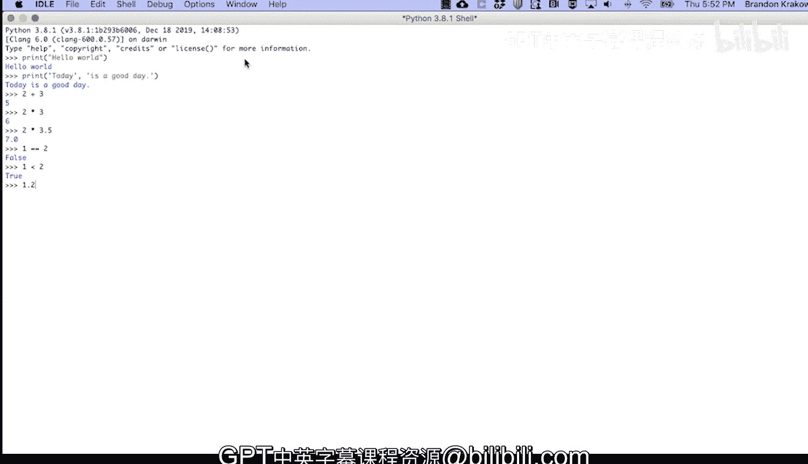
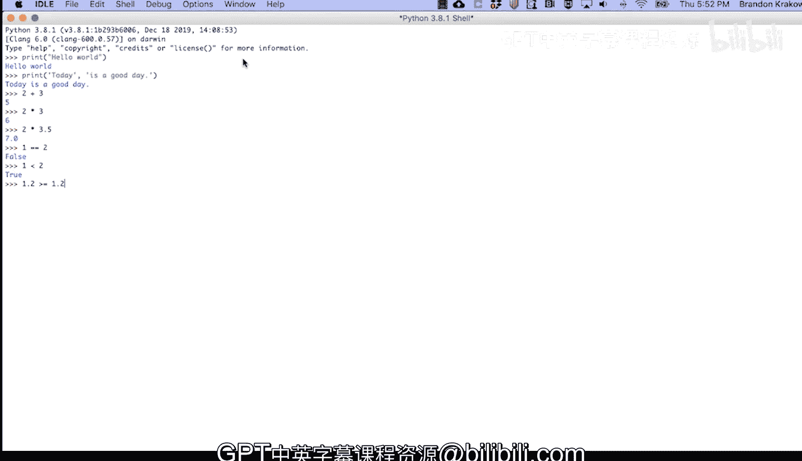

# 026：使用IDLE交互式环境 🐍

在本节课中，我们将要学习如何使用IDLE（Python自带的集成开发与学习环境）的交互式环境。我们将了解如何启动IDLE，在Python Shell中直接输入并运行代码，以及执行一些基本的操作，如打印输出和进行数学运算。

---

## 启动IDLE与Python Shell



IDLE包含一个交互式的Python解释器和一个脚本编辑器。我们将主要使用其交互式环境来即时运行代码。

当你首次启动IDLE时，你会看到**Python Shell**窗口。你可以直接在这个Shell中输入Python代码并立即看到执行结果。

---

## 在Shell中运行代码

在Python Shell中，代码是逐行解释执行的。让我们从最经典的示例开始：向控制台打印输出。

要打印“Hello, world”，只需输入以下代码并按回车键执行：

```python
print("Hello, world")
```

执行后，Shell会立即显示输出结果。

接下来，我们可以打印更长的句子：

```python
print("today is a good day")
```

同样，按下回车键后，这句话就会显示在控制台上。



---

## 执行数学与逻辑运算



除了打印文本，Python Shell还是一个强大的计算器。你可以直接进行数学运算和逻辑比较。

例如，进行加法运算：



```python
2 + 3
```

执行乘法运算：



```python
2 * 3
```

你还可以进行更复杂的运算，比如：

```python
2 * 3.5
```



对于逻辑判断，Python使用比较运算符。例如，判断1是否等于2：

```python
1 == 2
```

这个表达式会返回布尔值 `False`，因为1不等于2。

再判断1是否小于2：

```python
1 < 2
```



这个表达式会返回 `True`。

最后，判断1.2是否大于或等于1.2：



```python
1.2 >= 1.2
```

这个表达式同样会返回 `True`。

---



## 总结

本节课中，我们一起学习了IDLE交互式环境的基本用法。我们了解了如何启动IDLE并在Python Shell中直接输入代码，包括使用 `print()` 函数输出文本，以及执行基础的数学运算和逻辑比较。这个交互式环境是快速测试代码片段和熟悉Python语法的绝佳工具。在接下来的课程中，我们将学习如何使用IDLE的脚本编辑器来编写更复杂的程序。