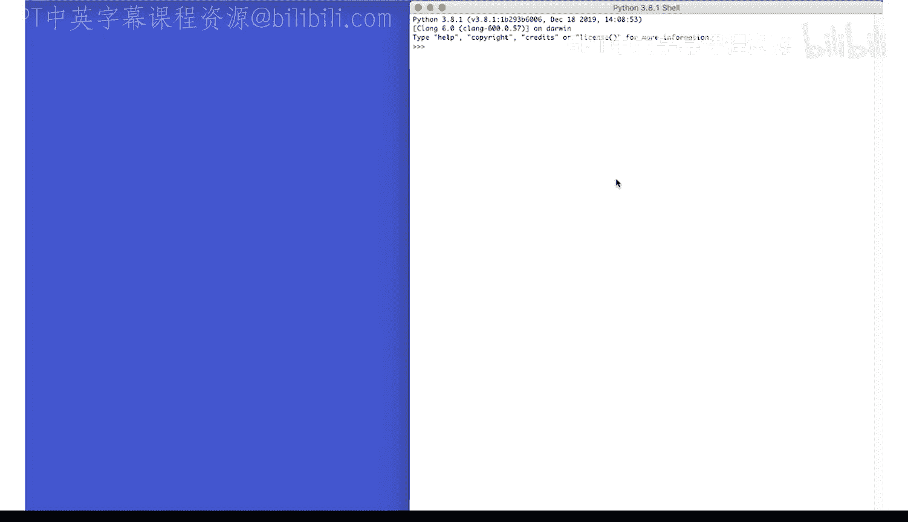
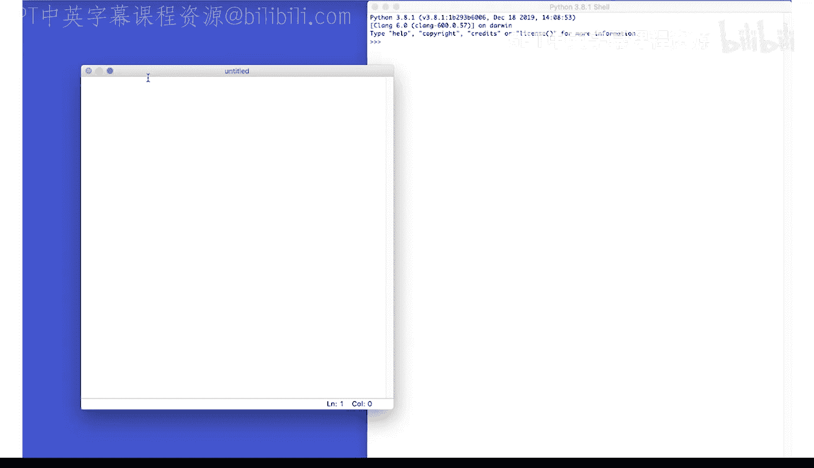
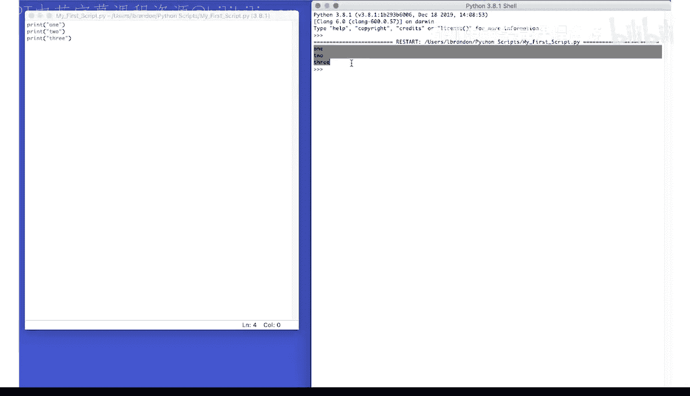

# 027：运行Python脚本 🐍

在本节课中，我们将学习如何在集成开发环境（IDE）中创建、保存和运行一个Python脚本文件。这是将代码转化为可执行程序的第一步。

## 创建脚本文件

首先，我们需要在IDE中创建一个新的文件来编写我们的Python代码。

以下是创建新文件的步骤：



1.  在IDE的菜单栏中，点击 **File**（文件）。
2.  在下拉菜单中，选择 **New File**（新建文件）。

## 保存脚本文件



创建新文件后，必须将其保存到计算机上，才能运行其中的代码。保存时，请确保文件扩展名为 `.py`，例如 `my_script.py`。

以下是保存文件的步骤：

1.  在菜单栏中，点击 **File**（文件）。
2.  选择 **Save**（保存）或 **Save As**（另存为）。
3.  在弹出的对话框中，为文件命名（例如 `hello.py`），并选择保存位置。
4.  点击保存。

## 编写与运行代码

文件保存后，你可以在其中输入Python代码。例如，输入一个简单的打印语句：
```python
print("Hello, World!")
```
要执行脚本文件中的代码，你需要运行它。

以下是运行脚本的方法：

*   在菜单栏中，点击 **Run**（运行），然后选择 **Run Module**（运行模块）。
*   或者，直接使用快捷键：在Windows/Linux系统上按 **F5**，在Mac系统上按 **Fn + F5**。

运行脚本后，代码的输出结果（例如“Hello, World!”）将显示在IDE下方的控制台（Console）窗口中。



---

本节课中，我们一起学习了Python脚本从创建到运行的完整流程：在IDE中新建文件、将其保存为 `.py` 格式、编写代码，最后通过菜单或快捷键运行脚本并查看结果。掌握这些基本操作是开始Python编程实践的基础。