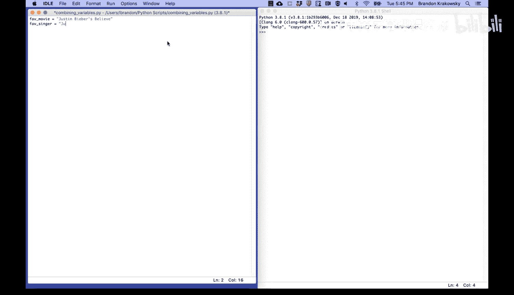
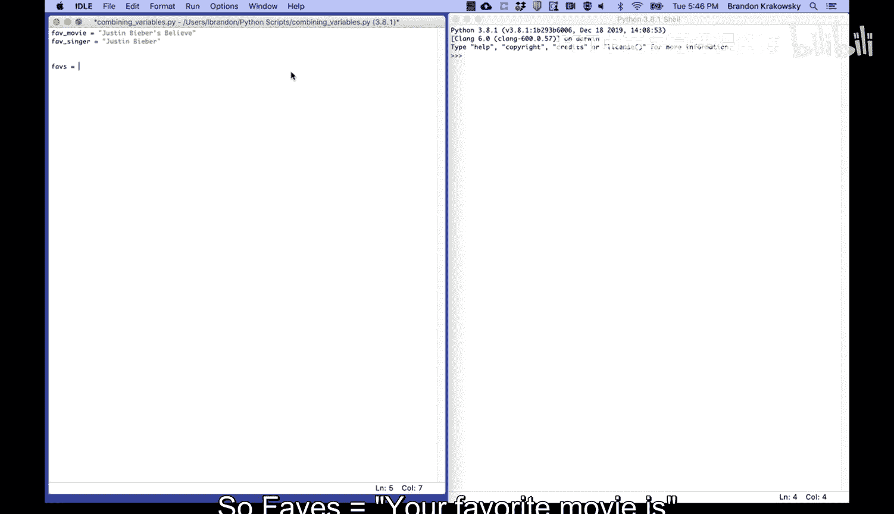
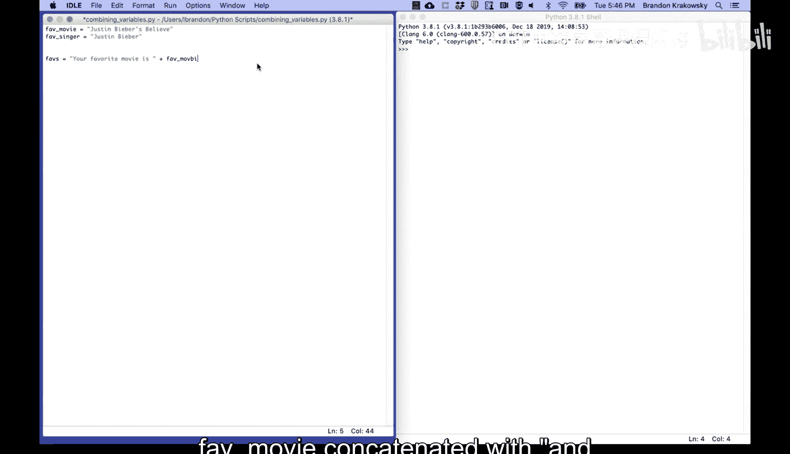
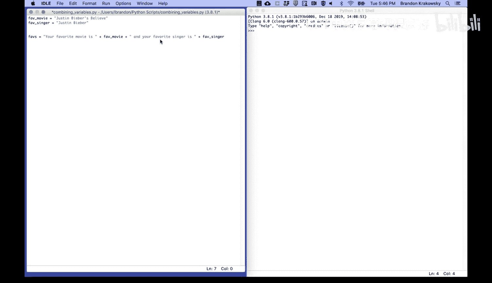
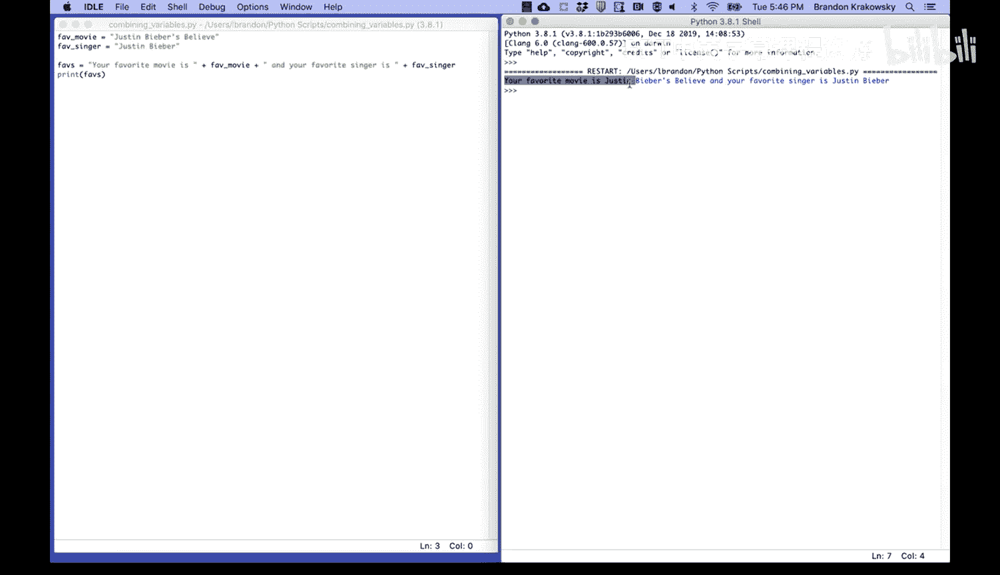

# 033：变量组合 🔗


在本节课中，我们将要学习如何组合变量，特别是如何将字符串变量连接起来，以创建新的、更复杂的字符串。


## 概述

上一节我们介绍了变量的基本概念和赋值操作。本节中我们来看看如何将不同的变量值组合在一起。这在编程中非常常见，例如，将用户的名字和问候语组合成一句完整的欢迎信息。



## 教程内容


你可以组合变量。让我们先存储一些字符串值。



以下是定义两个字符串变量的代码：
```python
fave_movie = "Justin Bieber's Believe"
fave_singer = "Justin Bieber"
```


然后，让我们将它们组合起来，创建一个新的字符串变量。



以下是将变量与固定文本组合的代码：
```python
faves = "Your favorite movie is " + fave_movie + " and your favorite singer is " + fave_singer
```

最后，让我们打印 `faves` 变量的值。



```python
print(faves)
```


运行以上代码，输出结果将是：
```
Your favorite movie is Justin Bieber's Believe and your favorite singer is Justin Bieber
```



## 总结


本节课中我们一起学习了如何组合字符串变量。我们通过 `+` 操作符将多个字符串片段（包括存储在变量中的文本和直接书写的文本）连接在一起，从而生成一个新的、更长的字符串。这是构建动态文本输出的基础技能。