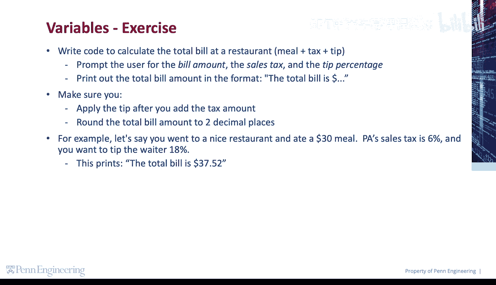
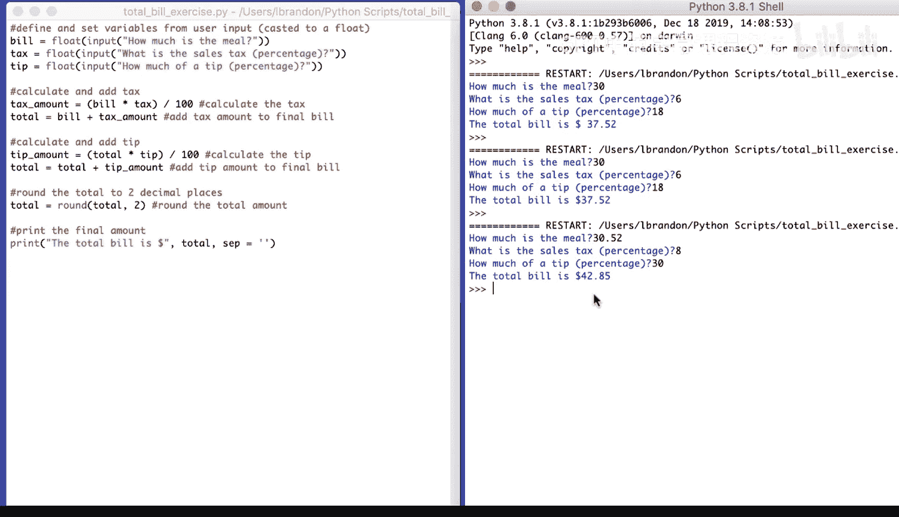

# 036：代码练习-计算账单总额 💰

在本节课中，我们将编写一个Python程序，用于计算餐厅消费的总账单。程序将引导用户输入餐费、销售税百分比和小费百分比，然后计算出包含税和小费后的总金额，并格式化为两位小数输出。

## 概述

我们将创建一个程序，其核心逻辑是：**总账单 = 餐费 + 税额 + 小费**。其中，税额基于餐费计算，而小费则基于“餐费+税额”后的总额计算。这是餐厅账单的常见计算方式。

## 分步实现

以下是实现该功能的详细步骤。



### 第一步：获取用户输入

首先，我们需要从用户那里获取三个关键信息：餐费、税率和小费率。Python的 `input()` 函数可以获取用户输入，但返回的是字符串类型，因此我们需要将其转换为浮点数（`float`）以便进行数学计算。

```python
bill = float(input("How much is the meal? "))
tax = float(input("What is the sales tax as a percentage? "))
tip = float(input("How much of a tip as a percentage? "))
```

### 第二步：计算税额并加到账单上

上一节我们获取了原始数据，本节中我们来看看如何计算税额。税额的计算公式是：**税额 = 餐费 × (税率 / 100)**。计算出税额后，将其与原始餐费相加，得到含税总额。

```python
tax_amount = bill * (tax / 100)
total = bill + tax_amount
```

### 第三步：计算小费并加到总账单上

在得到含税总额后，接下来我们需要计算小费。小费的计算基于当前的含税总额，公式为：**小费金额 = 含税总额 × (小费率 / 100)**。然后将小费金额加到总账单中。

```python
tip_amount = total * (tip / 100)
total = total + tip_amount
```

### 第四步：格式化并输出最终结果

所有计算完成后，我们需要将总金额四舍五入到两位小数，并以清晰的格式打印出来。Python内置的 `round()` 函数可以完成四舍五入。为了输出更美观，我们可以使用 `print()` 函数的 `sep` 参数来控制输出分隔符。

```python
total = round(total, 2)
print("The total bill is", total, sep=" ")
```

## 完整代码示例

将以上所有步骤组合起来，就得到了完整的程序。

```python
# 获取用户输入
bill = float(input("How much is the meal? "))
tax = float(input("What is the sales tax as a percentage? "))
tip = float(input("How much of a tip as a percentage? "))

# 计算税额并加到账单上
tax_amount = bill * (tax / 100)
total = bill + tax_amount

# 计算小费并加到总账单上
tip_amount = total * (tip / 100)
total = total + tip_amount

# 格式化并输出最终结果
total = round(total, 2)
print("The total bill is", total, sep=" ")
```

## 运行示例

运行上述程序，并按照提示输入数据，程序将输出最终的总账单金额。

```
How much is the meal? 30
What is the sales tax as a percentage? 6
How much of a tip as a percentage? 18
The total bill is 37.52
```

## 总结

本节课中我们一起学习了如何构建一个实用的餐厅账单计算器。我们掌握了以下关键技能：
1.  使用 `input()` 获取用户输入，并用 `float()` 进行类型转换。
2.  按照“先税后小费”的顺序进行数学计算。
3.  使用 `round()` 函数对结果进行格式化。
4.  使用 `print()` 函数的 `sep` 参数控制输出格式。



这个练习涵盖了变量、输入输出、类型转换和基本算术运算，是巩固Python基础知识的绝佳示例。