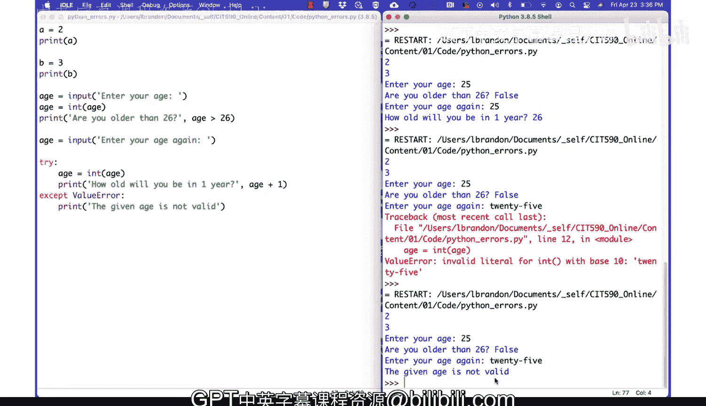
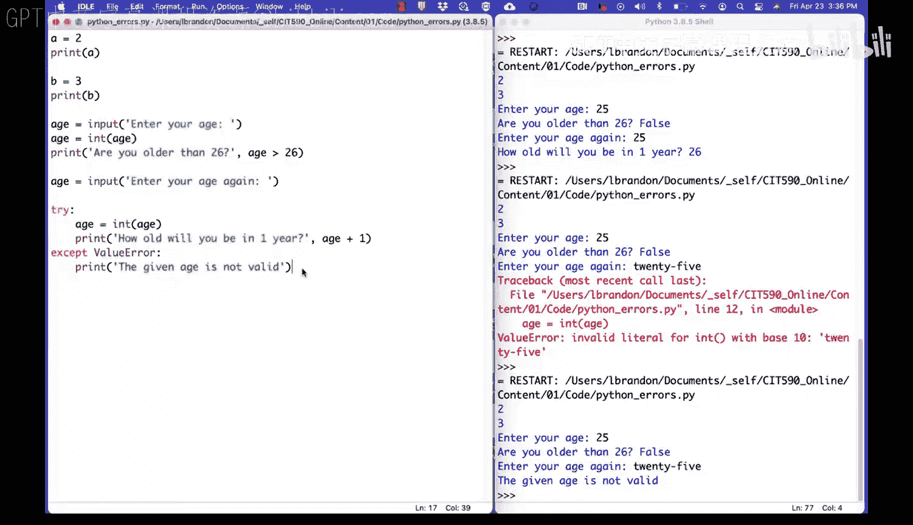

# 041：常见Python错误解析与处理 🐍

在本节课中，我们将学习Python编程中几种常见的错误类型，理解它们的含义，并掌握如何诊断和修复这些错误。我们将通过具体的代码示例来演示错误的发生场景以及正确的解决方法。

---

## 变量名大小写错误

首先，我们来看一个由变量名大小写不一致引发的错误。

```python
A = 2
print(a)
```

运行这段代码会得到一个 **NameError**，提示 `name 'a' is not defined`。错误发生在第2行。这是因为我们定义变量时使用的是大写字母 `A`，但在打印时却试图访问小写字母 `a`。Python是区分大小写的语言，`A` 和 `a` 被视为两个不同的变量。

**解决方法**：确保变量名在定义和使用时保持大小写一致。将打印语句改为 `print(A)` 即可修复。

---

## 函数名大小写错误

接下来，我们看看调用内置函数时，因大小写错误导致的问题。

```python
B = 3
Print(B)
```

运行这段代码会得到另一个 **NameError**，提示 `name 'Print' is not defined`。错误发生在第2行。这是因为Python的内置函数 `print` 必须全部小写，我们错误地将其首字母大写了。

**解决方法**：将函数调用更正为小写的 `print(B)`。

---

## 类型错误：字符串与数字比较

在处理用户输入时，一个常见的错误是忘记进行类型转换。用户输入默认是字符串类型。

```python
age = input("Enter your age: ")
print("Are you older than 26?")
print(age > 26)
```

运行代码并输入 `25` 后，会得到一个 **TypeError**，提示 `'>' not supported between instances of 'str' and 'int'`。这是因为我们不能直接用字符串 `"25"` 和整数 `26` 进行比较。

**解决方法**：在比较之前，使用 `int()` 函数将字符串转换为整数。

```python
age = int(input("Enter your age: "))
print("Are you older than 26?")
print(age > 26)
```

---

## 类型错误：字符串与数字运算

类似的类型错误也会发生在算术运算中。

```python
age = input("Enter your age again: ")
print("How old will you be in one year?")
print(age + 1)
```

运行代码并输入 `25` 后，会得到 **TypeError**，提示 `can only concatenate str (not "int") to str`。这是因为 `+` 运算符对字符串是连接操作，不能直接将字符串 `"25"` 和整数 `1` 相加。

**解决方法**：同样，需要先将字符串转换为整数再进行计算。

```python
age = int(input("Enter your age again: "))
print("How old will you be in one year?")
print(age + 1)
```

---

## 处理无效输入：ValueError

然而，直接转换用户输入存在风险。如果用户输入的不是有效的数字（例如输入了单词 `"twenty-five"`），`int()` 函数会抛出一个 **ValueError**。

以下是处理这种情况的方法，使用 `try...except` 语句来捕获并优雅地处理错误。

```python
try:
    age = int(input("Enter your age again: "))
    print("How old will you be in one year?")
    print(age + 1)
except ValueError:
    print("The given age is not valid.")
```

**代码解释**：
*   `try:` 块中包含可能引发错误的代码。
*   `except ValueError:` 块专门用于捕获 `ValueError` 类型的异常。
*   如果用户输入无法转换为整数，程序不会崩溃，而是执行 `except` 块中的代码，打印出友好的错误提示信息。

---

## 总结

本节课中，我们一起学习了Python编程中几种典型的错误及其处理方法：





1.  **NameError**：通常由未定义的变量名或错误大小写的函数名引起。解决方法是检查拼写和大小写。
2.  **TypeError**：在尝试对不兼容的数据类型进行操作时发生，例如字符串与数字比较或运算。解决方法是使用 `int()`、`float()` 或 `str()` 等函数进行正确的类型转换。
3.  **ValueError**：当函数接收到类型正确但值不合理的参数时引发，例如 `int("abc")`。解决方法是使用 `try...except` 语句来捕获异常并提供备用处理逻辑。


理解这些错误并学会如何调试，是成为一名熟练Python程序员的重要一步。记住，遇到错误时，仔细阅读错误信息，它通常会明确指出问题所在的行和原因。