# 048：遍历列表

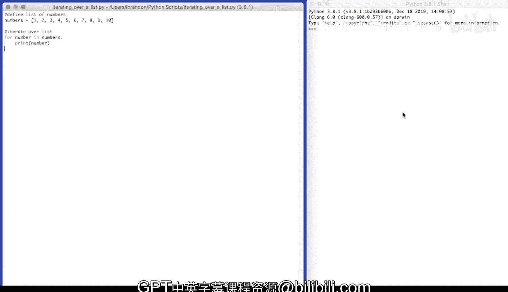

在本节课中，我们将要学习如何遍历列表，并在此过程中筛选出特定的元素（例如偶数），同时学习如何统计筛选出的元素数量。

## 遍历列表与筛选元素

上一节我们介绍了列表的基本概念。本节中我们来看看如何遍历列表中的所有元素，并对它们进行条件判断。

我们可以遍历同一个列表，并找出其中的偶数。首先，定义一个包含数字的列表。

```python
numbers = [1, 2, 3, 4, 5, 6, 7, 8, 9, 10]
```

列表中的每一项都是一个数字。以下代码展示了如何遍历这个列表：

```python
for number in numbers:
    print(number)
```

如果只想找出其中的偶数，我们需要创建一个新的列表来存储它们。

```python
even_numbers = []  # 定义一个空列表来存储偶数
```

以下是筛选偶数的逻辑：在遍历原始列表时，测试每个数字是否为偶数。如果是，则将其添加到 `even_numbers` 列表中。

判断一个数是否为偶数的条件是：该数除以2的余数为0。在Python中，可以使用取模运算符 `%` 来实现。

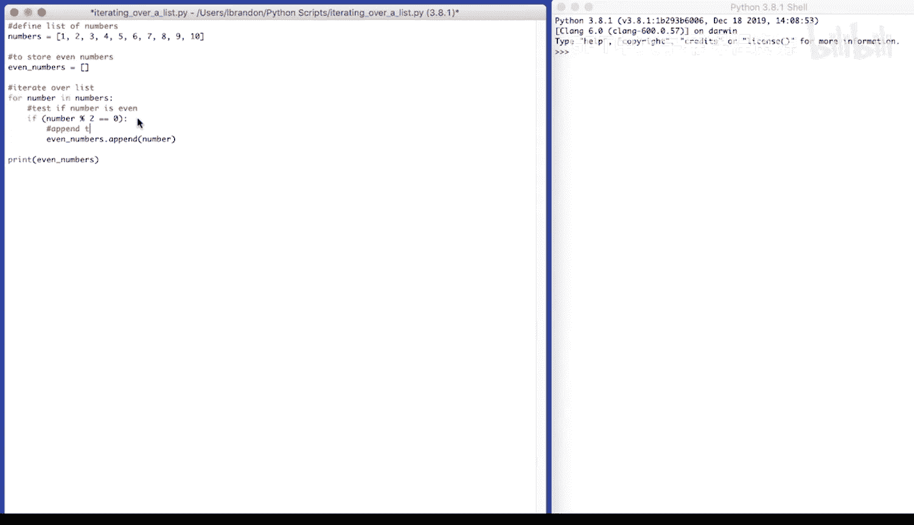

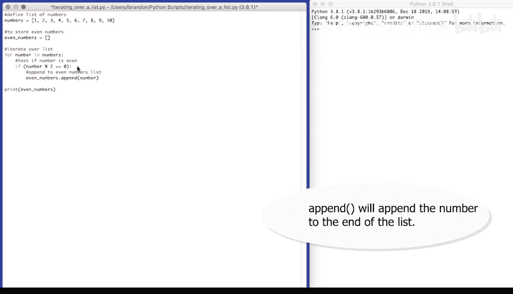

```python
for number in numbers:
    if number % 2 == 0:          # 检查数字是否为偶数
        even_numbers.append(number) # 如果是偶数，则添加到列表中
```

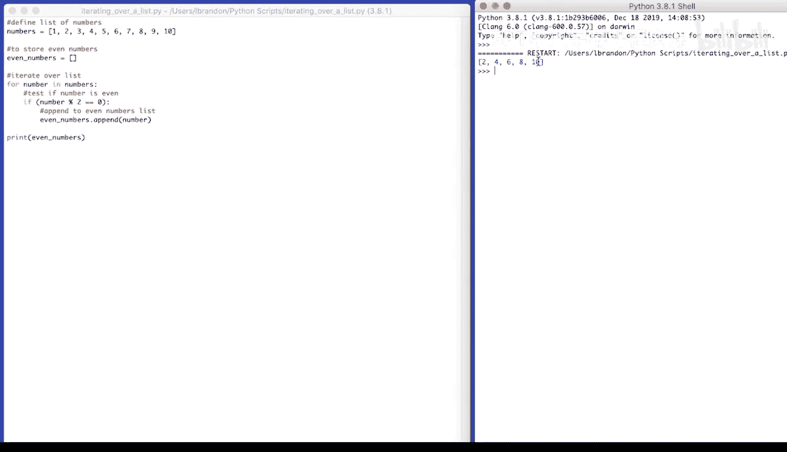

最后，打印出偶数列表。

```python
print(even_numbers)
```

运行上述代码，输出结果为：`[2, 4, 6, 8, 10]`。

## 统计元素数量

除了筛选，我们常常还需要知道筛选出的元素有多少个。有两种方法可以实现。

**方法一：使用计数器变量**
在遍历和筛选的同时，递增一个计数器。

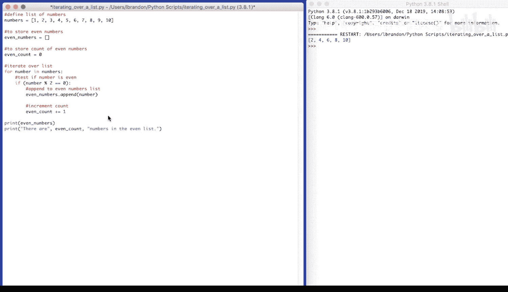

```python
even_count = 0  # 初始化偶数计数器
even_numbers = []

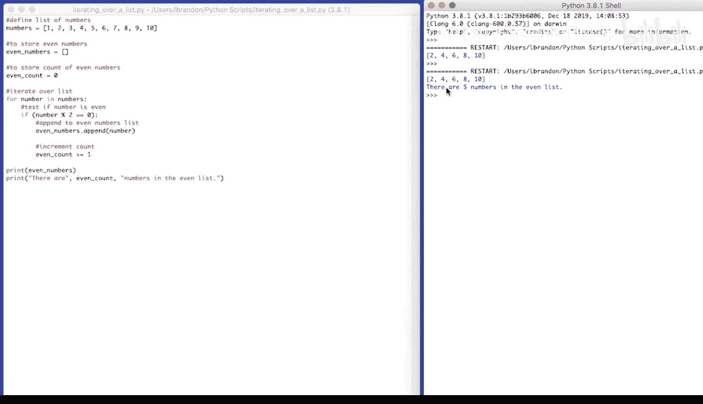

for number in numbers:
    if number % 2 == 0:
        even_numbers.append(number)
        even_count += 1  # 计数器加一

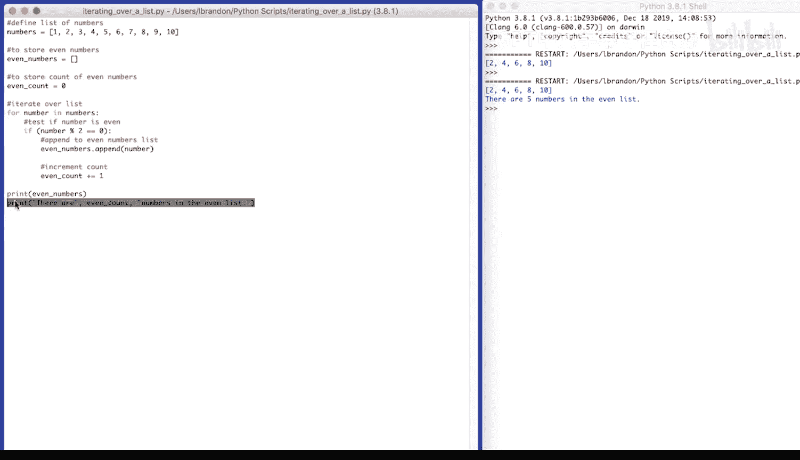

print(even_numbers)
print(f"There are {even_count} numbers in the even list.")
```

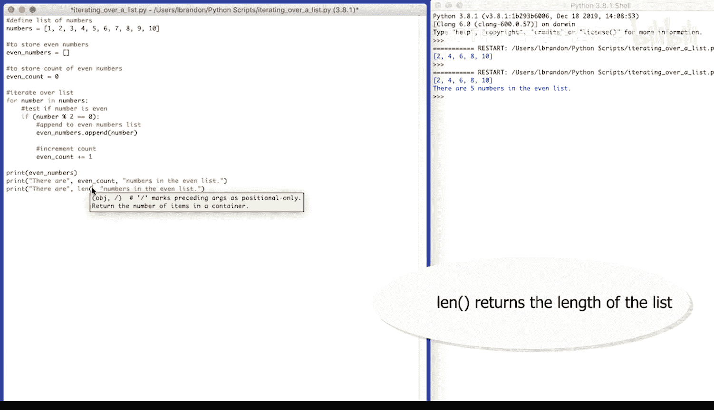

运行代码，会先输出偶数列表，然后输出：`There are 5 numbers in the even list.`。

**方法二：使用 `len()` 函数**
更简单的方法是直接使用Python内置的 `len()` 函数来获取列表的长度。

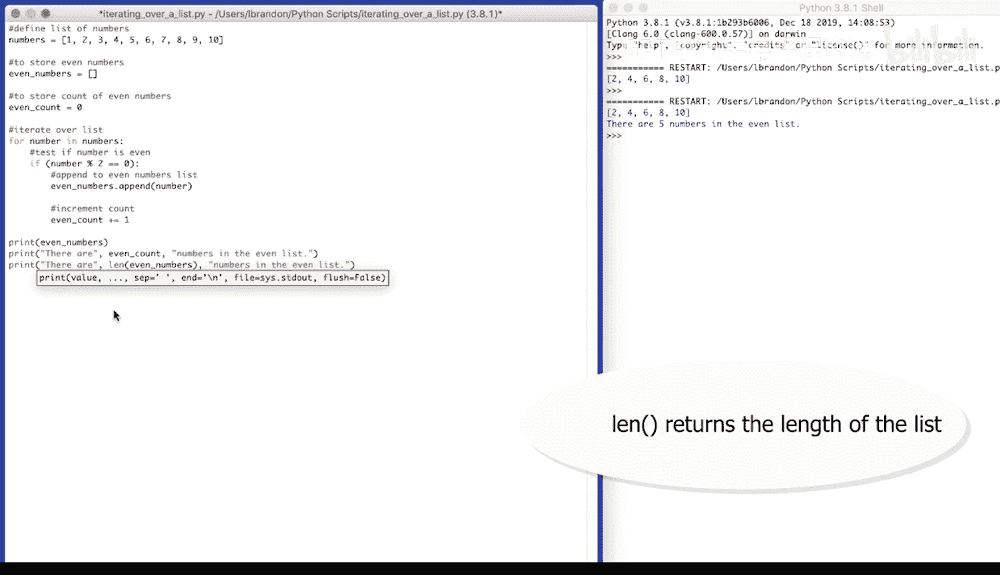

```python
even_numbers = [number for number in numbers if number % 2 == 0] # 列表推导式，后续课程会详细讲解
print(even_numbers)
print(f"There are {len(even_numbers)} numbers in the even list.")
```

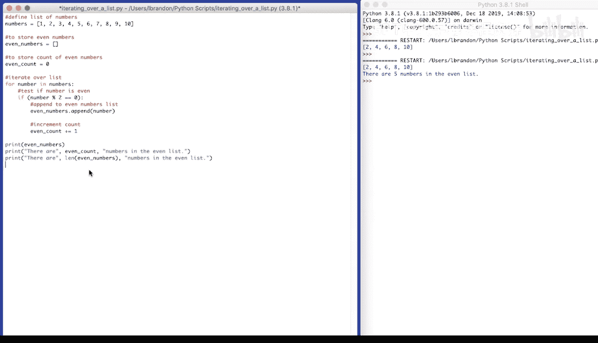

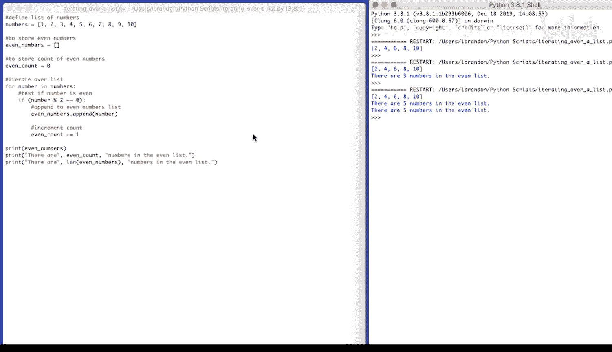

这段代码同样会输出偶数列表和数量：`There are 5 numbers in the even list.`。

---

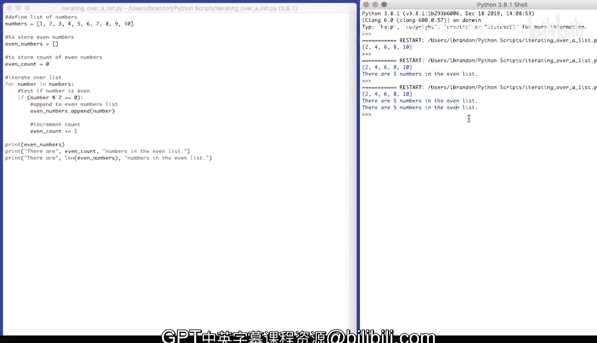

本节课中我们一起学习了如何遍历列表、使用条件语句筛选元素（如偶数），以及使用两种方法统计筛选出的元素数量。这些是处理列表数据的基础且重要的操作。