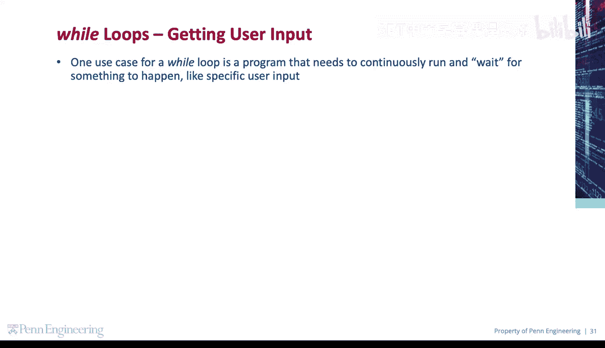
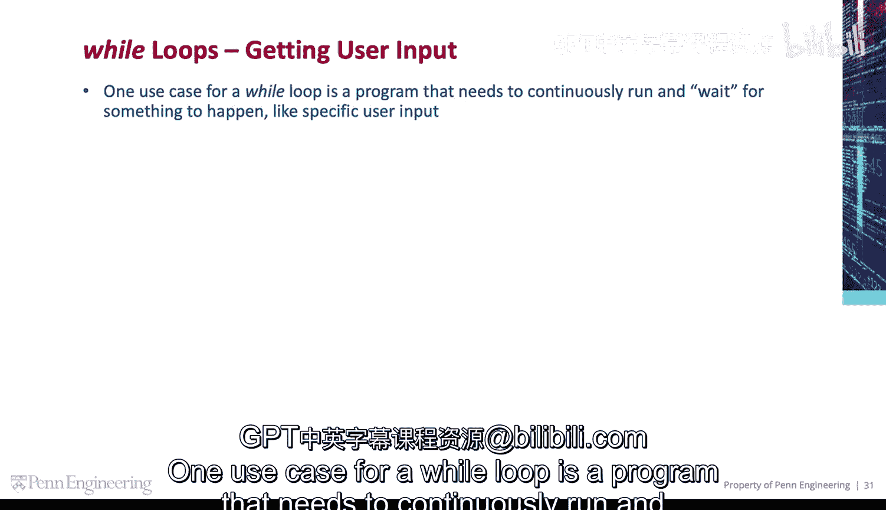
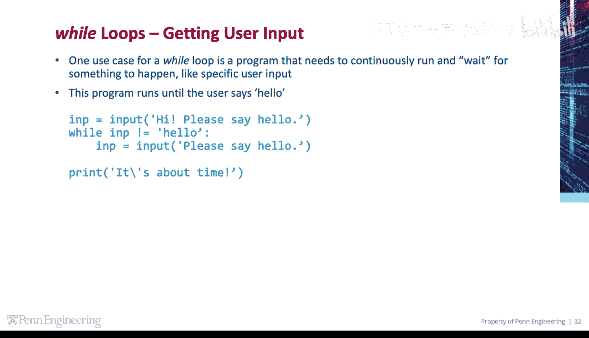
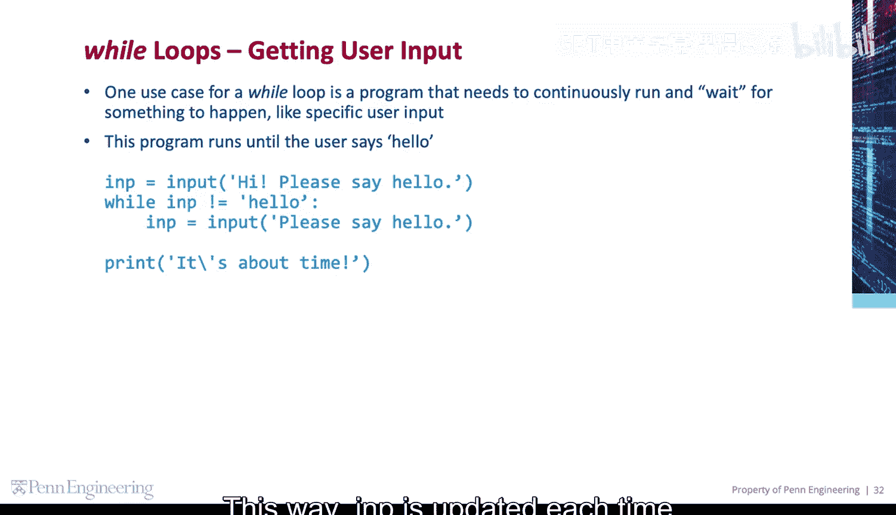
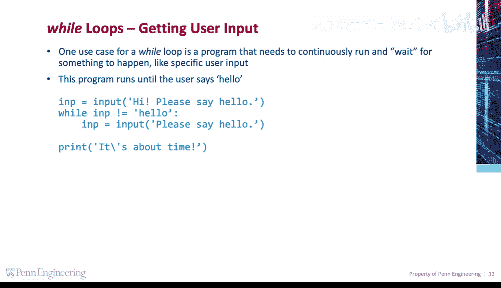

# 055：等待用户输入 🎯

在本节课中，我们将学习如何使用 `while` 循环来创建一个持续运行的程序，直到接收到特定的用户输入为止。这是一种常见的交互式编程模式。



---

## 使用 `while` 循环等待特定输入

上一节我们介绍了 `while` 循环的基本结构。本节中我们来看看它的一个典型应用场景：等待用户输入特定内容。

`while` 循环的一个常见用途是编写需要持续运行并等待某些事件发生的程序，例如，等待特定的用户输入。

以下是一个程序示例，它会一直运行，直到用户输入单词 “Hello”。



```python
# 首先，获取用户输入并将其存储在变量 inp 中
inp = input("Please enter something: ")

# 当 inp 不等于 "Hello" 时，循环继续
while inp != "Hello":
    # 重新提示用户输入，并将新结果存储在 inp 中
    inp = input("That's not the right word. Try again: ")
```

通过这种方式，每次提示用户输入新内容时，变量 `inp` 都会被更新。

---

## 循环结束与后续操作

一旦 `inp` 的值确实等于 “Hello”，程序就会退出 `while` 循环。

退出循环后，程序可以继续执行后续的代码。例如，打印一条消息：



```python
print("It's about time!")
```



---

## 总结

本节课中我们一起学习了如何利用 `while` 循环来等待并验证用户的输入。我们掌握了以下核心流程：



1.  使用 `input()` 函数获取初始输入。
2.  使用 `while` 循环和条件判断（如 `inp != "Hello"`）来持续检查输入。
3.  在循环体内更新输入变量，为下一次条件检查做准备。
4.  当条件满足时退出循环，并执行后续代码。

这种模式对于创建需要与用户进行特定交互的程序非常有用。