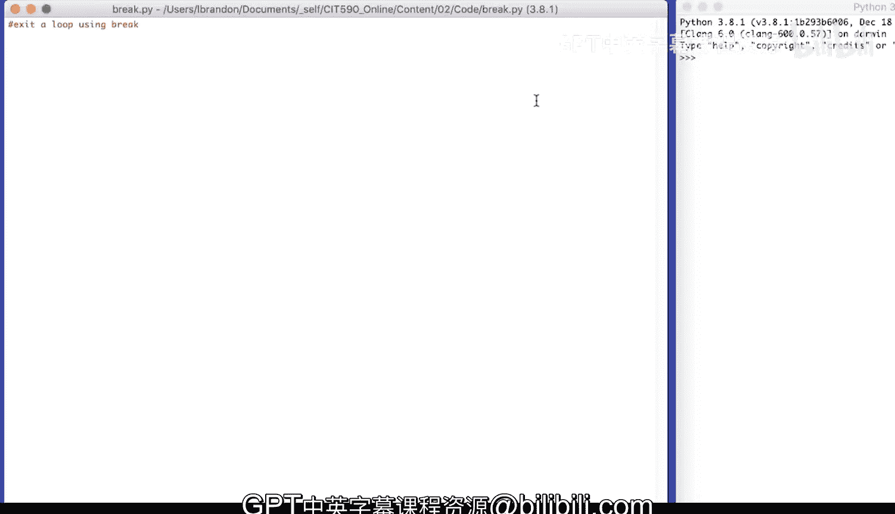
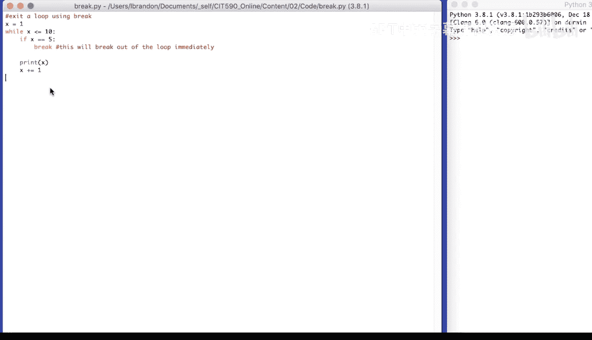
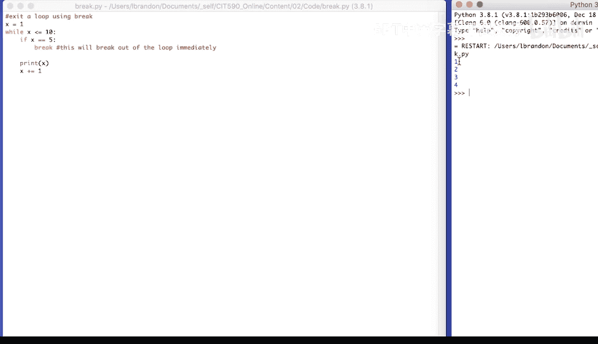
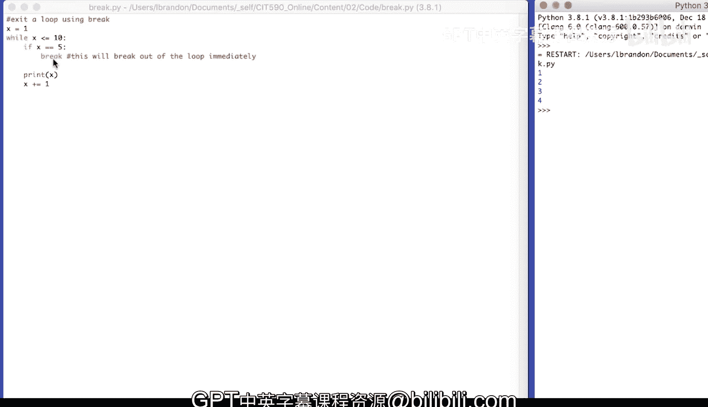

# 057：使用break退出循环 🔄

在本节课中，我们将要学习如何使用 `break` 语句来提前退出循环。这是一种控制循环流程的强大工具，允许我们在满足特定条件时立即停止循环的执行。



## 概述

循环是编程中用于重复执行代码块的结构。然而，有时我们可能需要在循环正常结束之前，根据某个条件提前终止它。`break` 语句正是为此目的而设计的。

## break语句的工作原理

`break` 命令会立即终止其所在的整个循环，并将程序控制权转移到循环之后的语句。它通常与条件判断语句（如 `if`）结合使用。

其核心逻辑可以用以下伪代码描述：
```python
while 条件:
    # 执行一些代码
    if 特定条件满足:
        break  # 立即退出循环
    # 循环的其他代码
```

上一节我们介绍了循环的基本概念，本节中我们来看看如何使用 `break` 来主动控制循环的退出。

## 代码示例与分析

让我们通过一个具体的例子来理解 `break` 的用法。我们将初始化一个变量 `x` 为 1，然后在一个 `while` 循环中递增它，并在 `x` 等于 5 时使用 `break` 退出。

以下是实现此逻辑的Python代码步骤：

1.  将变量 `x` 初始化为 1。
2.  设置一个 `while` 循环，条件是 `x` 小于或等于 10。
3.  在循环内部，检查 `x` 是否等于 5。
4.  如果 `x` 等于 5，则执行 `break` 语句。
5.  否则，打印 `x` 的当前值，然后将 `x` 的值增加 1。

对应的代码如下：
```python
x = 1
while x <= 10:
    if x == 5:
        break
    print(x)
    x += 1
```



## 执行流程与输出

现在，我们来逐步分析这段代码的执行过程：
*   `x` 从 1 开始。
*   进入 `while` 循环，因为 1 <= 10 为真。
*   `x` 不等于 5，所以打印 `1`，然后 `x` 变为 2。
*   循环继续，打印 `2`，`x` 变为 3。
*   循环继续，打印 `3`，`x` 变为 4。
*   循环继续，打印 `4`，`x` 变为 5。
*   当 `x` 等于 5 时，`if` 条件成立，执行 `break` 语句。
*   循环被立即终止，程序跳出 `while` 循环。

因此，这段代码的输出结果是：
```
1
2
3
4
```
代码打印了 1、2、3、4，然后当 `x` 变为 5 时，它跳出了 `while` 循环，程序结束。



## 总结



本节课中我们一起学习了 `break` 语句的用法。`break` 是一个重要的流程控制关键字，它允许我们在循环内部满足某个条件时，立即并完全地退出当前循环。这为编写更灵活、高效的循环逻辑提供了可能。记住，`break` 只影响它所在的最内层循环。