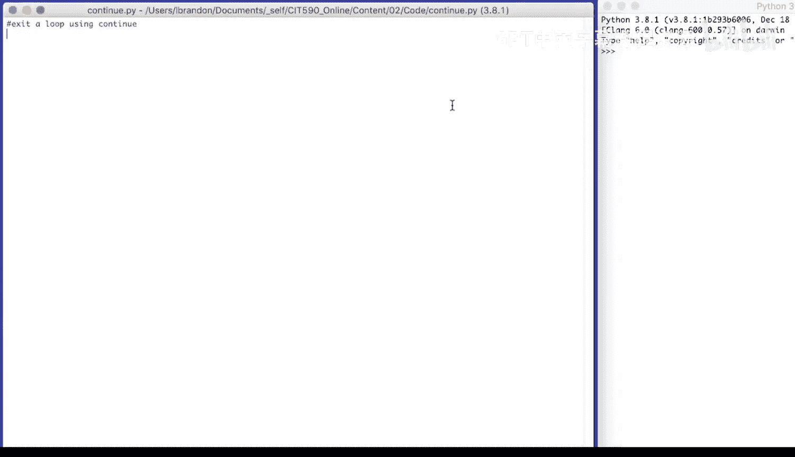
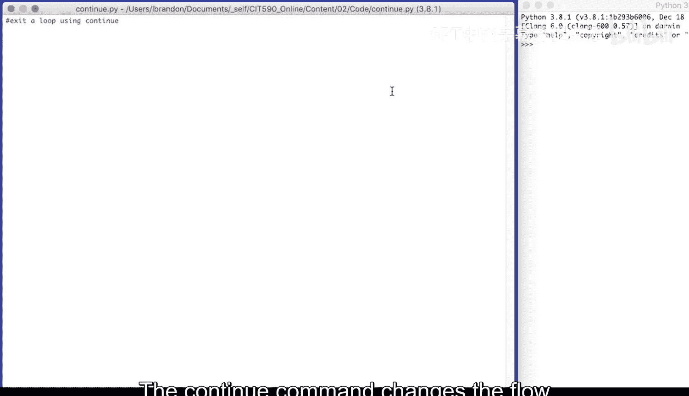
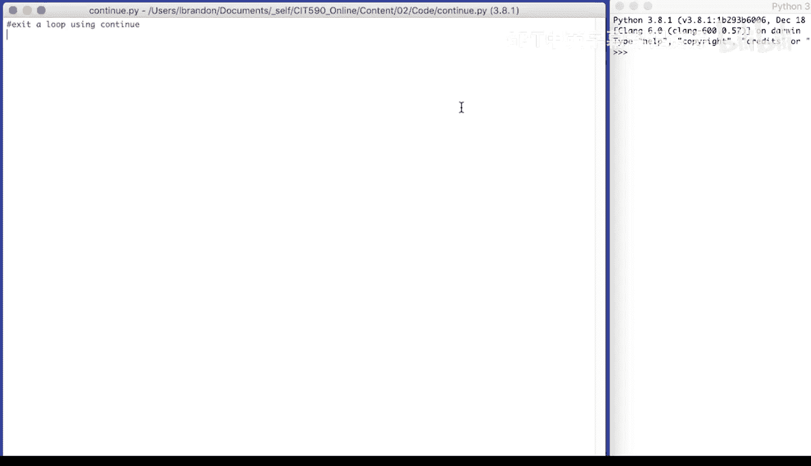
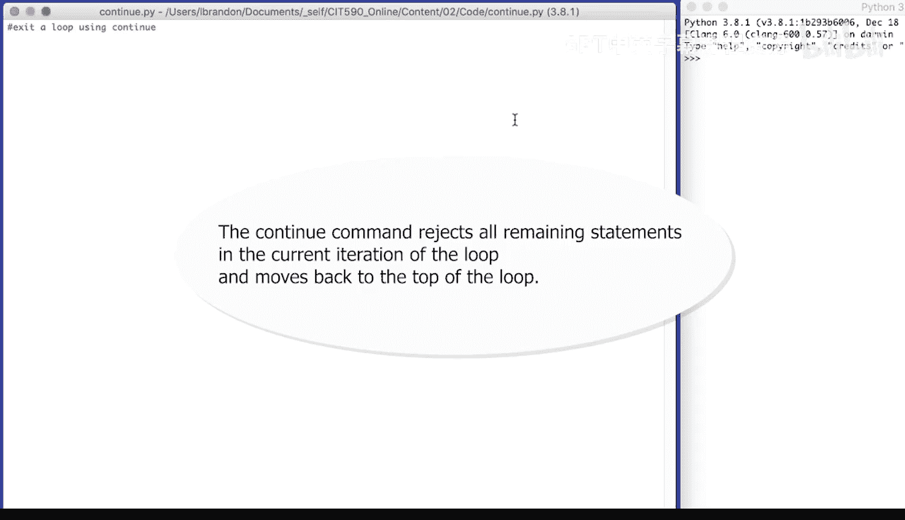
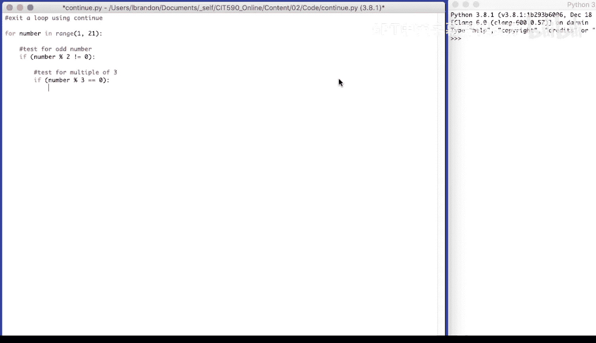
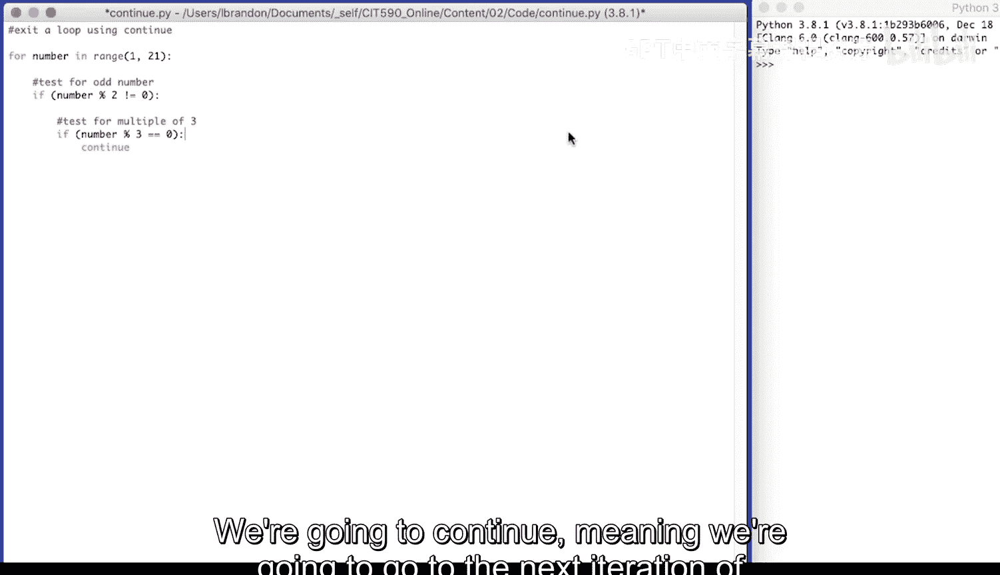
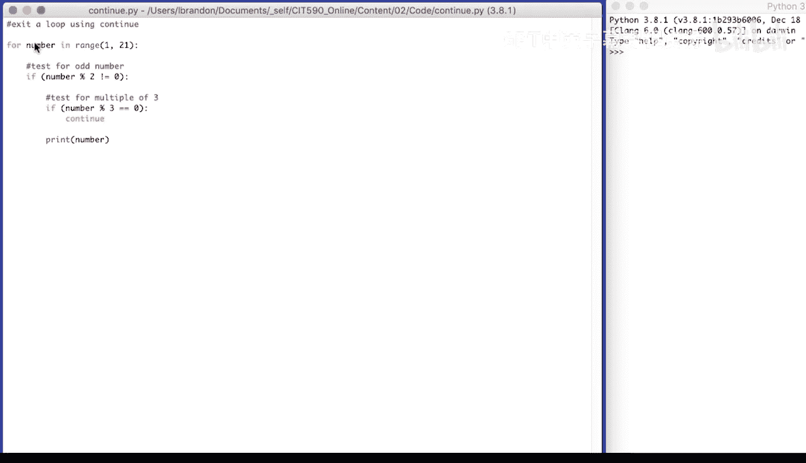
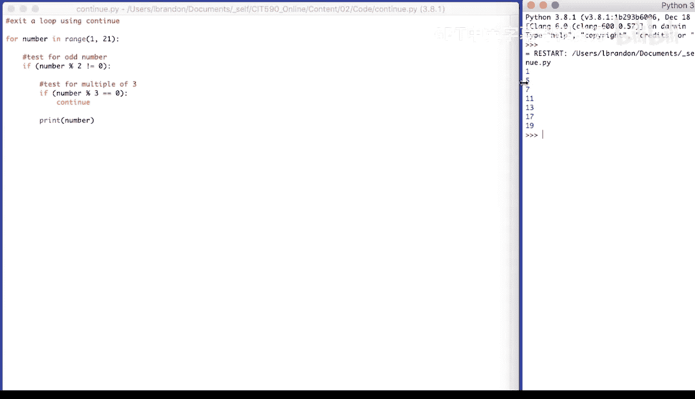
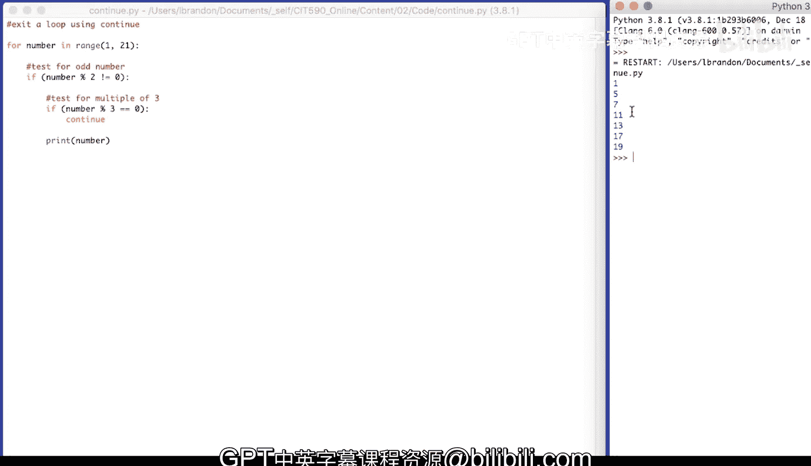

# 058：使用continue跳过循环 🔄



在本节课中，我们将要学习Python循环控制中的另一个重要关键字：`continue`。我们将了解它与`break`的区别，并通过一个具体的例子来掌握如何使用它来跳过循环中的特定迭代。

## 概述



`continue`语句用于改变程序的控制流，它会立即结束当前循环的本次迭代，并跳转到循环的下一次迭代开始处。这与`break`语句不同，`break`会完全终止整个循环。

## `continue`语句的工作原理

上一节我们介绍了使用`break`来终止循环。本节中我们来看看`continue`，它提供了一种更精细的控制方式。





当程序在循环体内执行到`continue`语句时，它会跳过本次迭代中`continue`之后的所有代码，直接回到循环的顶部，并根据循环条件决定是否开始下一次迭代。

## 代码示例：打印特定奇数

让我们通过一个具体的编程任务来理解`continue`的用法。我们的目标是编写代码，打印出1到20之间的所有奇数，但需要跳过那些同时是3的倍数的数字。

以下是实现此逻辑的步骤：



1.  使用`for`循环遍历1到20的数字。
2.  判断当前数字是否为奇数。
3.  如果当前数字是奇数，再判断它是否是3的倍数。
4.  如果它同时是3的倍数，则使用`continue`跳过打印。
5.  否则，打印这个数字。

对应的Python代码如下：



```python
for number in range(1, 21):
    # 测试是否为奇数
    if number % 2 != 0:
        # 测试是否为3的倍数
        if number % 3 == 0:
            # 如果是3的倍数，则跳过本次迭代
            continue
        # 打印符合条件的奇数
        print(number)
```

**代码解析：**
*   `range(1, 21)` 生成从1到20的整数序列。
*   `number % 2 != 0` 是判断奇数的条件。`%`是取模运算符，`number % 2`的结果为0表示`number`是偶数，不为0则表示是奇数。
*   `number % 3 == 0` 是判断是否为3的倍数的条件。
*   当两个条件都满足（即是奇数又是3的倍数）时，执行`continue`，程序会直接跳转到`for`循环的下一个`number`，不会执行最后的`print(number)`语句。



运行这段代码，输出结果为：
```
1
5
7
11
13
17
19
```
可以看到，数字3、9、15虽然也是奇数，但因为它们是3的倍数，所以在执行`continue`后被跳过了，没有打印出来。



## 总结



本节课中我们一起学习了`continue`语句的用法。我们了解到：
*   `continue`用于**跳过当前循环的本次迭代**，立即开始下一次迭代。
*   它与`break`的关键区别在于：`break`会**终止整个循环**，而`continue`只**跳过当前一次循环**。
*   通过结合条件判断，我们可以使用`continue`灵活地控制循环中哪些代码需要执行，哪些需要跳过，从而编写出更清晰、高效的循环逻辑。