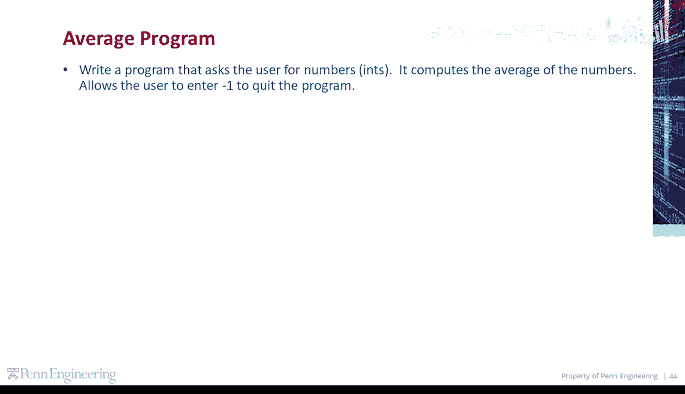
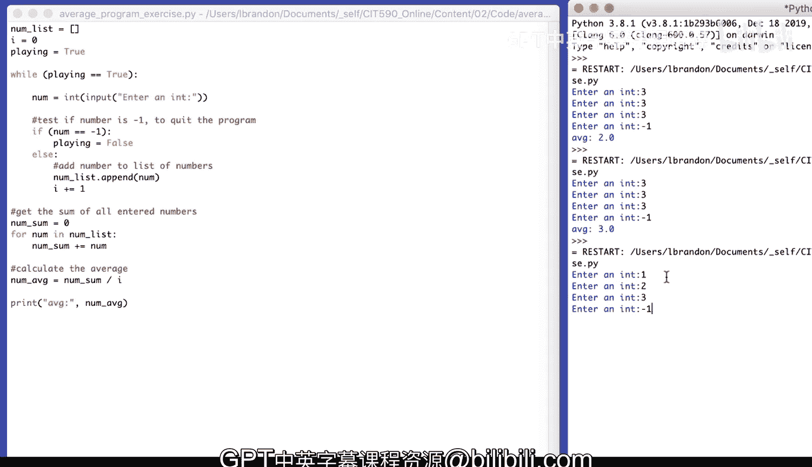

# 061：编程演示-平均值计算程序 📊

在本节课中，我们将学习如何编写一个Python程序，该程序会持续向用户请求输入整数，并计算这些输入数字的平均值。程序允许用户输入 `-1` 来退出循环并计算平均值。

## 概述与思路

我们将创建一个程序，其核心逻辑是：持续接收用户输入，将输入的数字存储起来，直到用户输入特定的退出指令（`-1`）。然后，程序会计算所有已输入数字的总和与平均值。



为了实现这个功能，我们需要使用一个**循环**来反复获取输入，并使用一个**列表**来存储所有输入的数字。同时，我们需要一个**计数器**来记录输入了多少个数字，以便后续计算平均值。

## 程序实现步骤

以下是构建此程序的具体步骤。

### 1. 初始化变量

首先，我们需要初始化几个关键的变量：
*   `num_list`：一个空列表，用于存储用户输入的所有数字。
*   `count`：一个计数器，初始值为 `0`，用于记录输入了多少个数字。
*   `playing`：一个布尔值标志，初始为 `True`，用于控制循环是否继续执行。

```python
num_list = []
count = 0
playing = True
```

### 2. 设置循环获取输入

接下来，我们使用一个 `while` 循环来反复请求用户输入。只要 `playing` 变量的值为 `True`，循环就会继续执行。

```python
while playing:
    # 获取用户输入
    num_input = int(input(“Enter an int: “))
```

### 3. 处理用户输入

在循环内部，我们需要对用户的输入进行判断和处理。这里有两种情况：
1.  如果用户输入 `-1`，则将 `playing` 标志设为 `False`，以便在下一次循环迭代前退出。
2.  否则，将输入的数字添加到列表中，并增加计数器。

```python
    if num_input == -1:
        playing = False
    else:
        num_list.append(num_input)
        count += 1
```

**请注意**：`if-else` 结构确保了退出指令 `-1` 不会被添加到数字列表中，也不会被计入总数。

### 4. 计算并输出平均值

当用户输入 `-1` 退出循环后，程序将执行循环之后的代码。我们需要计算列表中所有数字的总和，然后用总和除以数字的个数来得到平均值。

以下是计算和输出的代码：

```python
# 计算总和
num_sum = 0
for num in num_list:
    num_sum += num

# 计算平均值
num_average = num_sum / count

# 输出结果
print(“Average:”, num_average)
```

**核心公式**：平均值 = 总和 / 数量，即 **`average = sum / count`**。

## 完整代码与运行示例

将以上所有步骤组合起来，就得到了完整的程序。

```python
# 1. 初始化变量
num_list = []
count = 0
playing = True

# 2. 循环获取输入
while playing:
    num_input = int(input(“Enter an int: “))

    # 3. 处理输入
    if num_input == -1:
        playing = False
    else:
        num_list.append(num_input)
        count += 1

# 4. 计算并输出平均值
num_sum = 0
for num in num_list:
    num_sum += num

num_average = num_sum / count
print(“Average:”, num_average)
```

**运行示例**：
```
Enter an int: 3
Enter an int: 3
Enter an int: 3
Enter an int: -1
Average: 3.0
```
```
Enter an int: 1
Enter an int: 2
Enter an int: 3
Enter an int: -1
Average: 2.0
```

## 总结

本节课中，我们一起学习并实现了一个交互式的平均值计算程序。我们掌握了以下几个关键点：
1.  使用 `while` 循环和布尔标志来控制程序的持续运行。
2.  使用 `if-else` 语句对不同的用户输入（正常数字 vs 退出指令）进行分支处理。
3.  使用列表来动态存储数据，并使用 `for` 循环遍历列表以计算总和。
4.  应用 **`average = sum / count`** 这个基本公式来计算平均值。



这个程序是理解循环控制、条件判断和基础数据处理的经典示例。你可以尝试修改它，例如计算输入数字的最大值、最小值，或者允许用户输入小数。