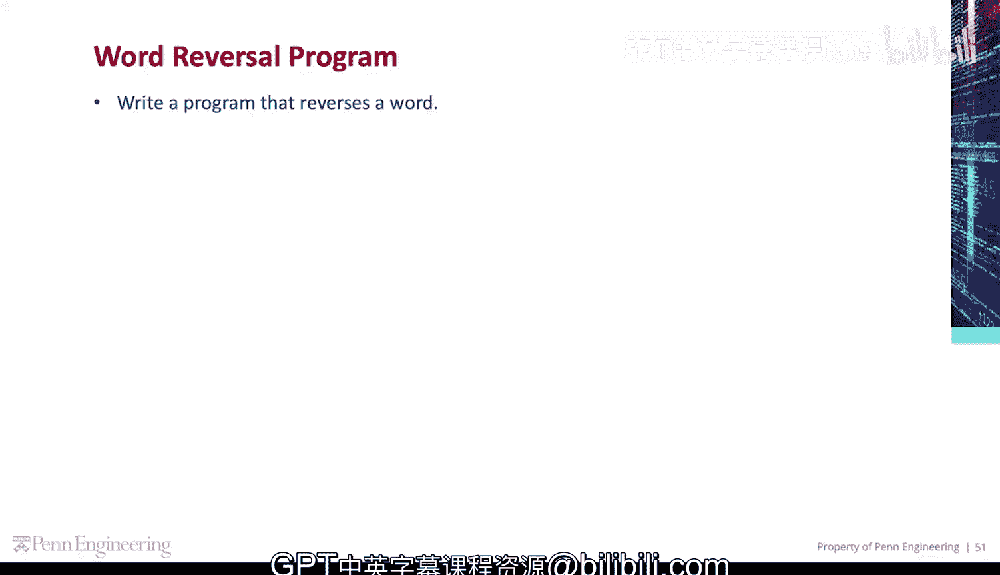
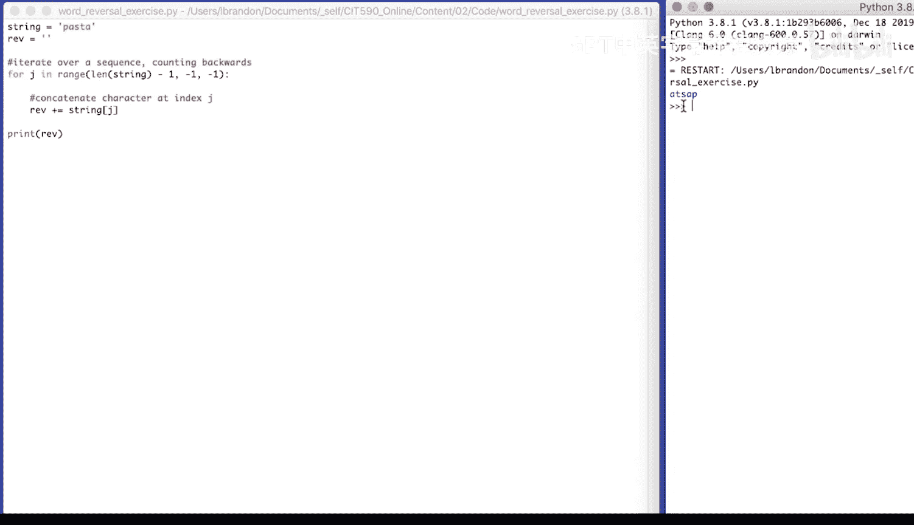

# 062：编程演示-单词反转 🔄

在本节课中，我们将学习如何编写一个Python程序来反转一个单词。我们将通过一个具体的例子，逐步讲解如何从后向前遍历字符串，并将字符拼接起来形成反转后的单词。

---

## 概述



我们的目标是编写一个程序，将一个给定的单词进行反转。例如，将单词 “pastor” 反转为 “rotsap”。我们将使用循环和字符串索引来实现这个功能。

---

## 程序实现步骤

以下是实现单词反转的具体步骤。

### 1. 初始化变量

首先，我们定义原始单词和一个用于存储反转结果的空字符串。

```python
word = "pastor"
rev = ""
```

### 2. 设计循环结构

接下来，我们需要遍历原始单词，但是顺序是从后向前。我们将使用 `range` 函数来生成一个递减的索引序列。

```python
for j in range(len(word) - 1, -1, -1):
```

**公式解释**：
*   `len(word) - 1`：这是循环的起始索引，即单词的最后一个字符的位置。
*   `-1`：这是循环的结束条件，表示索引大于 `-1` 时循环继续，即索引为 `0` 时仍会执行。
*   `-1`：这是步长，表示每次循环索引 `j` 减少 `1`。

### 3. 拼接字符

在循环体内，我们根据当前索引 `j` 获取单词中的字符，并将其拼接到 `rev` 字符串的前面。

```python
    rev = rev + word[j]
```

**代码解释**：
*   `word[j]`：获取 `word` 字符串中索引为 `j` 的字符。
*   `rev + word[j]`：将当前字符连接到 `rev` 字符串的末尾。

### 4. 输出结果

循环结束后，`rev` 字符串中存储的就是反转后的单词。我们将其打印出来。

```python
print(rev)
```

---

## 完整代码示例

将以上所有步骤组合起来，就得到了完整的单词反转程序。

```python
word = "pastor"
rev = ""

for j in range(len(word) - 1, -1, -1):
    rev = rev + word[j]

print(rev)
```

运行这段代码，控制台将输出：
```
rotsap
```

---

## 总结



本节课中，我们一起学习了如何用Python实现单词反转。核心要点包括：
1.  使用 `range` 函数生成反向索引序列。
2.  通过字符串索引 `word[j]` 访问特定位置的字符。
3.  利用字符串拼接操作逐步构建反转后的结果。

通过这个简单的例子，我们掌握了循环和字符串处理的基本配合方式，这是编程中非常常见的模式。