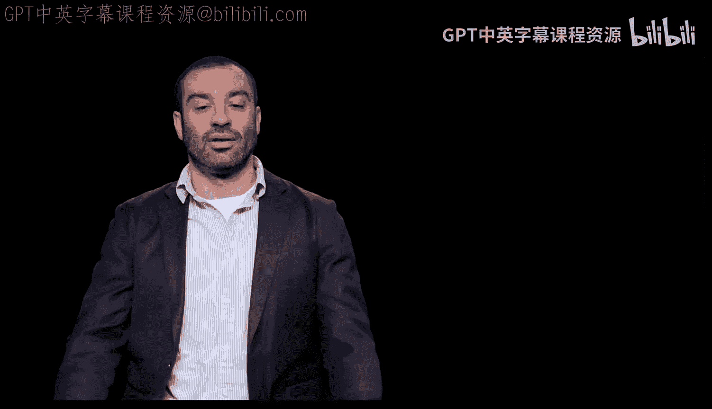
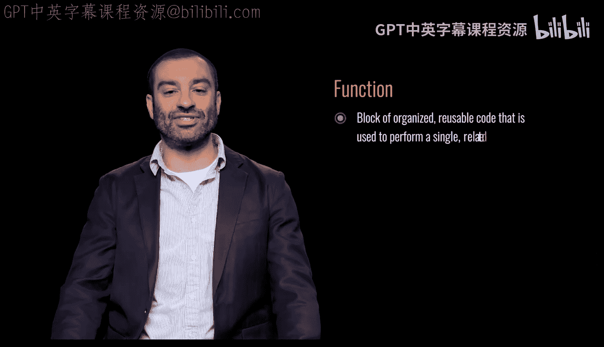
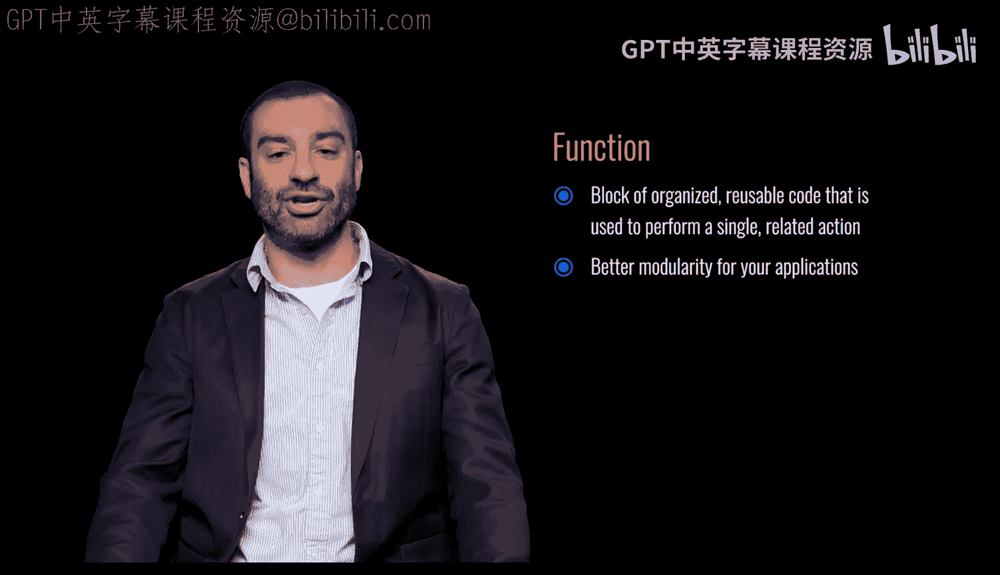
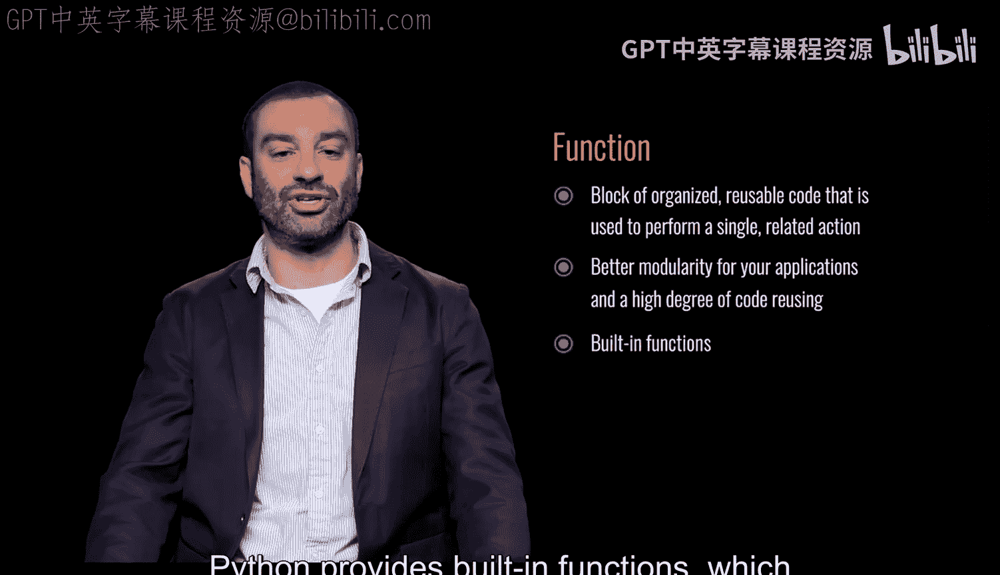
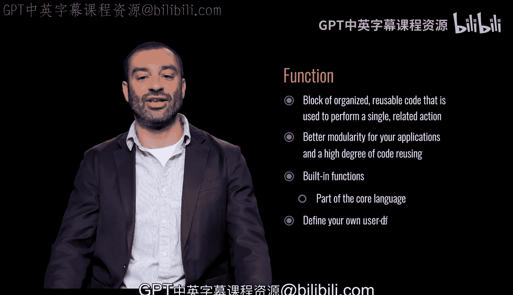

# 063：什么是函数 👨‍💻

在本节课中，我们将要学习编程中一个非常核心的概念：**函数**。理解函数是编写高效、可维护代码的关键一步。

## 概述



函数是组织好的、可重复使用的代码块，用于执行一个单一相关的操作。函数为你的应用程序提供了更好的模块化特性，并实现了高度的代码重用。

## 函数的基本概念

上一节我们概述了函数的重要性，本节中我们来看看函数的具体定义和作用。

函数是一个**有组织的、可重用的代码块**，它被用来执行一个**单一相关的操作**。这意味着你可以将一段完成特定任务的代码打包起来，给它起一个名字，然后在需要的时候反复调用它，而无需重复编写相同的代码。

## 函数的好处

了解了函数是什么之后，我们来看看使用函数能带来哪些具体的好处。



使用函数主要有两大优势：
*   **更好的模块化**：函数将复杂的程序分解成一个个小的、功能明确的模块。这使得代码结构更清晰，更容易理解和维护。
*   **高度的代码重用**：一旦定义了一个函数，你就可以在程序的任何地方多次调用它。这避免了代码重复，提高了开发效率。



## Python中的函数

我们已经讨论了函数的通用概念，现在让我们聚焦到Python语言中，看看函数是如何实现的。

Python本身提供了许多**内置函数**，这些是核心语言的一部分，例如 `print()`、`len()` 等，你可以直接使用它们。

同时，Python也允许你**定义自己的函数**，这是你构建复杂程序的基础。定义函数的语法通常如下：

```python
def 函数名(参数):
    # 函数体：执行操作的代码
    return 返回值 #（可选）
```



## 总结



本节课中我们一起学习了**函数**的概念。我们了解到函数是一个用于执行特定任务的可重用代码块，它能带来模块化和代码重用的好处。我们还知道了Python既提供了内置函数，也允许我们自定义函数来构建程序。

掌握函数是编程旅程中的一个重要里程碑，它将帮助你写出更优雅、更强大的代码。