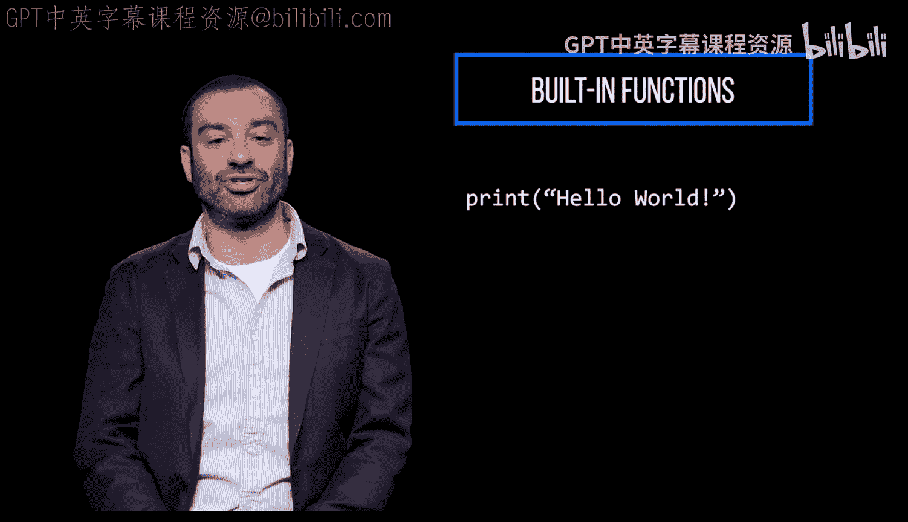
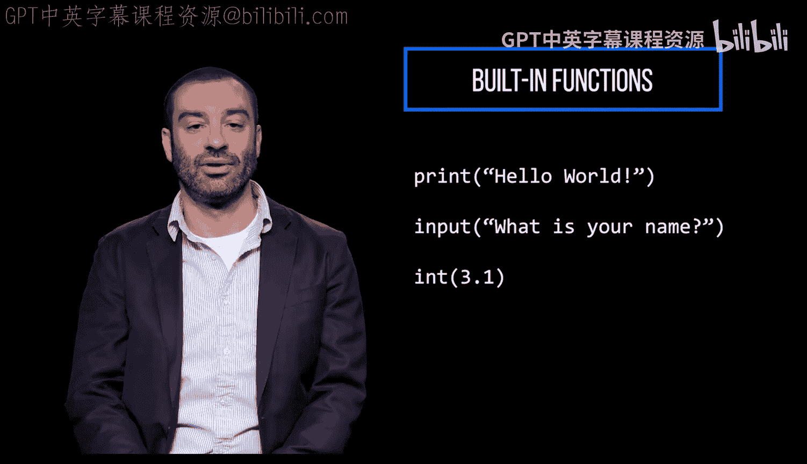
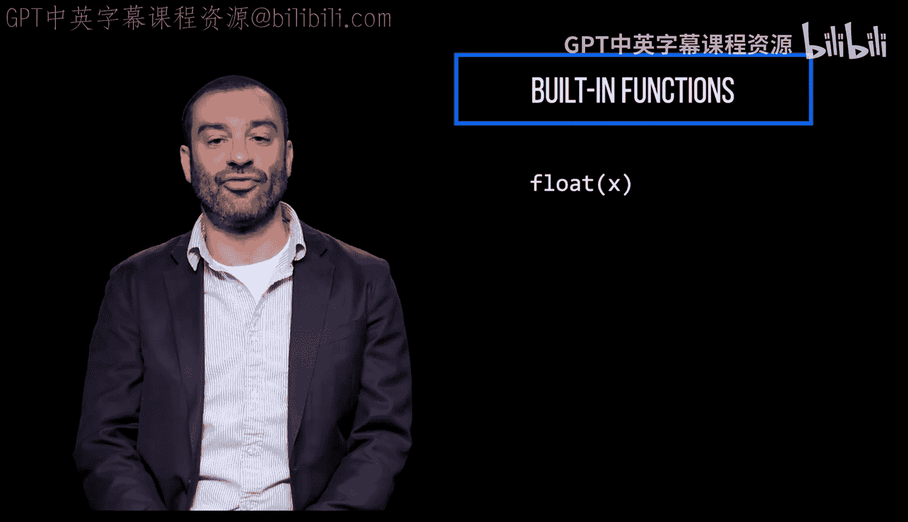
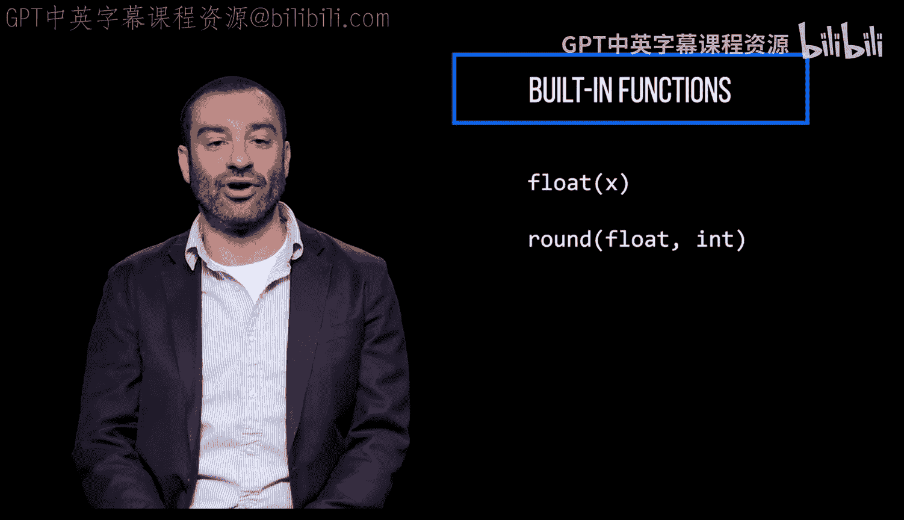
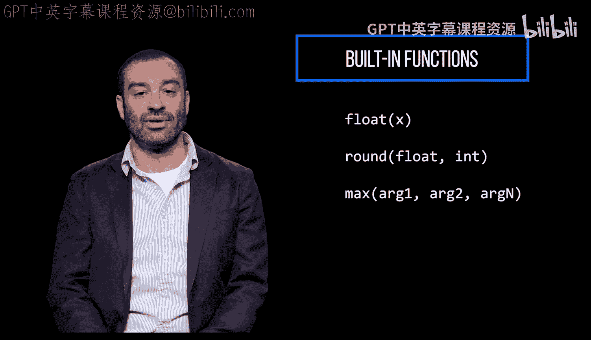
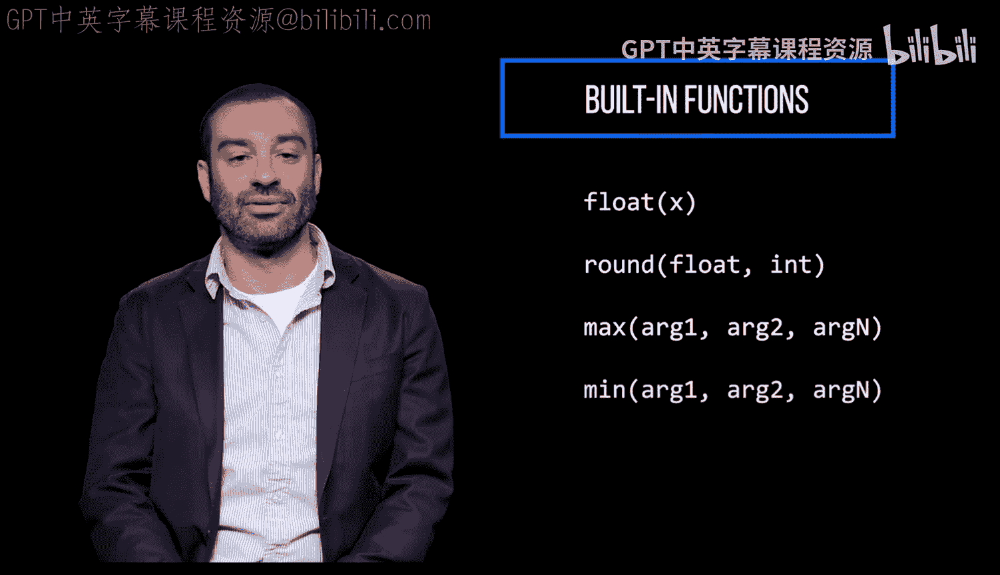
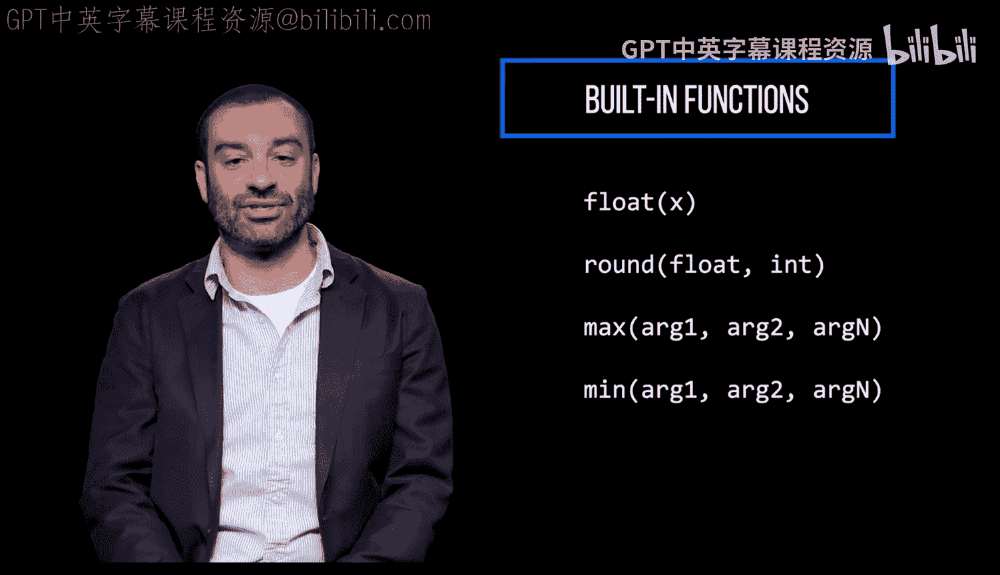
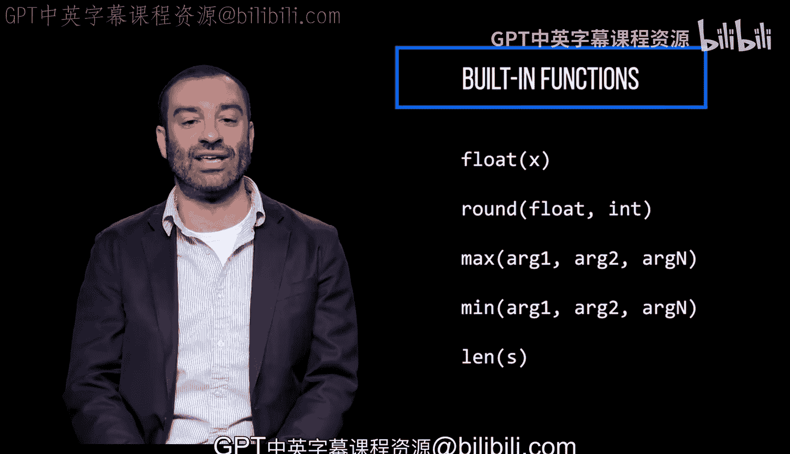

# 064：内置函数 📚

在本节课中，我们将要学习Python中的内置函数。你已经使用过一些内置函数，例如用于打印字符串的`print`函数和用于获取用户输入的`input`函数。本节将系统地介绍其他几个常用的内置函数，帮助你更高效地处理数据。

## 已使用的内置函数回顾

在之前的课程中，你已经接触过几个核心的内置函数。


以下是几个你已经熟悉的内置函数示例：



*   `print()`: 用于向控制台输出信息。
    ```python
    print("Hello, World!")
    ```
*   `input()`: 用于从用户那里获取输入。
    ```python
    name = input("请输入你的名字：")
    ```
*   `int()`: 用于将其他数据类型（如字符串）转换为整数。
    ```python
    num_str = "10"
    num_int = int(num_str)  # 结果是整数 10
    ```

## 更多内置函数介绍

上一节我们回顾了已学的函数，本节中我们来看看其他几个非常有用的内置函数。


### `float()` 函数



`float()`函数用于将给定的字符串或整数转换为浮点数（即小数）。

```python
result = float("3.14")  # 结果是浮点数 3.14
```

### `round()` 函数



`round()`函数用于对给定的浮点数进行四舍五入。你可以指定要保留的小数位数。

```python
rounded_num = round(3.14159, 2)  # 结果是 3.14
```

### `max()` 与 `min()` 函数



`max()`函数用于获取给定参数中的最大值。

```python
maximum = max(5, 1, 8, 3)  # 结果是 8
```



类似地，`min()`函数用于获取给定参数中的最小值。

```python
minimum = min(5, 1, 8, 3)  # 结果是 1
```



### `len()` 函数



`len()`函数用于获取给定对象的长度或其中包含的项目数量。它常用于字符串、列表等。

```python
length = len("Python")  # 结果是 6
```

## 总结



本节课中我们一起学习了Python的几个重要内置函数。我们回顾了`print()`、`input()`和`int()`，并新学习了`float()`用于类型转换、`round()`用于数值舍入、`max()`和`min()`用于找最值，以及`len()`用于获取长度。熟练运用这些内置函数是进行有效Python编程的基础。