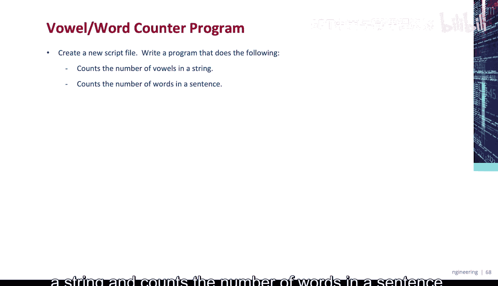
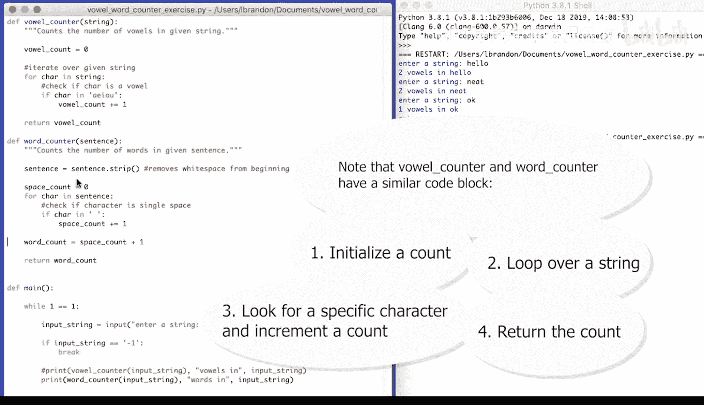
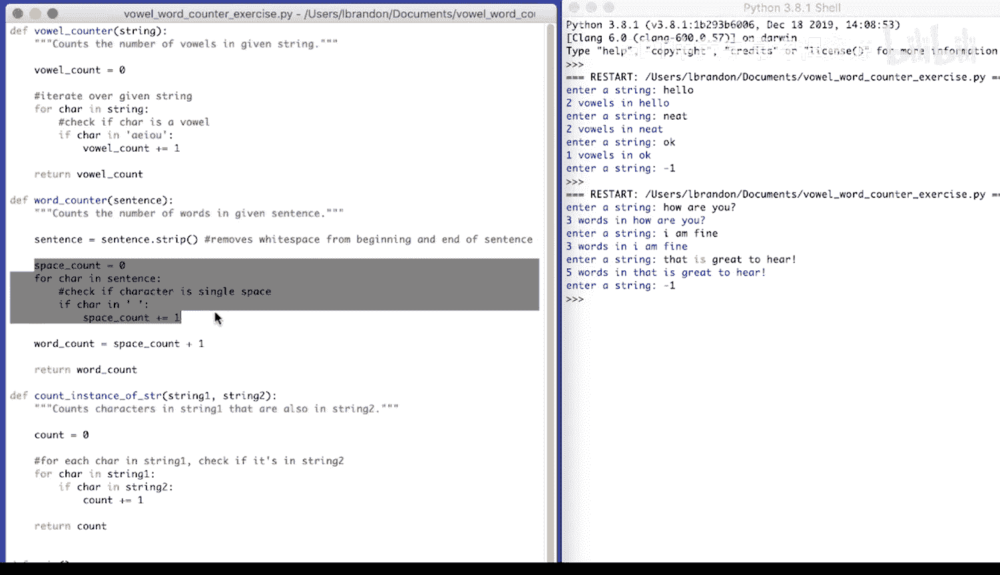
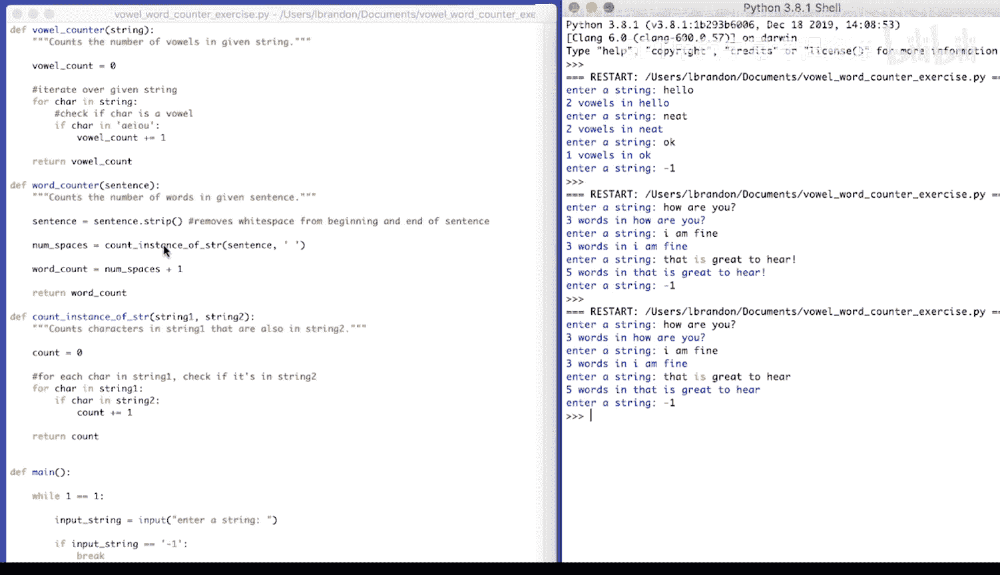
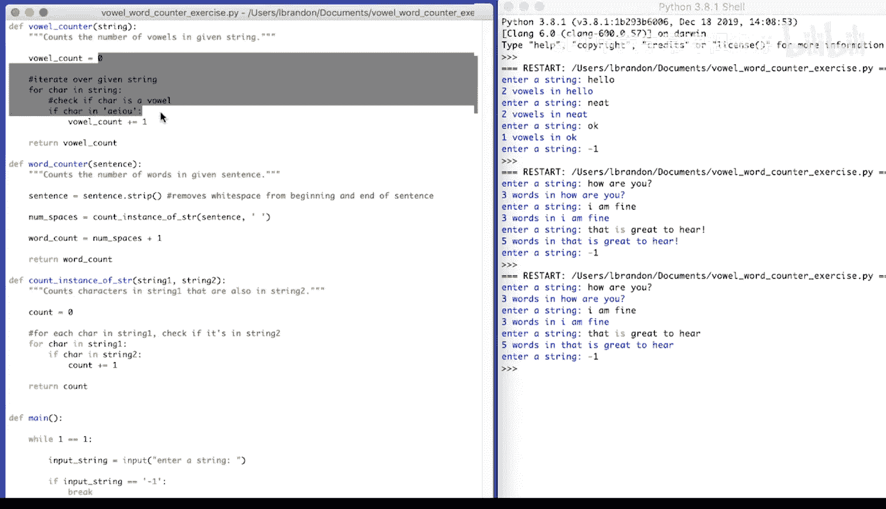
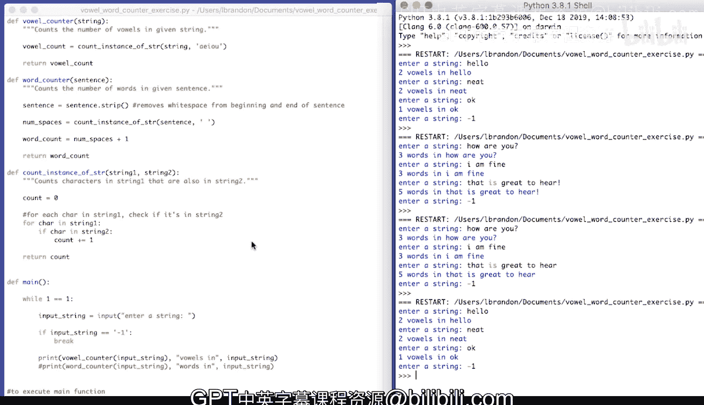

# 073：编程演示-元音单词计数器 🧮



在本节课中，我们将学习如何编写一个Python程序，该程序能够统计字符串中的元音字母数量以及句子中的单词数量。我们将从创建两个独立的功能开始，然后通过代码重构将它们合并到一个更通用的函数中，以提高代码的复用性和清晰度。

## 创建元音计数器函数

首先，我们创建一个名为 `vowel_counter` 的函数，用于统计给定字符串中的元音字母（A, E, I, O, U）数量。

以下是实现步骤：
1.  初始化一个计数器变量。
2.  遍历字符串中的每一个字符。
3.  检查当前字符是否为元音字母。
4.  如果是元音字母，则计数器加一。
5.  函数返回最终的计数结果。

```python
def vowel_counter(given_string):
    vowel_count = 0
    for character in given_string:
        if character in "AEIOUaeiou":
            vowel_count += 1
    return vowel_count
```

## 创建主函数循环

接下来，我们创建一个 `main` 函数。该函数包含一个无限循环，允许用户重复输入字符串进行元音计数，直到输入特定的退出指令（例如 `-1`）为止。

```python
def main():
    while True:
        input_string = input("Enter a string: ")
        if input_string == "-1":
            break
        count = vowel_counter(input_string)
        print(f"{count} vowels in '{input_string}'")
```

为了在直接运行此脚本时执行 `main` 函数，我们使用 Python 的特殊变量 `__name__`。

```python
if __name__ == "__main__":
    main()
```

## 创建单词计数器函数

上一节我们介绍了如何统计元音，本节中我们来看看如何统计句子中的单词数量。我们假设单词之间由单个空格分隔。

以下是实现步骤：
1.  使用 `strip()` 方法去除句子首尾的空白字符。
2.  初始化一个空格计数器。
3.  遍历句子中的每个字符，检查它是否为空格。
4.  单词数量等于空格数量加一。

```python
def word_counter(sentence):
    sentence = sentence.strip()
    space_count = 0
    for char in sentence:
        if char == " ":
            space_count += 1
    word_count = space_count + 1
    return word_count
```

创建完成后，我们可以修改 `main` 函数，调用 `word_counter` 来测试其功能。

## 代码重构：创建通用计数函数

观察 `vowel_counter` 和 `word_counter` 函数，我们发现它们具有相似的结构：都是遍历一个字符串，并统计其中符合特定条件的字符数量。



为了提高代码的复用性，我们可以创建一个通用的函数 `count_instance_of_str`。

这个函数接收两个参数：`string1` 和 `string2`。它的功能是统计 `string1` 中有多少个字符也出现在 `string2` 中。

```python
def count_instance_of_str(string1, string2):
    count = 0
    for character in string1:
        if character in string2:
            count += 1
    return count
```



现在，我们可以利用这个通用函数来重写（重构）之前的两个专用函数。

以下是重构后的 `vowel_counter` 函数：
```python
def vowel_counter(given_string):
    vowel_count = count_instance_of_str(given_string, "AEIOUaeiou")
    return vowel_count
```

以下是重构后的 `word_counter` 函数。注意，我们统计的是空格的数量，因此 `string2` 参数是一个空格字符 `" "`。
```python
def word_counter(sentence):
    sentence = sentence.strip()
    space_count = count_instance_of_str(sentence, " ")
    word_count = space_count + 1
    return word_count
```



最后，更新 `main` 函数以同时或分别调用这两个功能，程序的核心逻辑就完成了。



## 总结



本节课中我们一起学习了如何构建一个具有交互功能的字符串处理程序。我们从编写独立的元音计数器和单词计数器开始，然后通过识别代码中的重复模式，创建了一个通用的字符计数函数 `count_instance_of_str` 来重构代码。这个过程展示了函数封装和代码重构的基本思想，它们能让程序变得更简洁、更易于维护和扩展。