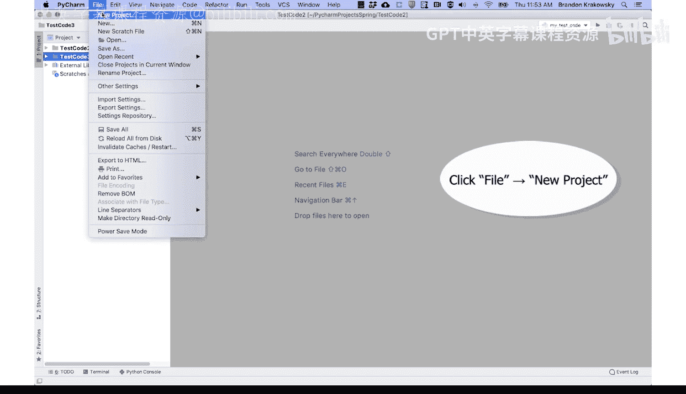
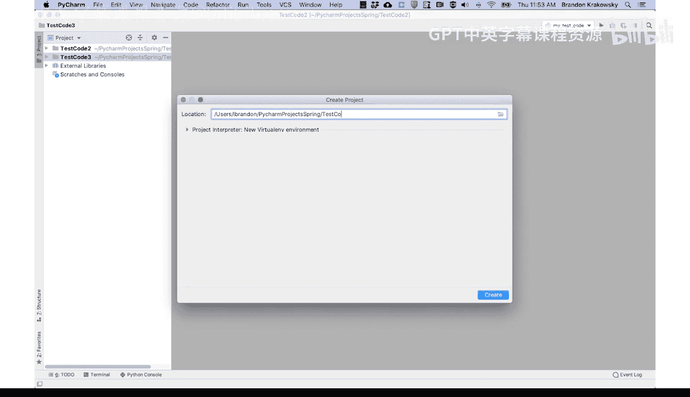
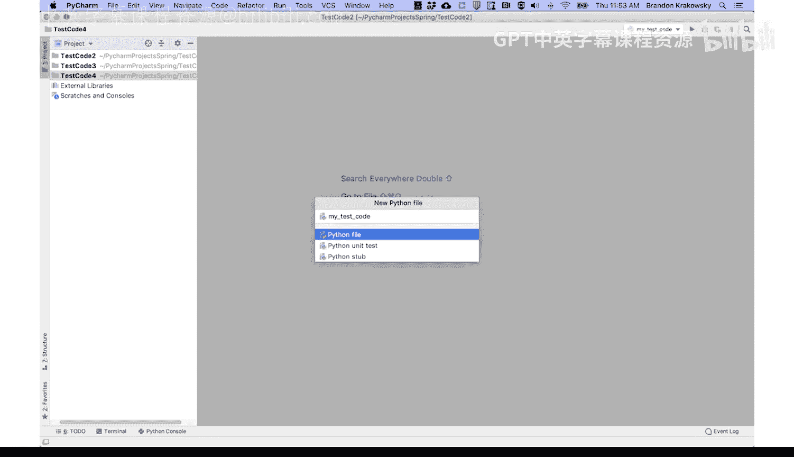
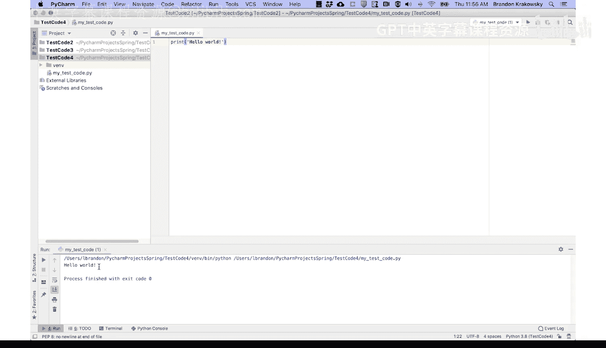

# 077：运行代码 🚀

在本节课中，我们将学习如何在PyCharm集成开发环境中创建项目、编写Python脚本并运行代码。我们将从打开PyCharm开始，逐步完成创建项目、新建Python文件、编写代码以及执行脚本的完整流程。

---

## 创建新项目

上一节我们介绍了PyCharm的安装，本节中我们来看看如何创建一个新的项目。

下载并安装PyCharm后，打开IDE并创建一个新项目。操作路径为：**File** -> **New Project**。

为项目命名。

点击“Create”。你可以选择将项目附加到当前窗口。

---

## 在项目中创建Python文件

成功创建项目后，下一步是在项目中创建Python脚本文件。

在左侧选中项目，然后依次点击 **File** -> **New** -> **Python File**。接着为你的Python文件命名。

按下回车键。这将在项目中创建一个Python文件，你可以在左侧的项目导航器中看到你的项目及其包含的文件。

---

## 编写并运行代码

现在我们已经有了项目结构，接下来看看如何编写和运行Python代码。

在PyCharm中运行代码，首先需要将代码输入到脚本文件中并保存。以下是运行脚本的步骤：

1.  在创建的Python文件中输入代码。
2.  保存该文件。
3.  要运行脚本，可以点击菜单栏的 **Run** -> **Run**。
4.  或者，使用键盘快捷键 **Control + Option + R**（在Mac上；Windows/Linux上通常是 **Ctrl + Shift + F10** 或 **Shift + F10**）。
5.  选择要运行的文件。

随后，你将在IDE底部看到代码的输出结果。

---

本节课中我们一起学习了在PyCharm中创建项目、新建Python文件以及运行代码的基本操作。掌握这些步骤是开始Python编程实践的第一步。