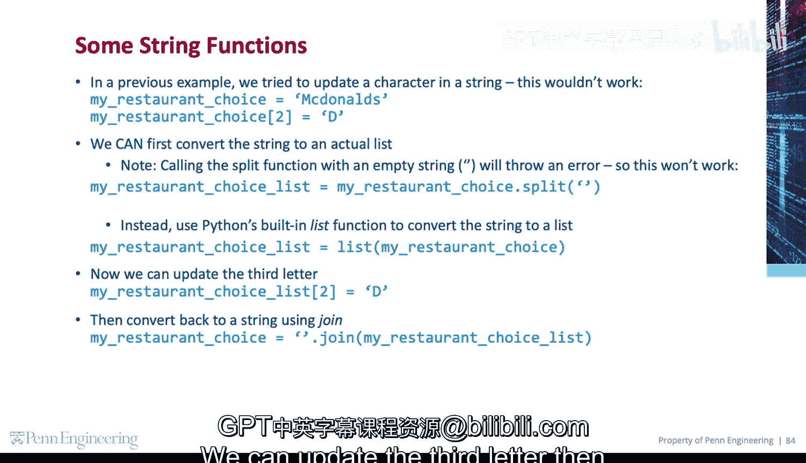
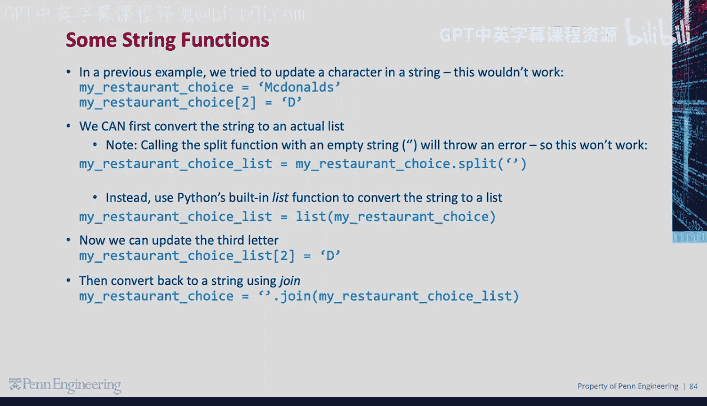

# 085：字符串的分割与连接

在本节课中，我们将要学习Python中两个非常实用的字符串方法：`split`（分割）和`join`（连接）。它们能帮助我们在字符串和列表之间进行灵活的转换，是处理文本数据的基础。

## 使用 `split` 方法分割字符串

`split` 是一个有用的字符串方法，用于将一个字符串分割成一个由多个字符串组成的列表。

例如，我们定义一个变量 `colors` 并存储一个字符串。由于该字符串中包含逗号，我们可以使用 `split` 方法，以逗号字符作为分隔符，将字符串分割成一个字符串列表。

以下是具体操作步骤：
1.  定义一个包含逗号分隔颜色的字符串。
2.  调用 `split` 方法并指定分隔符为逗号。
3.  结果 `colors_list` 将是一个字符串列表。

```python
colors = "red,green,blue"
colors_list = colors.split(",")
# 现在 colors_list 是 ['red', 'green', 'blue']
```
列表中第三个字符串（即颜色）将是 “green”。

## 使用 `join` 方法连接列表

与分割相反，`join` 方法能从多个字符串组成的列表中创建一个单一的字符串。

这里，我们使用定义为逗号字符的分隔符来连接字符串列表。

以下是具体操作步骤：
1.  准备一个字符串列表。
2.  在分隔符字符串（如逗号）上调用 `join` 方法，并将列表作为参数传入。
3.  结果 `new_colors` 将是一个包含所有三个颜色的字符串。

```python
colors_list = ['red', 'green', 'blue']
new_colors = ",".join(colors_list)
# 现在 new_colors 是 "red,green,blue"
```

## 结合使用以修改字符串

在之前的例子中，我们曾尝试直接更新字符串中的某个字符，但这是行不通的，因为字符串在Python中是不可变的。

我们可以先将字符串转换为一个真正的列表。但是，使用空字符串调用 `split` 函数会引发错误，所以 `split("")` 这个方法不可行。

正确的做法是使用Python内置的 `list` 函数将字符串转换为字符列表。

以下是修改字符串中特定字符的完整流程：
1.  使用 `list()` 将字符串转换为列表。
2.  在列表中更新目标位置的字符。
3.  使用 `join` 方法将列表转换回字符串。



```python
my_string = "hello"
# 1. 转换为列表
my_list = list(my_string)  # ['h', 'e', 'l', 'l', 'o']
# 2. 更新第三个字母（索引为2）
my_list[2] = 'x'
# 3. 转换回字符串
new_string = "".join(my_list)  # "hexlo"
```



本节课中我们一起学习了字符串的 `split` 和 `join` 方法。`split` 用于将字符串按指定分隔符拆分为列表，而 `join` 则用于将列表中的元素合并为一个字符串。通过结合使用 `list()` 和 `join()`，我们可以巧妙地修改原本不可变的字符串。掌握这些方法是进行文本处理的关键步骤。