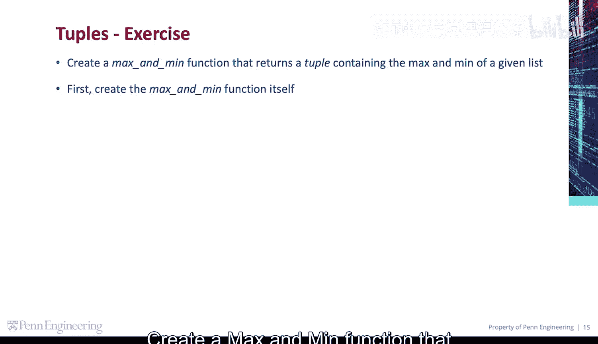
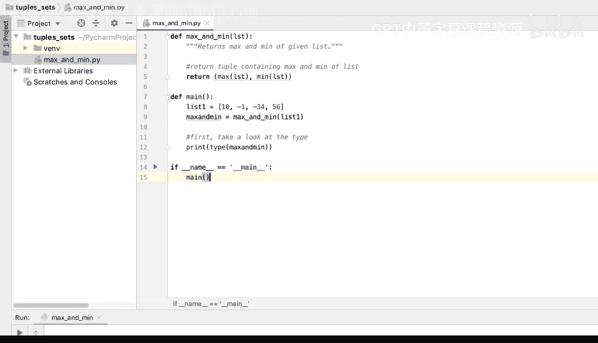
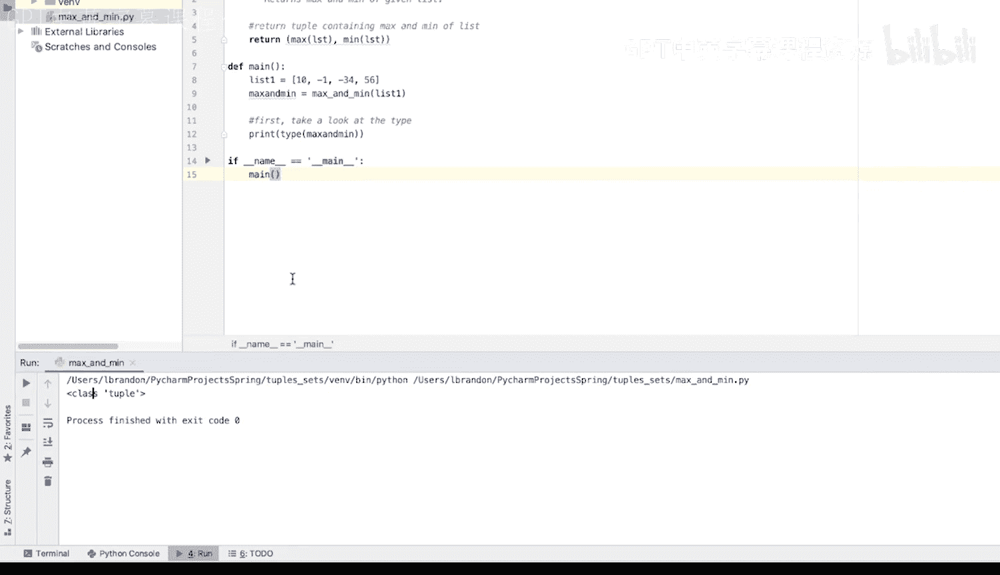
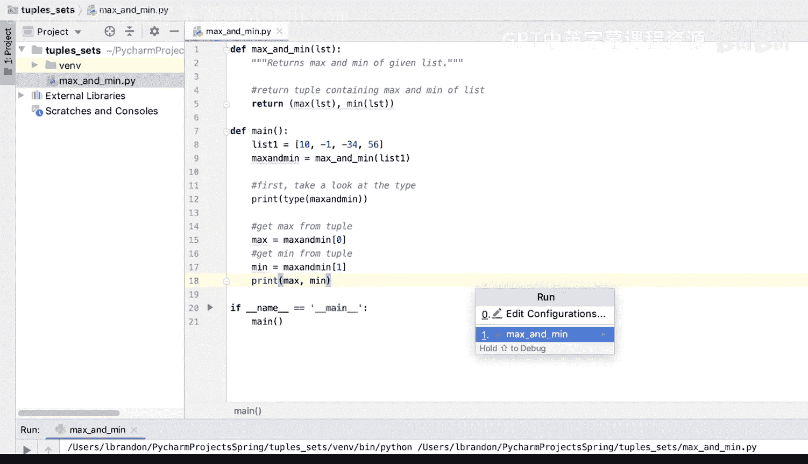
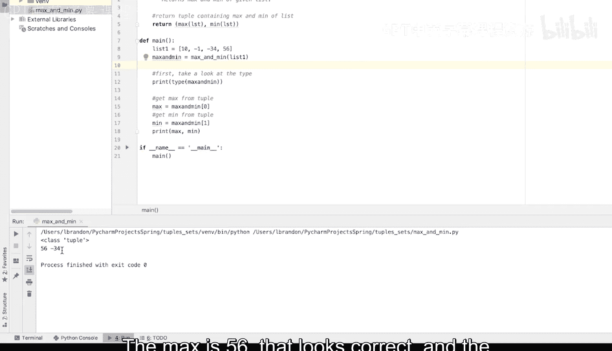
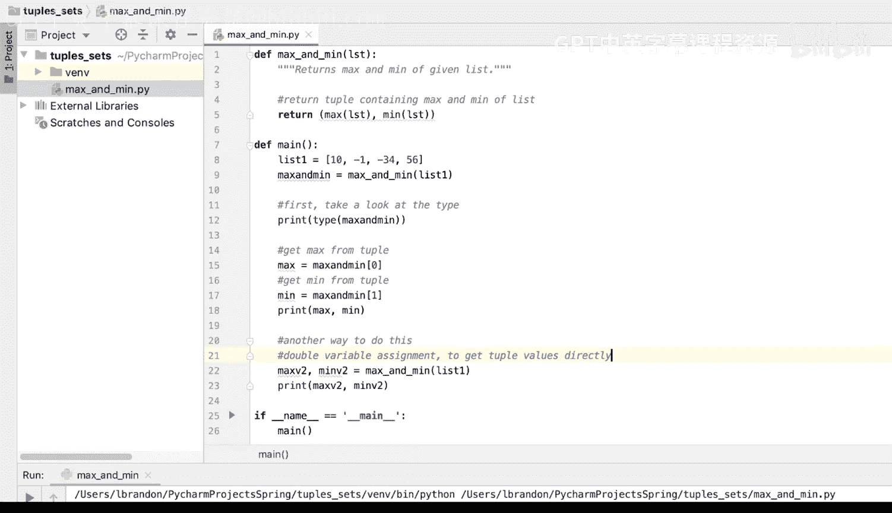
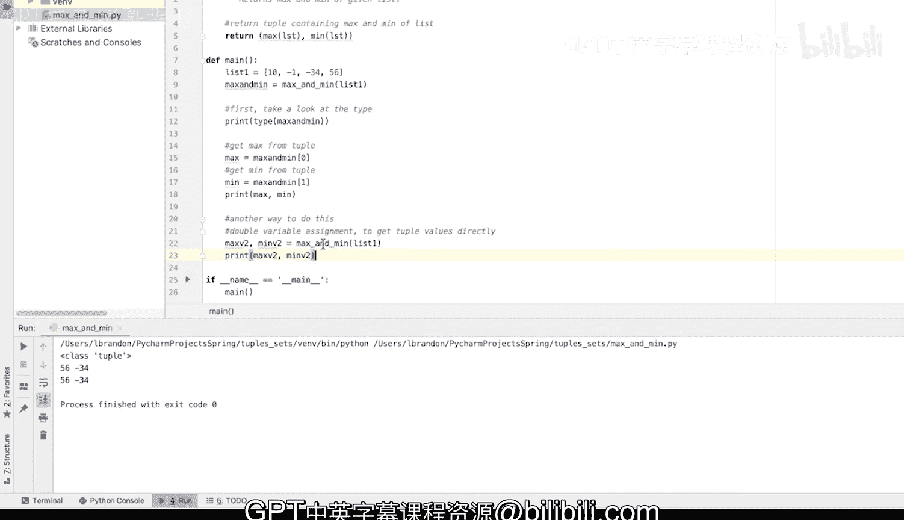

# 087：代码练习-最大值最小值函数 📊

在本节课中，我们将学习如何编写一个函数，该函数接收一个列表，并返回一个包含该列表中最大值和最小值的元组。我们将使用Python内置的`max()`和`min()`函数，并探索两种不同的方法来处理函数返回的元组。



---

## 概述

我们将创建一个名为`max_and_min`的函数。这个函数接受一个列表作为参数，使用Python内置的`max()`和`min()`函数找出列表中的最大值和最小值，然后将这两个值作为一个元组返回。之后，我们将在主函数中调用它，并学习如何从返回的元组中提取值。

---

## 创建最大值最小值函数

首先，我们定义`max_and_min`函数。该函数接收一个列表，并返回一个包含该列表最大值和最小值的元组。

```python
def max_and_min(given_list):
    """
    返回一个包含给定列表最大值和最小值的元组。
    """
    max_value = max(given_list)  # 使用内置max函数获取最大值
    min_value = min(given_list)  # 使用内置min函数获取最小值
    return (max_value, min_value)  # 返回包含这两个值的元组
```

函数内部，我们使用`max(given_list)`获取列表的最大值，使用`min(given_list)`获取列表的最小值。通过将这两个值放在括号`()`内，我们创建并返回了一个元组。

---

## 编写主函数进行测试

为了测试我们的函数，我们需要编写一个主函数。在主函数中，我们将创建一个列表，调用`max_and_min`函数，并打印结果。



上一节我们介绍了`max_and_min`函数的定义，本节中我们来看看如何在主程序中使用它。

以下是主函数的实现步骤：



1.  创建一个测试列表。
2.  调用`max_and_min`函数，并将返回的元组赋值给一个变量。
3.  打印该变量的类型以确认它是元组。
4.  通过索引从元组中提取最大值和最小值并打印。

```python
def main():
    # 1. 创建一个测试列表
    list1 = [10, -1, -34, 56]

    # 2. 调用函数并将返回的元组赋值给变量
    max_min_tuple = max_and_min(list1)

    # 3. 打印返回值的类型
    print(type(max_min_tuple))  # 输出：<class 'tuple'>

    # 4. 通过索引从元组中提取值
    max_value = max_min_tuple[0]  # 获取元组的第一个元素（最大值）
    min_value = max_min_tuple[1]  # 获取元组的第二个元素（最小值）

    print(f"最大值: {max_value}")  # 输出：最大值: 56
    print(f"最小值: {min_value}")  # 输出：最小值: -34
```

运行上述代码，我们可以看到函数正确返回了元组`(56, -34)`，并且我们成功通过索引提取了这两个值。

---



## 使用元组解包赋值

除了通过索引访问元组元素，Python还提供了一种更简洁的方法，称为“元组解包”或“多重赋值”。这种方法允许我们将元组中的值直接赋值给多个变量。



上一节我们通过索引手动提取了元组中的值，本节中我们来看看一种更高效的赋值方法。

以下是使用元组解包的步骤：

1.  在调用函数时，直接将返回的元组解包到两个变量中。
2.  这两个变量会分别被赋值为元组中的第一个和第二个元素。

```python
def main():
    list1 = [10, -1, -34, 56]

    # 使用元组解包直接赋值
    max_val_2, min_val_2 = max_and_min(list1)

    print(f"最大值 (方法二): {max_val_2}")  # 输出：最大值 (方法二): 56
    print(f"最小值 (方法二): {min_val_2}")  # 输出：最小值 (方法二): -34
```

通过`max_val_2, min_val_2 = max_and_min(list1)`这行代码，我们一次性完成了函数调用和值提取两个步骤，代码更加简洁易读。

---

## 总结

本节课中我们一起学习了如何完成一个关于元组的代码练习。我们主要掌握了以下内容：



1.  **定义函数**：创建了`max_and_min`函数，它利用内置的`max()`和`min()`函数计算列表的极值，并以元组形式返回。
2.  **处理返回值**：学会了如何调用函数，并通过索引（如`tuple[0]`）从返回的元组中提取特定值。
3.  **使用元组解包**：掌握了更高效的元组解包技巧，可以直接将函数返回的元组元素赋值给多个变量，简化了代码。



这个练习巩固了函数定义、返回值以及元组操作的基本概念，这些都是Python编程中的重要基础。