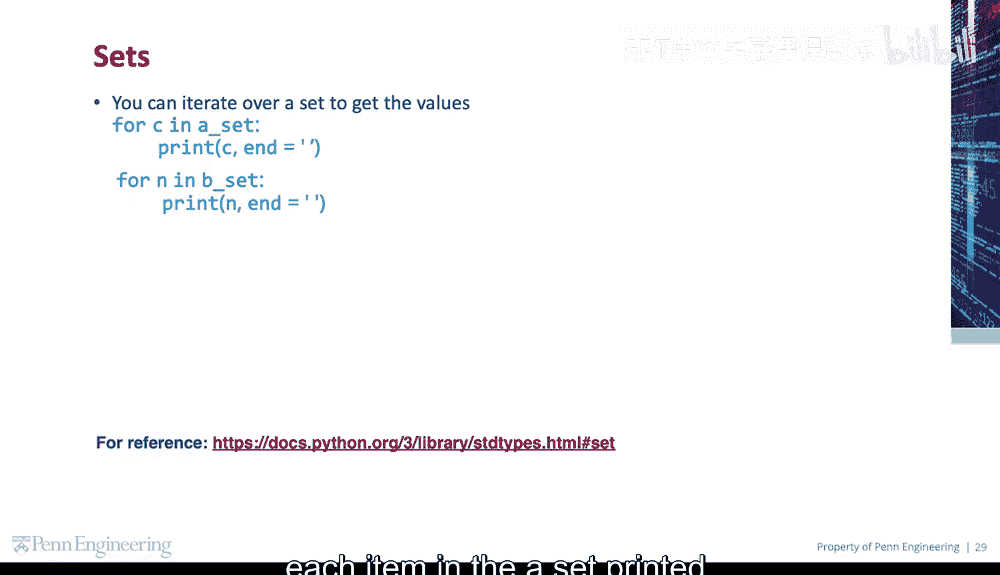
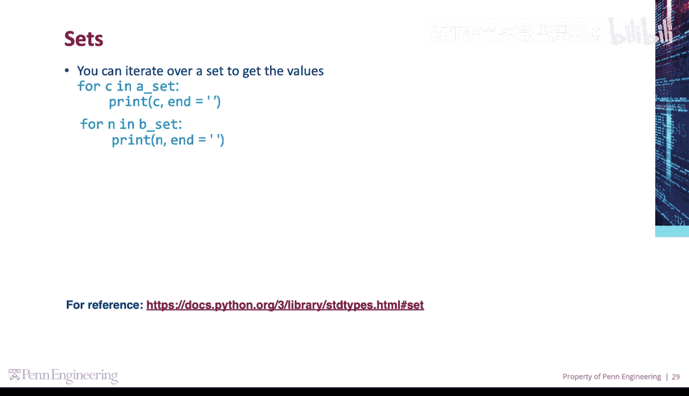
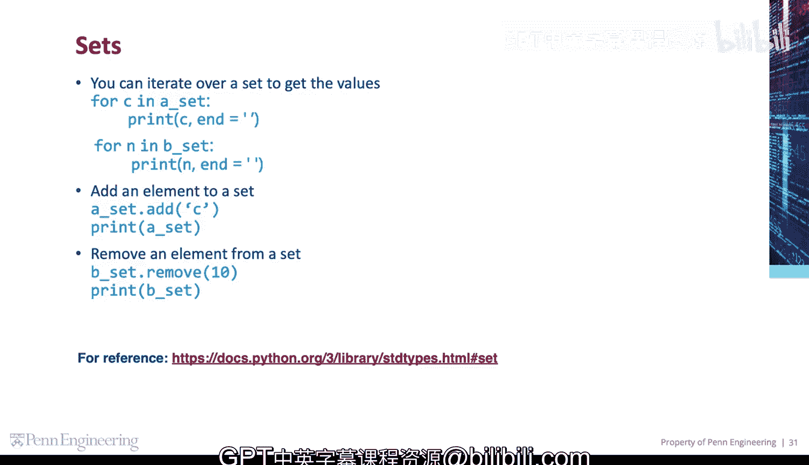
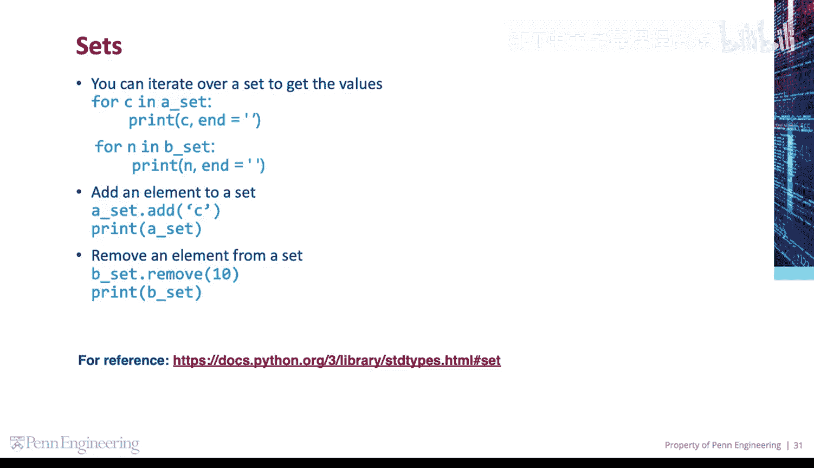

Python与Java编程入门：第3章第2节：遍历与更新集合 🔄

在本节课中，我们将要学习如何遍历集合中的元素，以及如何向集合中添加或移除元素。这些操作是管理和使用集合数据的基础。

---


上一节我们介绍了集合的基本概念和创建方法。本节中我们来看看如何访问集合中的每一个元素。

你可以遍历一个集合，以获取其中的每一个独立元素。

以下是遍历集合 `A` 并打印每个元素的代码示例：
```python
for item in A:
    print(item)
```

---

同样地，我们也可以遍历另一个集合 `B`。



以下是遍历集合 `B` 并打印每个元素的代码示例：
```python
for item in B:
    print(item)
```

---



遍历集合让我们能够查看所有内容。接下来，我们将学习如何动态地修改集合的内容。

这里，我们向集合 `A` 中添加一个字符串元素。操作如下：
```python
A.add("new_string")
```

---

集合的修改也包括移除元素。

这里，我们从集合 `B` 中移除一个整数元素。操作如下：
```python
B.remove(some_integer)
```



---



通过以上操作，我们可以灵活地管理集合中的数据。

本节课中我们一起学习了遍历集合的两种方法，以及如何使用 `add` 和 `remove` 方法来更新集合中的元素。掌握这些操作是有效使用集合类型的关键。