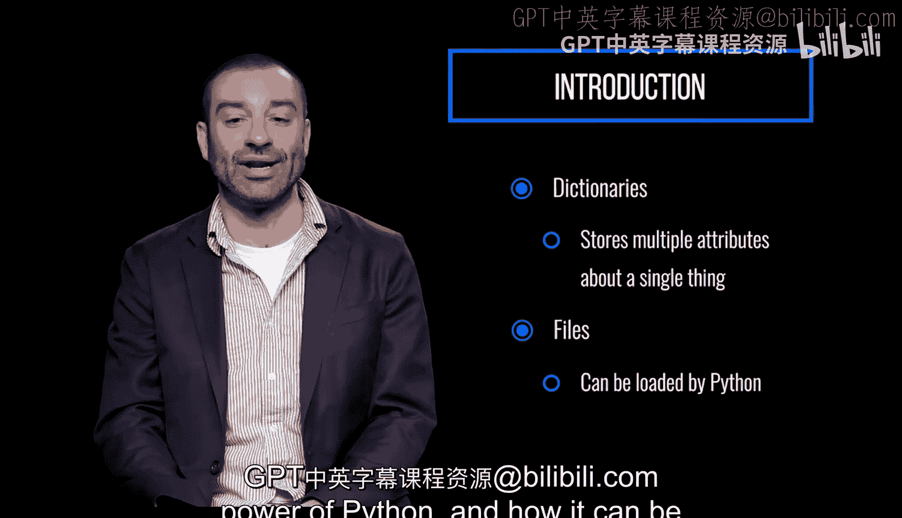

# 090：模块介绍


在本节课中，我们将学习Python中加载和存储数据的多种方式。我们将重点介绍字典这一数据结构，并学习如何与外部文件进行交互。

Python提供了多种加载和存储数据的方式。

信息可以保存在字典中。字典是一种数据结构，对于存储单个事物的多个属性或数据点极为有用。

数据也可以存储在外部的文件中，然后加载到Python中。

本模块将使我们能够以多种方式使用字典，并通过打开、读取和写入外部文件来与本地文件系统进行交互。

掌握了这些新增技能后，你将开始更好地理解Python的动态能力，以及它如何能轻松地与其他系统集成。

---

上一节我们概述了本模块的学习目标，本节中我们来看看具体的数据存储方式。

以下是两种主要的数据处理方式：

*   **使用字典**：字典用于存储键值对，非常适合组织具有多个属性的数据。
    *   **核心概念示例**：`student = {"name": "Alice", "age": 20, "major": "Computer Science"}`
*   **使用外部文件**：数据可以保存在文本文件（如`.txt`）、CSV文件或JSON文件中，程序可以读取这些文件或将数据写入其中。
    *   **核心操作示例**：
        ```python
        # 打开并读取文件
        with open('data.txt', 'r') as file:
            content = file.read()
        # 写入文件
        with open('output.txt', 'w') as file:
            file.write('Hello, World!')
        ```

---



本节课中我们一起学习了Python中两种核心的数据管理方法：使用字典在内存中结构化数据，以及通过文件操作与外部存储系统进行数据交换。这些技能是构建更复杂、能处理现实世界数据的Python应用程序的基础。