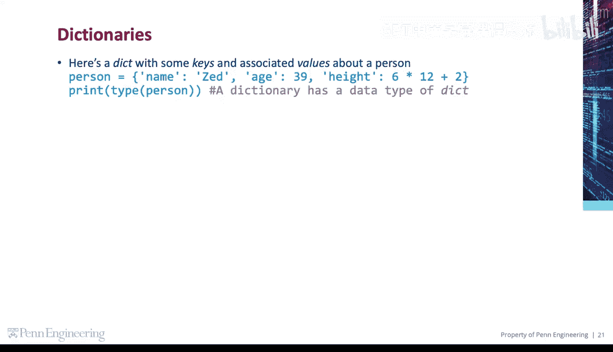
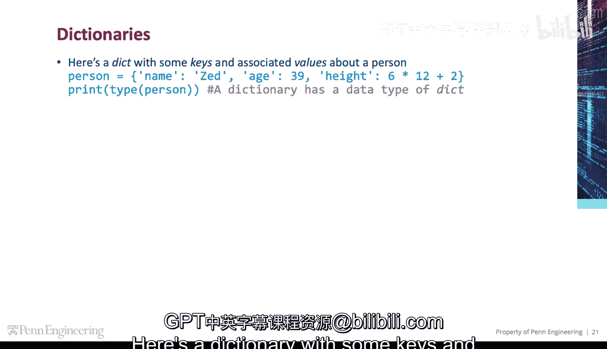
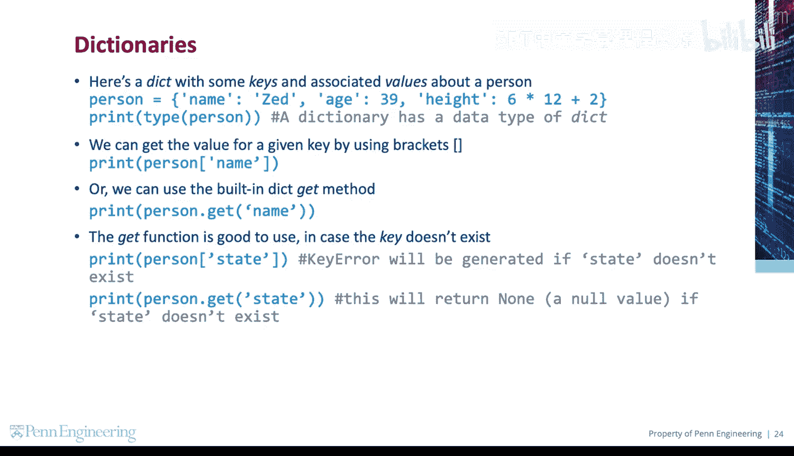
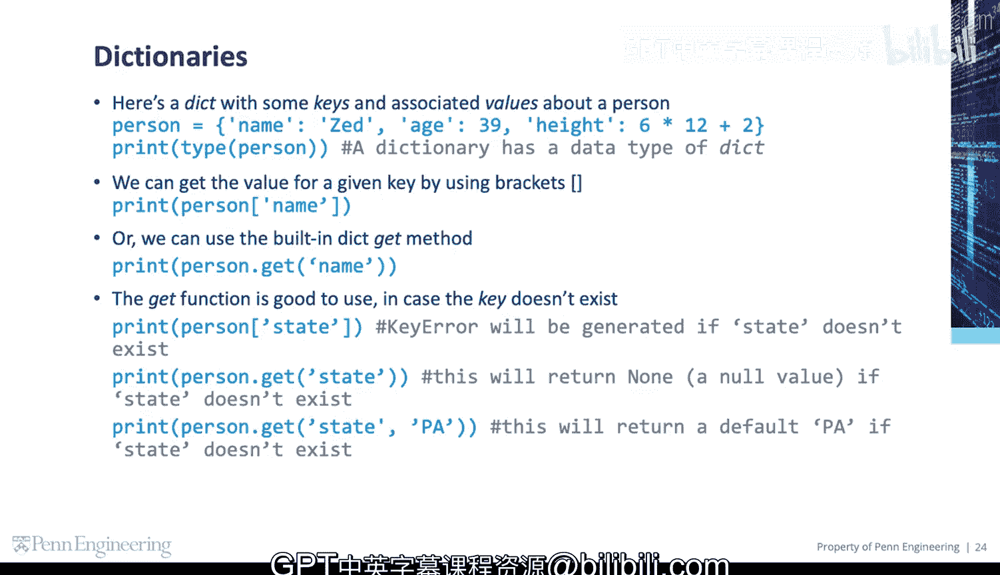

# 092：字典（键值对）📚

在本节课中，我们将要学习Python中一个非常重要的数据结构——字典。字典用于存储键值对，它允许我们通过一个唯一的“键”来快速查找和访问对应的“值”。



## 字典的基本概念

上一节我们介绍了列表和元组等序列类型，本节中我们来看看字典。字典是一种映射类型，它存储的是键（key）和值（value）之间的关联关系。

一个字典由花括号 `{}` 定义，其中包含多个用逗号分隔的 `键: 值` 对。



以下是一个关于个人信息的字典示例：

```python
person = {
    "name": "Alice",
    "age": 30,
    "city": "New York"
}
```

## 访问字典中的值

创建字典后，我们通常需要根据键来获取对应的值。Python提供了两种主要方法。

### 使用方括号 `[]` 访问

最直接的方式是使用方括号，并在其中放入键名。

```python
print(person["name"])  # 输出: Alice
```

### 使用 `.get()` 方法访问

另一种更安全的方式是使用字典内置的 `.get()` 方法。它的优势在于当查找的键不存在时，可以避免程序崩溃。

以下是 `.get()` 方法的几种使用情况：



*   **键存在时**：返回对应的值。
    ```python
    print(person.get("age"))  # 输出: 30
    ```
*   **键不存在时（默认）**：返回 `None`（空值）。
    ```python
    print(person.get("state"))  # 输出: None
    ```
*   **键不存在时（指定默认值）**：可以指定一个默认返回值。
    ```python
    print(person.get("state", "PA"))  # 输出: PA
    ```

相比之下，如果使用方括号 `[]` 去访问一个不存在的键，Python会直接抛出一个 `KeyError` 错误，导致程序中断。



```python
print(person["state"])  # 会引发 KeyError
```


## 课程总结

本节课中我们一起学习了Python字典的核心用法。我们了解到字典是一种高效的键值对存储结构，并通过方括号 `[]` 和 `.get()` 方法掌握了访问其中数据的技巧。特别需要注意的是，使用 `.get()` 方法能更安全地处理键可能不存在的情况，是更推荐的实践方式。