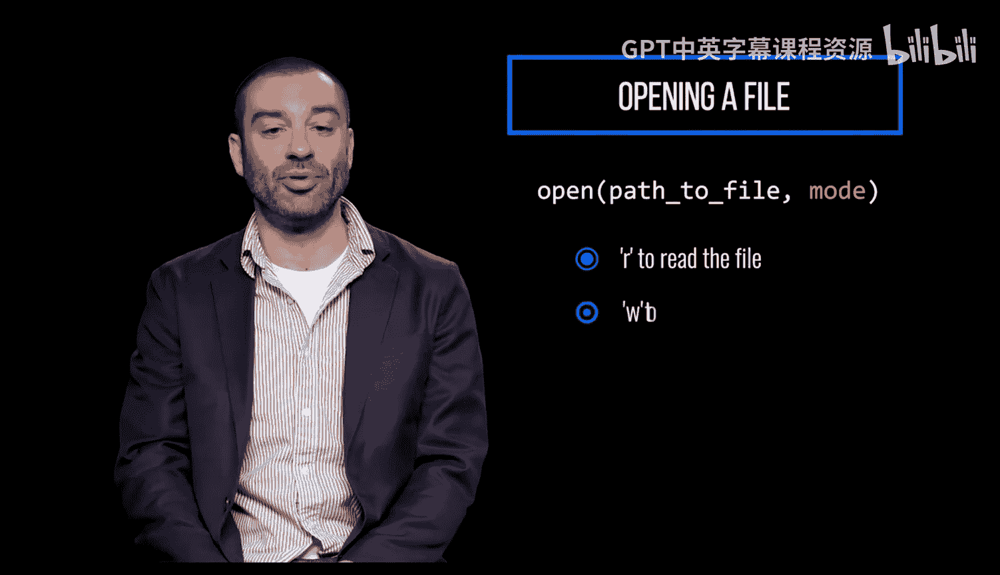
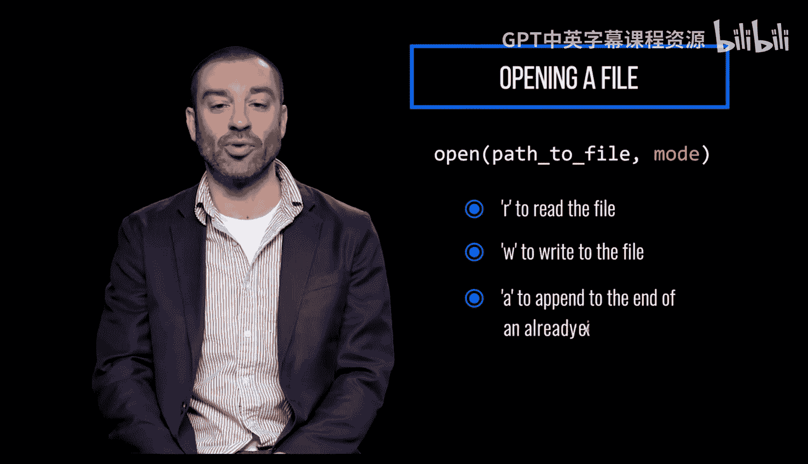
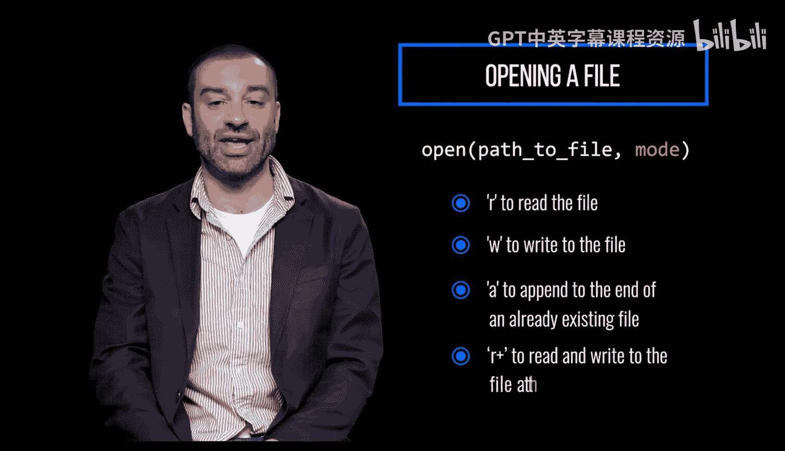

# 095：01 打开文件 📂


在本节课中，我们将要学习如何在Python中打开文件。这是进行文件读写操作的第一步，理解这个过程对于后续处理文件数据至关重要。

## 概述


在Python中打开文件，本质上需要完成三个步骤：打开文件、使用文件（即读取、写入或追加内容）以及关闭文件。

## 打开文件


要打开一个文件，需要使用Python内置的 `open()` 函数。其基本语法如下：


```python
file_object = open(path_to_file, mode)
```

其中，`path_to_file` 是一个指定文件路径的字符串，`mode` 则指定了访问文件的类型。


### 文件路径

`path_to_file` 可以是以下几种形式：
*   如果文件与程序在同一目录下，可以直接使用文件名。
*   也可以使用指向该文件的绝对路径或相对路径。


### 访问模式



要对文件进行读取或写入，`mode` 参数可以是以下值之一：
*   `'r'`：表示你只想读取文件。
*   `'w'`：表示你想写入文件。
*   `'a'`：表示你想向一个已存在文件的末尾追加内容。
*   `'r+'`：表示你想同时对文件进行读取和写入。

## 总结





本节课中我们一起学习了Python中打开文件的基础知识。我们了解了打开文件需要调用的 `open()` 函数，并详细解释了其两个关键参数：文件路径和访问模式。掌握这些是后续进行文件内容读取、写入和操作的基础。