Python和Java编程入门1-2：04：文件打开方法模式详解 📂

在本节课中，我们将要学习Python中文件操作的核心概念——文件打开模式。理解不同的模式是正确读写文件数据的基础。

上一节我们介绍了文件操作的基本概念，本节中我们来看看几种核心的文件打开模式及其具体行为。

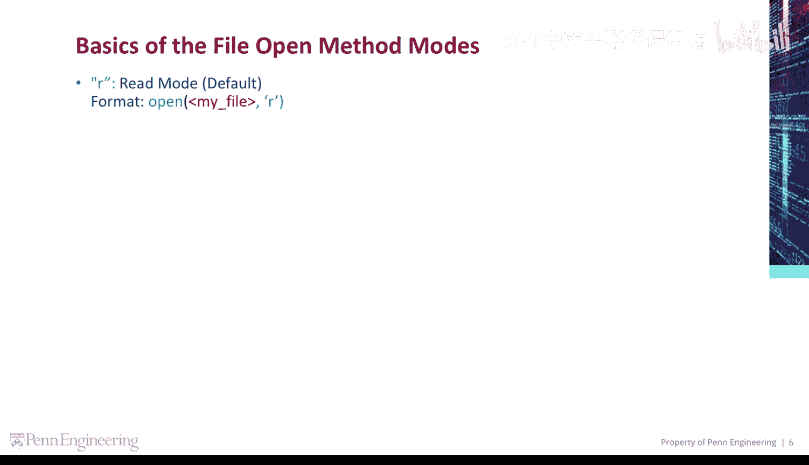

---


### 读取模式 `‘r’`

`‘r’` 代表读取模式，这也是 `open()` 函数的默认模式。该模式用于打开一个已存在的文件以读取其内容。

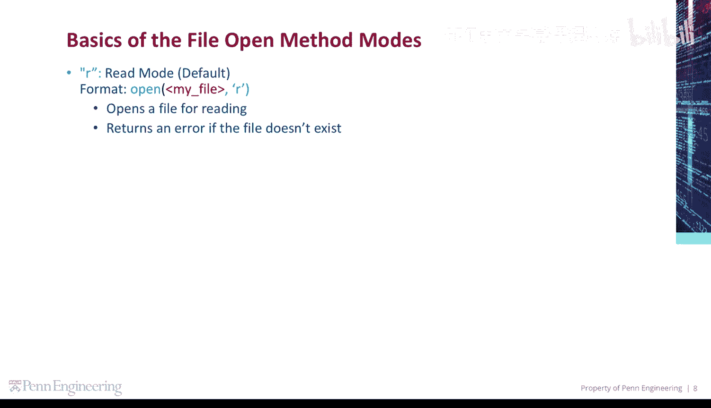

其基本格式如下：
```python
open(‘文件路径’, ‘r’)
```
此模式会打开文件用于读取。如果指定的文件不存在，程序将返回一个错误。由于这是默认模式，你也可以省略 `‘r’` 参数，直接写成 `open(‘文件路径’)`。

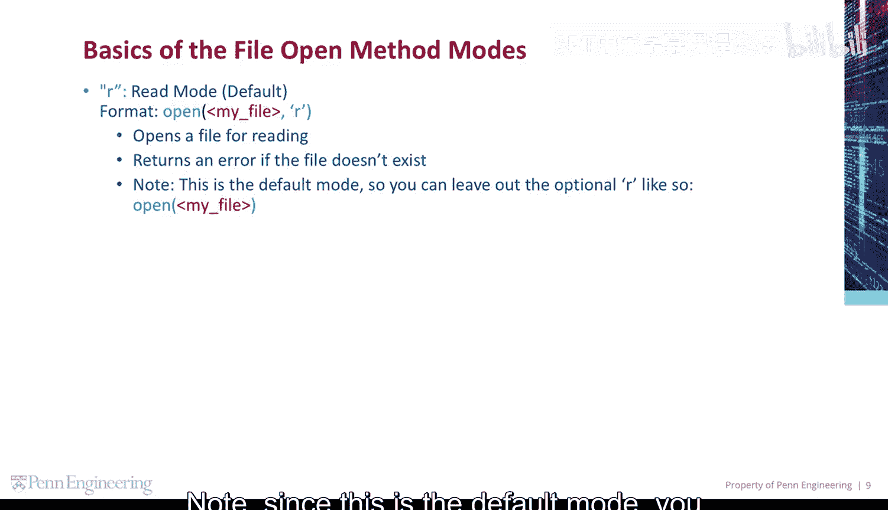

---

### 写入模式 `‘w’`

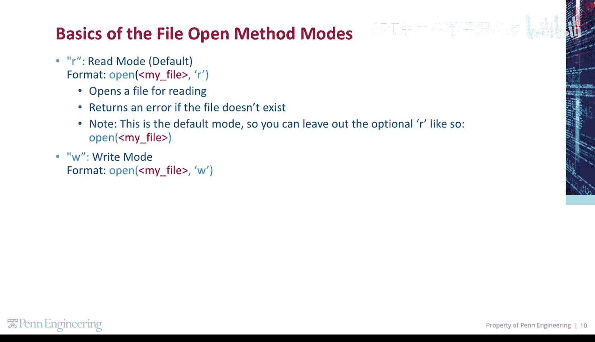

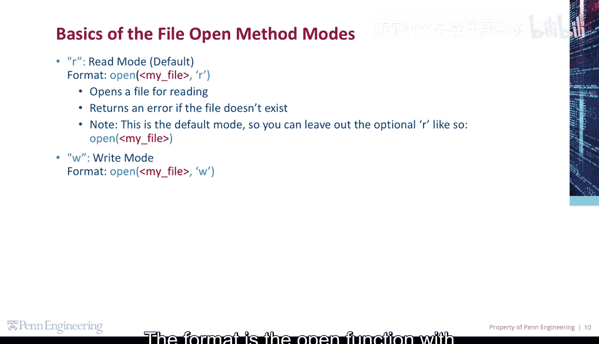

`‘w’` 代表写入模式。该模式用于向文件写入数据。

其基本格式如下：
```python
open(‘文件路径’, ‘w’)
```
此模式会打开文件用于写入，并具有两个关键特性：
1.  如果文件已存在，则会清空该文件中的所有旧数据。
2.  **如果文件不存在，则会创建一个新文件。**

---

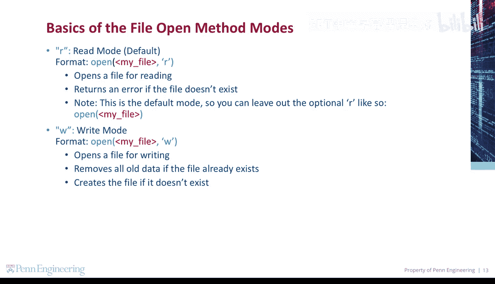

### 追加模式 `‘a’`

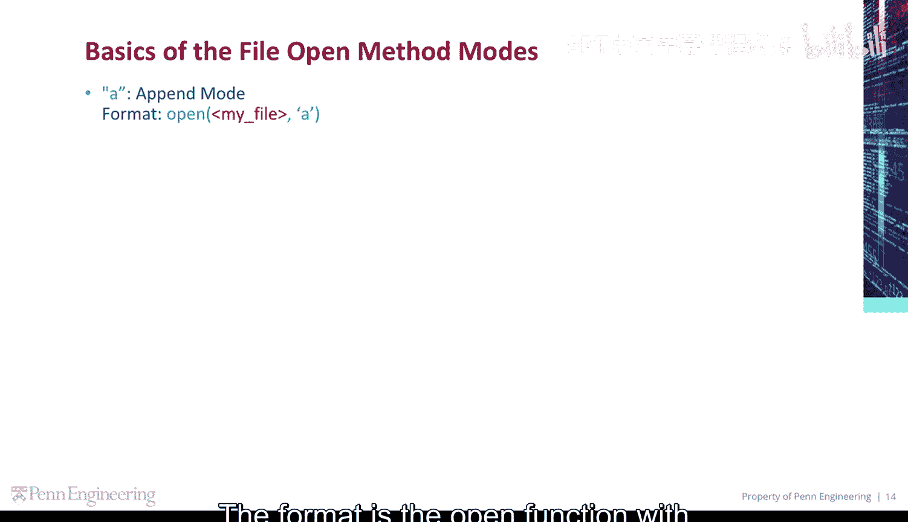

`‘a’` 代表追加模式。当你需要在文件末尾添加新内容，而不影响原有数据时，应使用此模式。

其基本格式如下：
```python
open(‘文件路径’, ‘a’)
```
此模式会打开文件用于在末尾追加数据。与写入模式类似，如果文件不存在，它也会创建一个新文件。

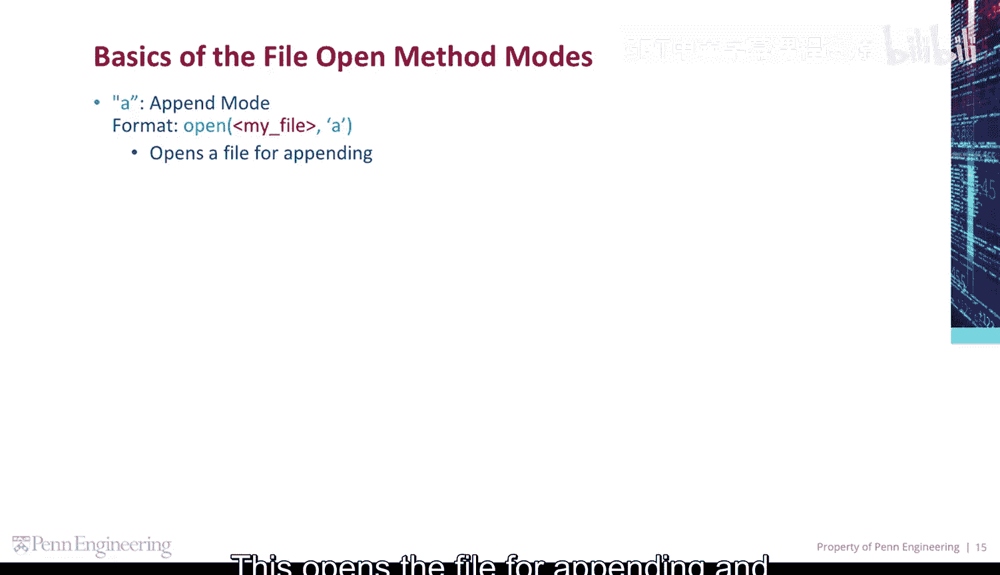

---

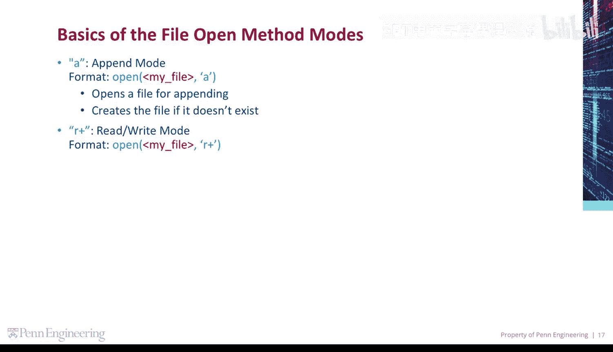

### 读写模式 `‘r+’`

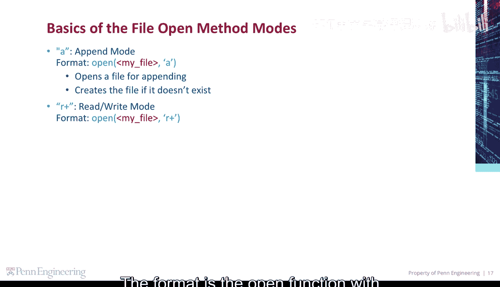

`‘r+’` 代表读写模式。这是一种组合模式，允许你对同一个文件既进行读取又进行写入操作。

其基本格式如下：
```python
open(‘文件路径’, ‘r+’)
```
此模式会打开文件同时用于读取和写入。它有两个重要特点：
1.  如果文件不存在，程序将返回一个错误。
2.  它**不会**像 `‘w’` 模式那样自动清空文件的旧有数据。

---

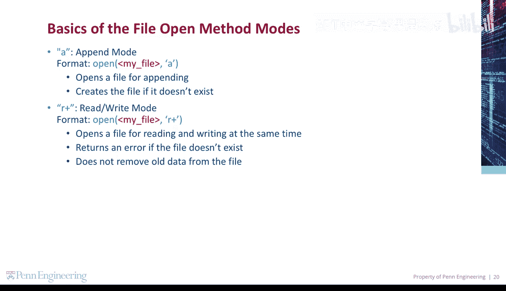

本节课中我们一起学习了Python中四种基本的文件打开模式：读取模式`‘r’`、写入模式`‘w’`、追加模式`‘a’`和读写模式`‘r+’`。理解每种模式何时创建文件、是否清空数据以及是否允许读写，是安全有效进行文件操作的关键。