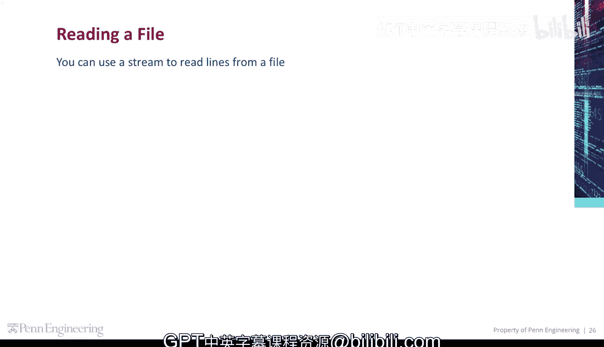
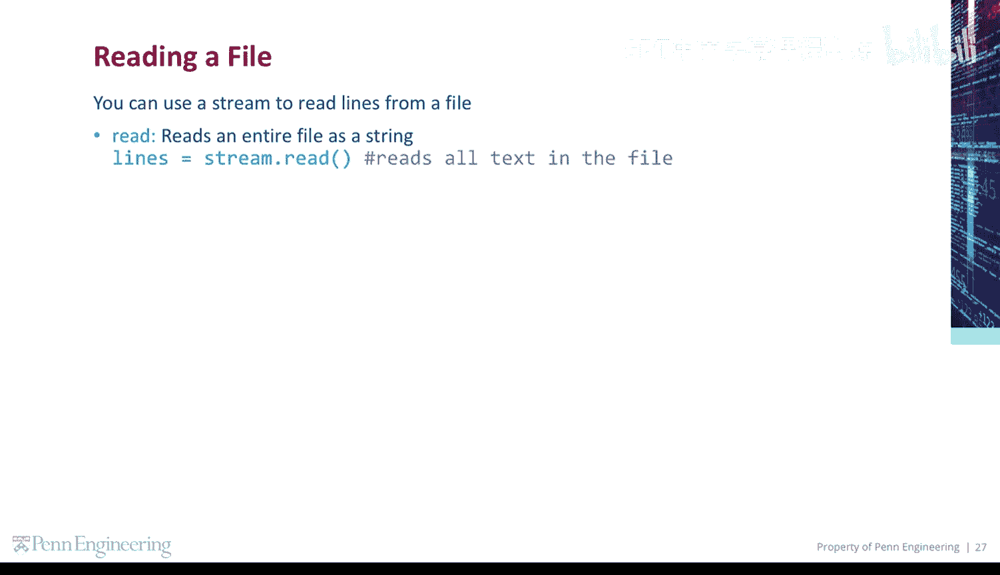
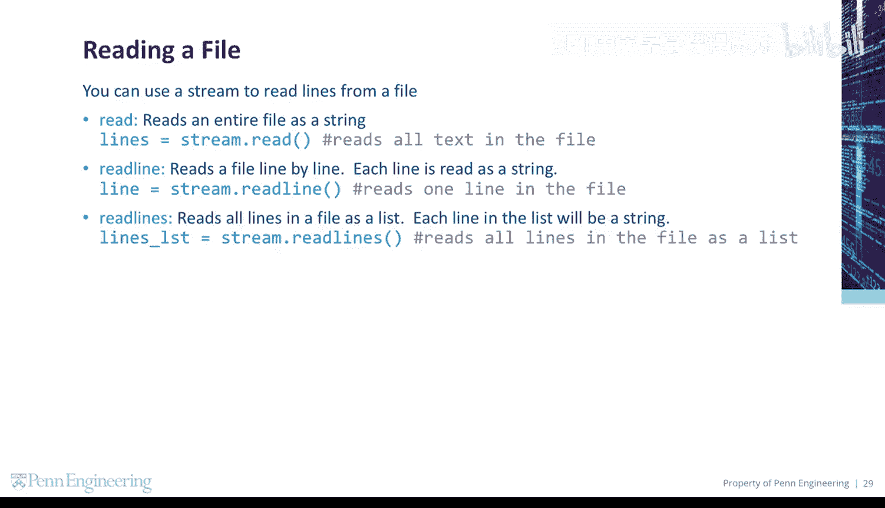
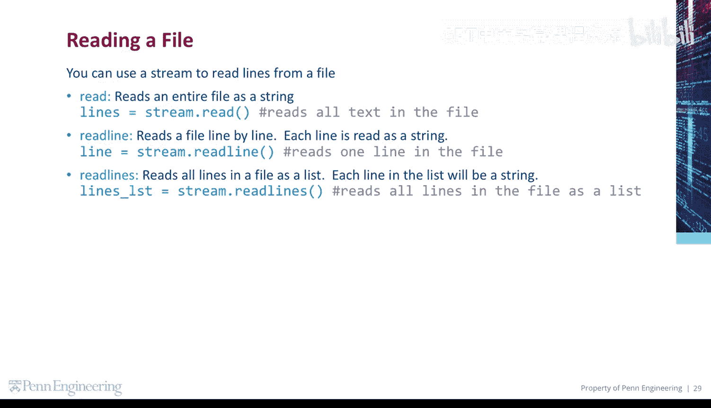
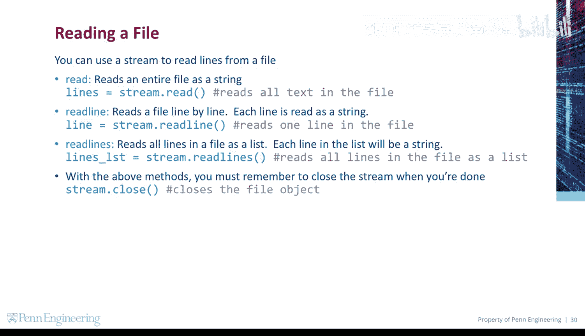

# 097：读取文件 📖

在本节课中，我们将要学习如何使用Python读取文件。我们将介绍三种不同的读取方法，并了解如何正确地打开和关闭文件流。

---

## 概述



文件操作是编程中的一项基本技能。通过读取文件，程序可以处理存储在外部文件中的数据。本节将详细介绍三种从文件中读取内容的方法。

---

## 使用流从文件中读取行

你可以使用一个流（stream）来从文件中逐行读取内容。流是程序与文件之间进行数据交换的通道。

---

## 读取文件的三种方法

以下是三种主要的文件读取方法，每种方法适用于不同的场景。



### `read()` 方法

`read()` 方法将整个文件的内容作为一个字符串读取。

```python
file_content = file_object.read()
```

此方法读取文件中的所有文本。

---

### `readline()` 方法

上一节我们介绍了如何一次性读取整个文件，本节中我们来看看如何逐行读取。`readline()` 方法每次读取文件的一行，并将该行作为字符串返回。

```python
single_line = file_object.readline()
```

此方法读取文件中的一行。

---



### `readlines()` 方法

`readlines()` 方法将文件中的所有行读取为一个列表（list）。列表中的每个元素都是文件中的一行，并且是一个字符串。

```python
all_lines = file_object.readlines()
```

此方法将文件中的所有行读取为一个列表。



---

## 重要注意事项

在使用所有读取方法后，必须记住在操作完成时关闭流。这是一个良好的编程习惯，可以释放系统资源。

```python
file_object.close()
```

此操作关闭文件对象。

---



## 总结

本节课中我们一起学习了Python中读取文件的三种核心方法：`read()`、`readline()`和`readlines()`。我们了解了每种方法的特点和适用场景，并强调了在文件操作完成后关闭文件流的重要性。掌握这些基础操作是进行更复杂文件处理的第一步。