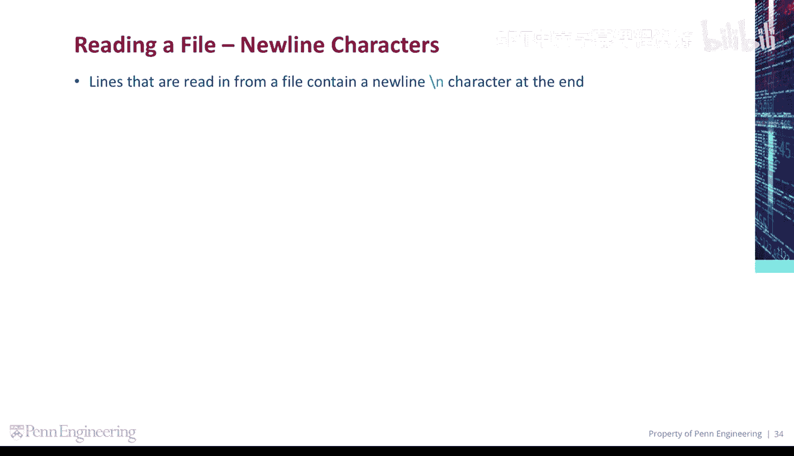
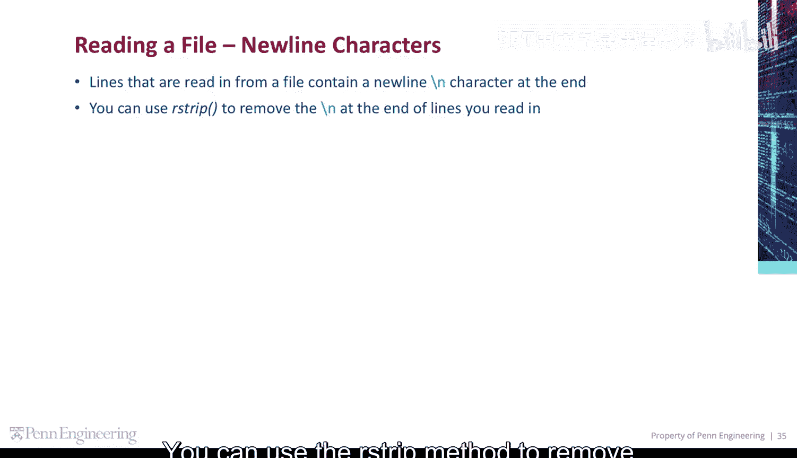
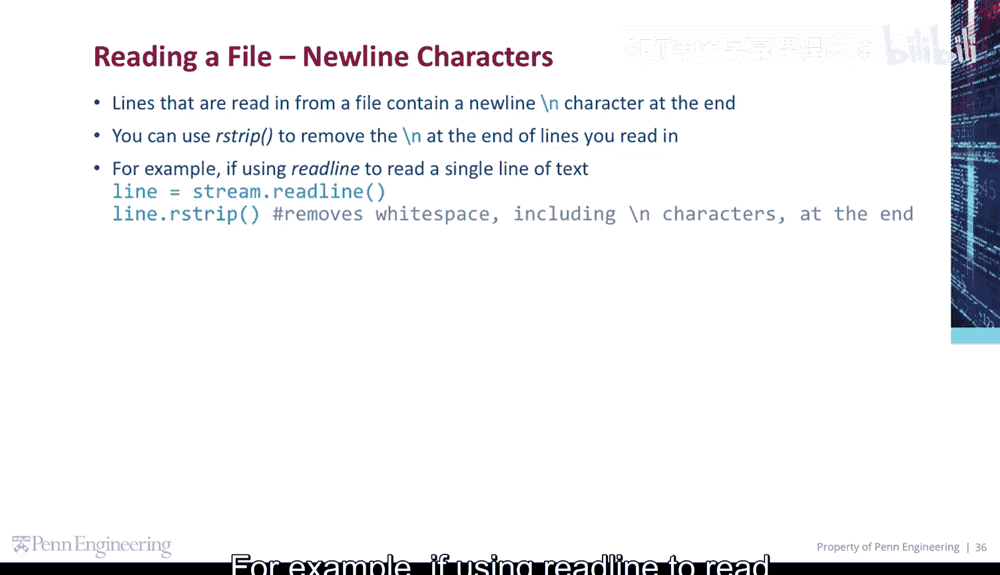
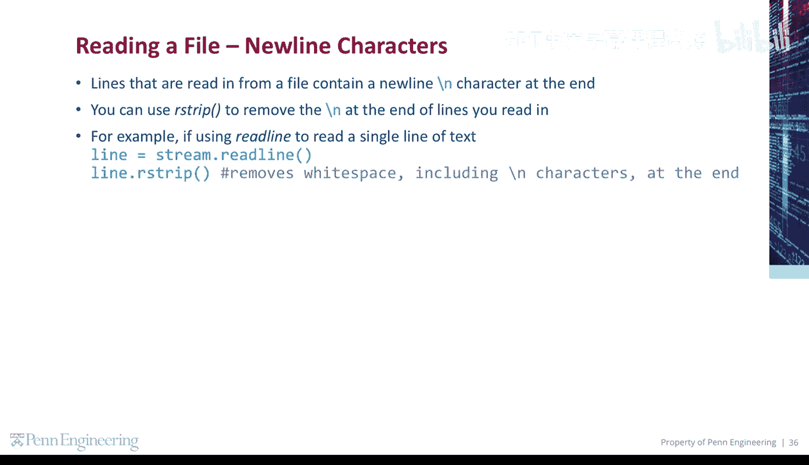
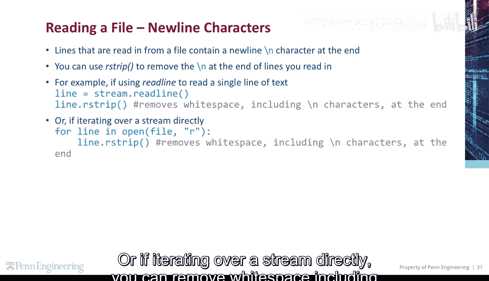
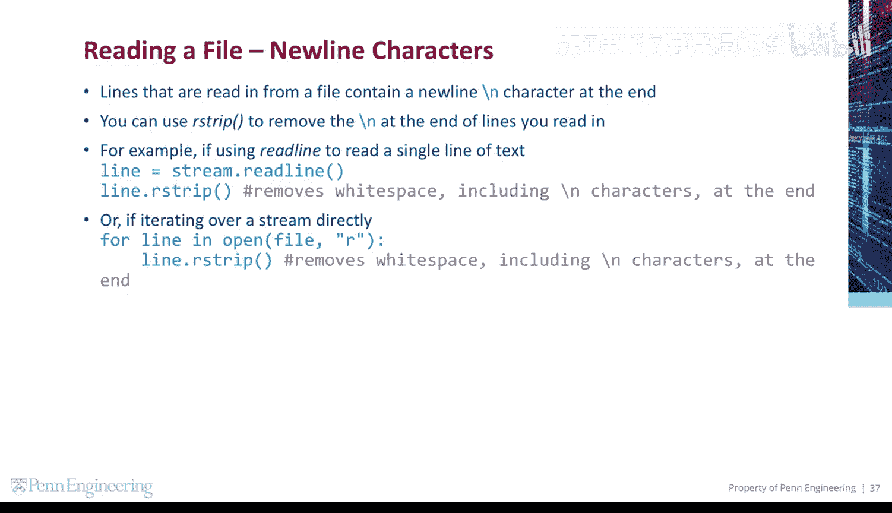

# 098：处理文件中的换行符 📄

在本节课中，我们将要学习如何处理从文件中读取文本时遇到的换行符。换行符是文本文件中的一个特殊字符，它表示一行的结束。在Python中，当我们从文件读取行时，这个字符通常会被包含进来，有时我们需要将其移除以便于后续处理。

## 什么是换行符？

从文件中读取的每一行，其末尾都包含一个换行符，在代码中表示为 `\n`。




这个字符虽然不可见，但它是文本行结构的一部分。如果不进行处理，它可能会影响字符串的比较、拼接或输出格式。

## 如何使用 `rstrip()` 方法移除换行符

为了移除行末的换行符以及其他可能的空白字符（如空格、制表符），我们可以使用字符串的 `rstrip()` 方法。

上一节我们介绍了换行符的存在，本节中我们来看看如何清理它。

以下是使用 `readline()` 方法读取单行文本后，移除末尾空白字符（包括换行符）的示例：





**代码描述**：
```python
line = file.readline().rstrip()
```


这行代码首先从文件中读取一行，然后立即调用 `rstrip()` 方法去除该行右侧（末尾）的所有空白字符。

## 在迭代文件流时处理换行符


更常见的情况是，我们直接迭代文件对象来逐行处理内容。同样，我们可以在处理每一行时移除其末尾的换行符。


以下是迭代文件流并清理每一行的示例：




**代码描述**：
```python
with open('filename.txt', 'r') as file:
    for line in file:
        cleaned_line = line.rstrip()
        # 接下来处理 cleaned_line
```

在这段代码中，`for` 循环会遍历文件的每一行。在循环体内，我们对每一行 `line` 调用 `rstrip()` 方法，得到清理后的字符串 `cleaned_line`，然后可以对其进行任何需要的操作。


## 总结


本节课中我们一起学习了文件操作中一个重要的细节——换行符的处理。我们了解到：
1.  从文件读取的行包含末尾的换行符 `\n`。
2.  使用字符串的 **`rstrip()`** 方法可以方便地移除行末的换行符及其他空白字符。
3.  无论是使用 `readline()` 读取单行，还是通过迭代直接处理多行，`rstrip()` 都是清理数据的有效工具。

掌握这个方法能让你更干净地处理文本数据，为后续的字符串操作或数据分析打下良好基础。