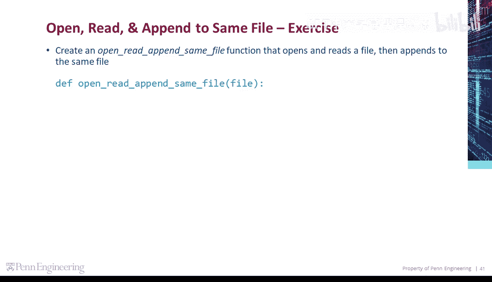
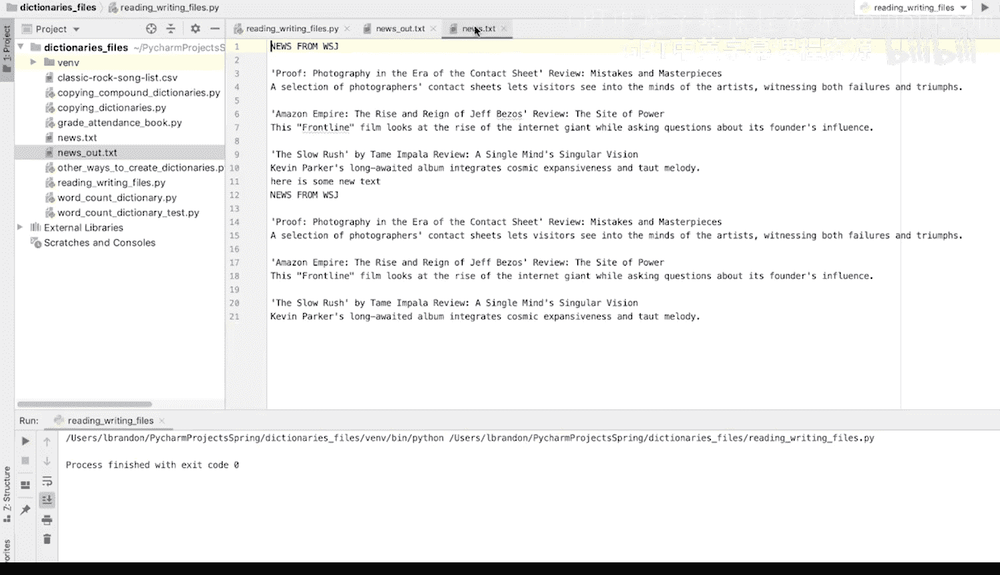
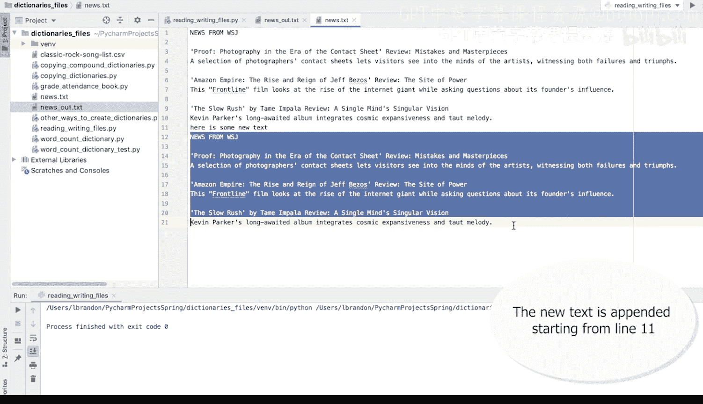
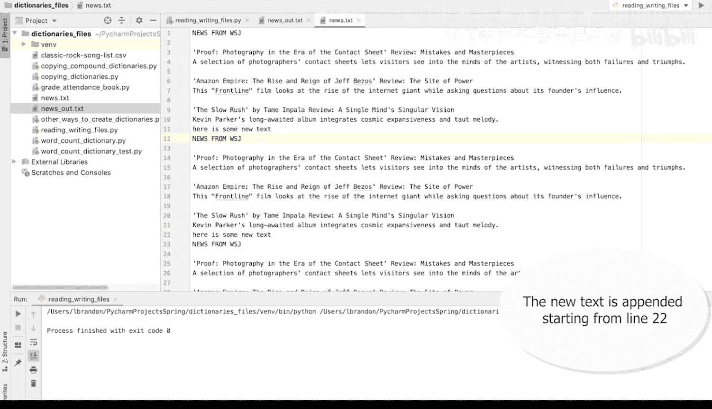
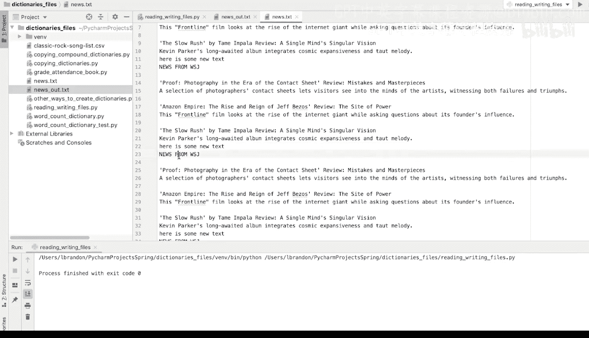

Python与Java编程入门1-2：103：编程演示 - 打开、读取并追加到原文件 📄

在本节课程中，我们将学习如何创建一个函数，该函数能够打开一个文件，读取其内容，并向同一个文件追加新的内容。我们将使用Python的文件操作模式来实现这一功能。



---

上一节我们介绍了基本的文件读写操作，本节中我们来看看如何对同一个文件进行读取和追加写入。

现在，让我们创建一个名为 `open_read_append_same_file` 的函数，它用于打开并读取一个文件，然后向同一个文件追加内容。

首先，我们定义这个函数。它接收一个文件名作为参数。

```python
def open_read_append_same_file(filename):
```

此函数将执行以下操作：打开指定文件，将所有行读取到一个列表中，然后向同一个文件追加内容。

由于我们需要对同一个文件进行读取和写入，因此我们使用 `‘r+’` 模式来打开文件。这个模式允许我们同时进行读取和写入操作。

```python
    f = open(filename, ‘r+’)
```

接下来，我们将文件的所有行读取到一个列表中。

```python
    lst = f.readlines()
```

在将内容追加回原文件之前，我们可以先对这个列表进行一些修改。例如，我们可以在列表的开头插入一些新的文本行。

以下是修改列表的步骤：

```python
    lst.insert(0, ‘\n‘)  # 在列表开头插入一个空行
    lst.insert(0, ‘Here is some new text.\n‘)  # 在列表开头插入一行新文本
    lst.insert(0, ‘\n‘)  # 再插入一个空行，作为分隔
```

现在，列表已经更新完毕。接下来，我们需要将修改后的列表内容写回原文件。由于我们是以 `‘r+’` 模式打开的文件，写入操作将从文件末尾开始，从而实现追加的效果。

```python
    f.writelines(lst)
```

最后，不要忘记关闭文件，这是一个良好的编程习惯。

```python
    f.close()
```



函数定义完成后，我们需要在主函数中调用它来测试效果。



```python
def main():
    open_read_append_same_file(‘news.txt‘)
```

运行这段代码。然后，如果我们打开 `news.txt` 文件，将会看到文件的开头已经追加了我们插入的新文本行和空行。每次运行此函数，都会在文件开头再次追加相同的内容。



---



本节课中我们一起学习了如何创建一个函数来打开、读取并向同一个文件追加内容。我们使用了 `‘r+’` 文件模式，并演示了如何通过修改读取到的列表来更新文件内容。记住，在完成文件操作后，务必关闭文件。