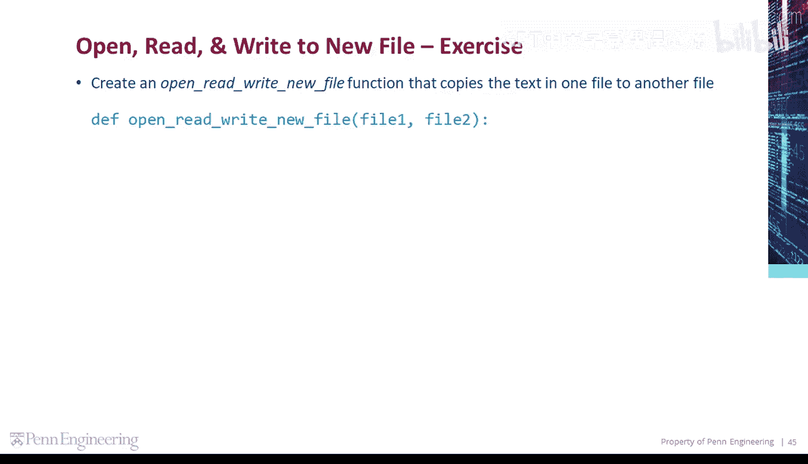
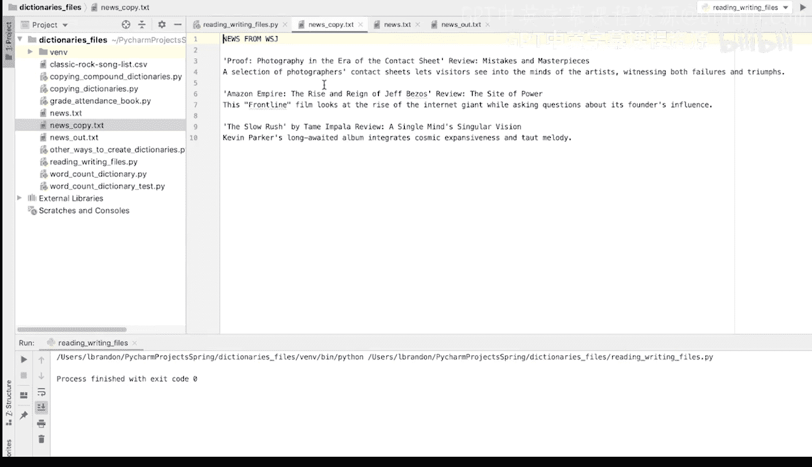

# 104：编程演示-打开读取并写入新文件 📄

在本节课中，我们将学习如何编写一个Python函数，该函数能够打开一个文件、读取其内容，并将这些内容完整地复制到另一个新文件中。这是文件操作的基础技能。



---

上一节我们介绍了文件操作的基本概念，本节中我们来看看如何具体实现一个文件复制函数。

现在，让我们创建一个名为 `open_read_write_new_file` 的函数，它的功能是将一个文件中的文本复制到另一个文件。

以下是创建该函数的步骤：

1.  **打开第一个文件用于读取**：我们使用 `with` 关键字和 `open()` 函数，以默认的读取模式打开第一个文件。这确保了文件在使用后会被正确关闭。
    ```python
    with open(file1) as fin:
    ```

2.  **读取文件全部内容**：我们使用文件对象的 `.read()` 方法，将文件中的所有行读取为一个单独的字符串。
    ```python
    text = fin.read()
    ```

3.  **打开第二个文件用于写入**：我们再次使用 `open()` 函数，但这次指定模式为写入模式 (`‘w’`)。如果目标文件不存在，此操作会自动创建它。
    ```python
    with open(file2, ‘w’) as fout:
    ```

4.  **将内容写入第二个文件**：我们使用文件对象的 `.write()` 方法，将之前读取的字符串 `text` 写入到第二个文件中。
    ```python
    fout.write(text)
    ```

将以上步骤组合起来，就构成了我们的函数。以下是完整的函数定义：

```python
def open_read_write_new_file(file1, file2):
    # 打开第一个文件并读取全部内容
    with open(file1) as fin:
        text = fin.read()
    # 打开（或创建）第二个文件并写入内容
    with open(file2, ‘w’) as fout:
        fout.write(text)
```

---

函数定义完成后，我们需要调用它来执行复制操作。

让我们调用这个函数，将 `news.txt` 文件的内容复制到一个名为 `news_copy.txt` 的新文件中。

```python
open_read_write_new_file(‘news.txt‘, ‘news_copy.txt‘)
```

运行这段代码后，你会在当前目录下发现一个新文件 `news_copy.txt`。打开这个文件，你会看到它的内容与原始的 `news.txt` 文件完全一致，证明复制操作成功。

---



本节课中我们一起学习了如何编写一个完整的文件复制函数。我们掌握了使用 `with open() as ...` 语句安全地打开文件，使用 `.read()` 方法读取内容，以及使用 `.write()` 方法将内容写入新文件。这是处理文本文件的基础且重要的操作。