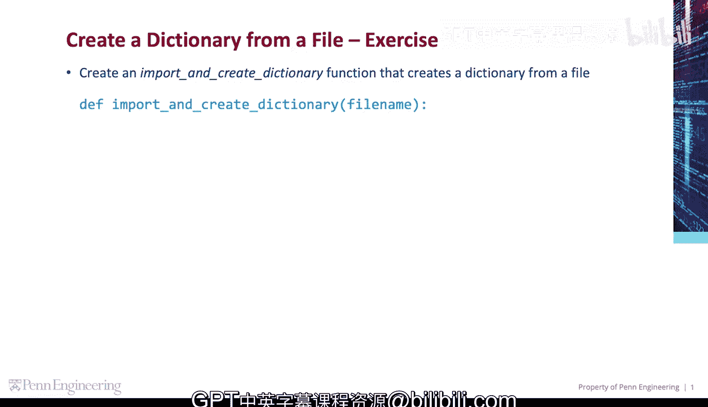
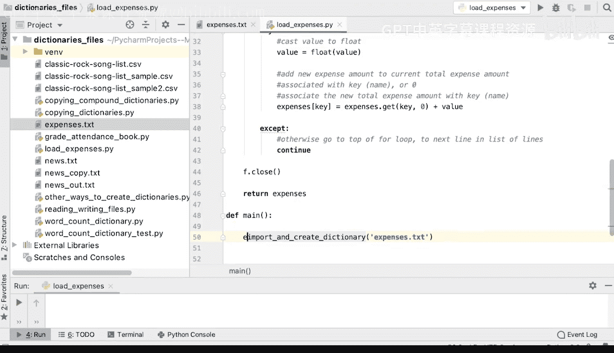
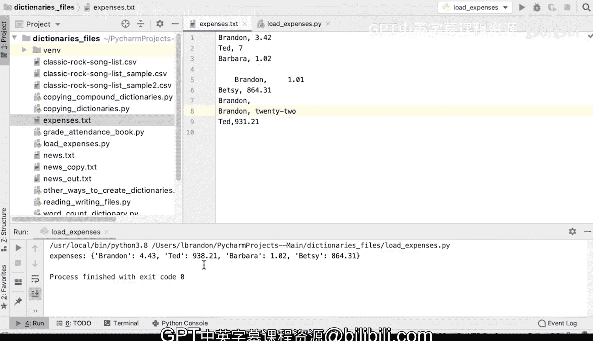

# 105：编程演示-文件转字典



在本节课中，我们将学习如何编写代码，从一个文本文件中读取数据，并将其内容整理成一个字典。我们将处理一个包含用户及其消费金额的文件，目标是计算每个用户的总消费额。

## 概述

我们将创建一个名为 `import_and_create_dictionary` 的函数。该函数接收一个文件名作为参数，读取文件内容，并返回一个字典。字典的键是用户名，值是该用户的总消费金额。文件中的每一行格式应为 `用户名, 消费金额`。我们的代码需要能够处理空行、缺失金额或无效金额的情况，并忽略这些行。

## 代码实现步骤

上一节我们介绍了任务目标，本节中我们来看看具体的实现步骤。

以下是创建字典的核心步骤：

1.  **初始化空字典**：首先，我们创建一个空的字典来存储结果。
    ```python
    expenses = {}
    ```

2.  **读取文件**：打开指定的文件，并将其所有行读取到一个列表中。
    ```python
    f = open(filename, 'r')
    lines = f.readlines()
    ```

3.  **处理每一行**：遍历列表中的每一行。
    ```python
    for line in lines:
    ```

4.  **清理和分割**：移除每行首尾的空白字符，然后根据逗号 `,` 进行分割。
    ```python
    lst = line.strip().split(',')
    ```

5.  **检查数据完整性**：检查分割后的列表长度。如果长度小于等于1，说明该行缺少消费金额，应跳过。
    ```python
    if len(lst) <= 1:
        continue
    ```

6.  **提取键和值**：从列表中提取用户名（键）和消费金额字符串（值），并再次清理首尾空格。
    ```python
    key = lst[0].strip()
    value = lst[1].strip()
    ```

7.  **转换数值**：尝试将消费金额字符串转换为浮点数。如果转换失败（例如遇到非数字字符），则跳过该行。
    ```python
    try:
        value = float(value)
    except ValueError:
        continue
    ```

8.  **更新字典**：在字典中查找该用户当前的总消费额（如果不存在则默认为0），加上新的消费金额，然后更新回字典。
    ```python
    expenses[key] = expenses.get(key, 0) + value
    ```

9.  **关闭文件并返回结果**：处理完所有行后，关闭文件并返回构建好的字典。
    ```python
    f.close()
    return expenses
    ```

## 运行示例

现在，让我们创建一个主函数来测试我们的代码。

我们将调用 `import_and_create_dictionary` 函数处理名为 `expenses.txt` 的文件，并打印结果字典。

```python
def main():
    expenses = import_and_create_dictionary('expenses.txt')
    print(expenses)

if __name__ == '__main__':
    main()
```

运行程序后，输出结果如下：

```
{'Brandon': 443.0, 'Ted': 938.21, 'Barbara': 102.0, 'Betsy': 864.31}
```



这个字典准确地反映了每个用户的总消费额。例如，用户 `Brandon` 在文件中有两笔有效消费（342 和 101），总和为 443，与我们的计算结果一致。

## 总结



本节课中我们一起学习了如何从文件创建字典。我们实现了一个函数，它能读取格式化的文本文件，处理可能出现的异常数据（如空行、格式错误），并最终汇总生成一个以用户名为键、总消费额为值的字典。这个练习涵盖了文件操作、字符串处理、异常捕获和字典更新等核心编程概念。