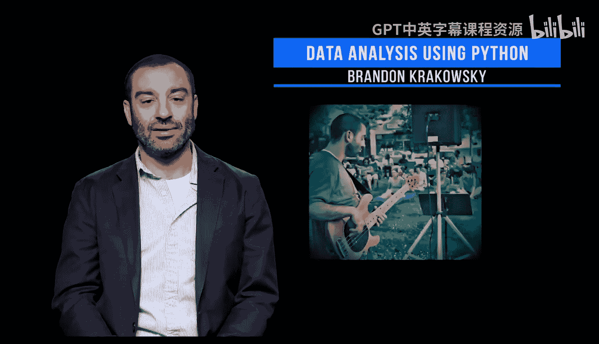

# 108：讲师介绍 🧑‍🏫

在本节课中，我们将认识本课程的讲师Brandon Krakowsky，了解他的专业背景和个人经历。

大家好，我是Brandon Krakowsky，我是这门编程语言与技术课程的讲师。

关于我的背景，我最初是一名音乐家，之后在无线电广播和音频制作领域工作。

我的编程经验始于Adobe Flash。我曾使用这个工具为一家大型制药公司开发了一个实时网络会议平台。

我获得了宾夕法尼亚大学的计算机与信息技术硕士学位，并曾在宾夕法尼亚大学设计学院担任程序员。

之后，我在沃顿商学院计算部门担任应用开发人员，与教职员工合作构建技术，以推进多个学生项目。

在此期间，我创立了自己的公司Bak LLC，为多家公司提供编程和自由职业应用开发服务。

后来我转向数据与分析领域，成为沃顿客户分析部门的研究与教育总监，负责管理来自世界各地的学生和学术研究人员参与的大规模研究项目。

最近，我成为了宾夕法尼亚大学工程学院的讲师。关于我个人，我弹奏贝斯，喜欢我的狗，并且重视家庭。

本节课中我们一起学习了本课程讲师Brandon Krakowsky的职业发展路径和个人兴趣。他的经历展示了从艺术到技术，再到教育与创业的多元化跨界旅程。