# 117：检查数据 📊

在本节课中，我们将学习如何使用Pandas库加载和初步检查一个数据集。我们将以Yelp数据文件为例，介绍如何读取数据、查看数据结构、获取统计信息以及处理重复项。

---

## 加载和读取Yelp数据文件

首先，我们需要导入Pandas库，并使用其`ExcelFile`类来加载整个Yelp Excel文件。

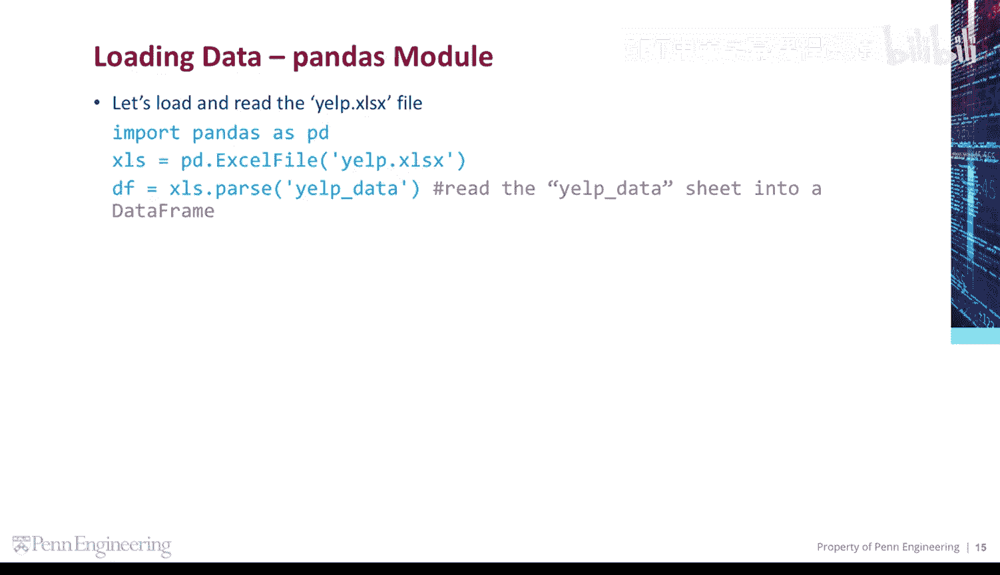

```python
import pandas as pd
yelp_file = pd.ExcelFile('yelp_data.xlsx')
```

---

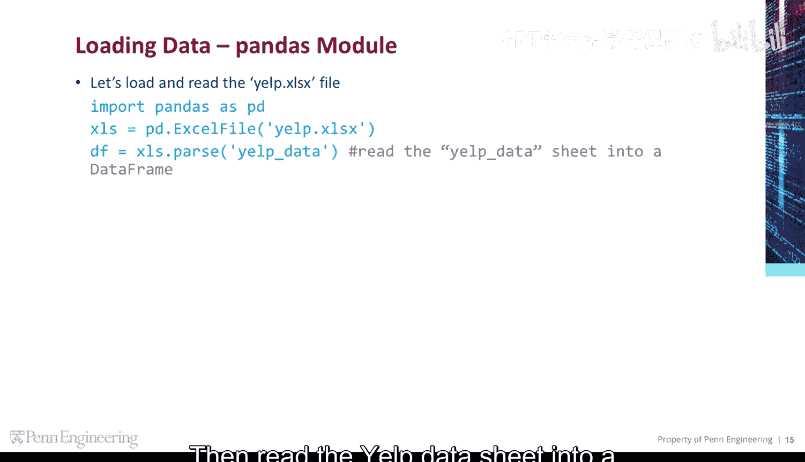

## 读取数据到DataFrame

上一节我们加载了文件，本节中我们来看看如何将特定的工作表读取到一个`DataFrame`中。我们使用`parse`方法来完成这个操作。

```python
df = yelp_file.parse('Yelp Data')
```

我们可以看到`df`的类型是一个`DataFrame`。

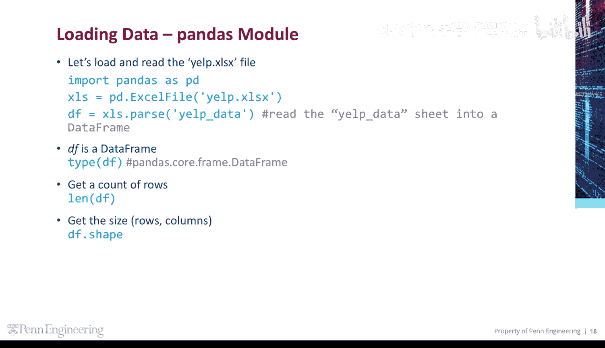

---

## 查看数据的基本信息

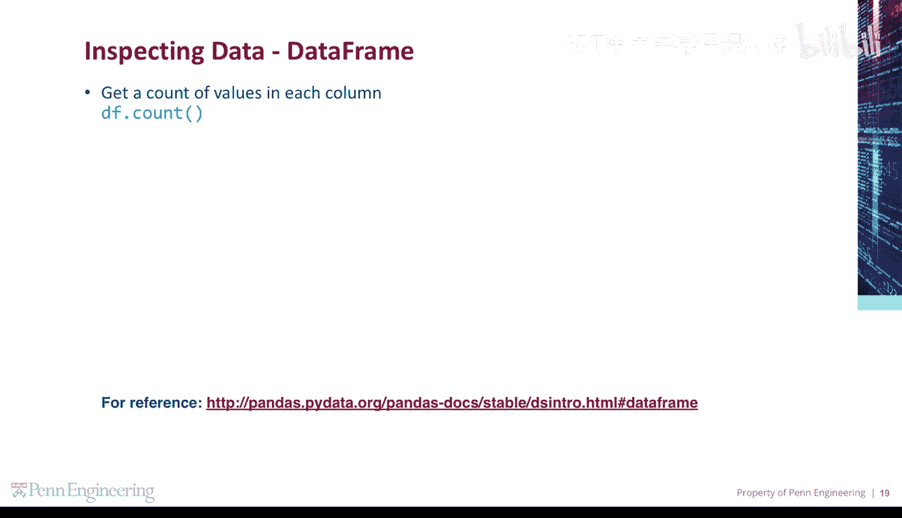

我们可以获取数据框的行数，并通过访问`shape`属性来获取行和列的数量。

```python
row_count = len(df)
rows, columns = df.shape
```

以下是获取每列中非空值数量的方法：

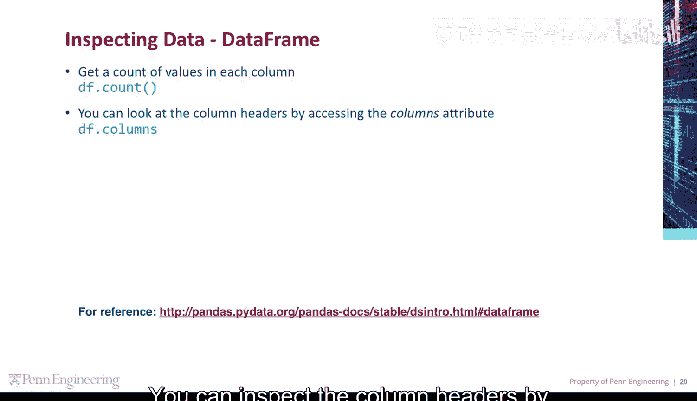

```python
value_counts = df.count()
```

你可以通过访问`columns`属性来查看列标题。

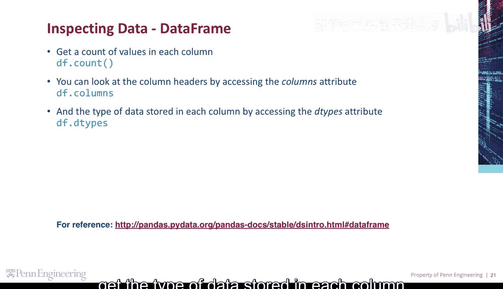

```python
column_headers = df.columns
```

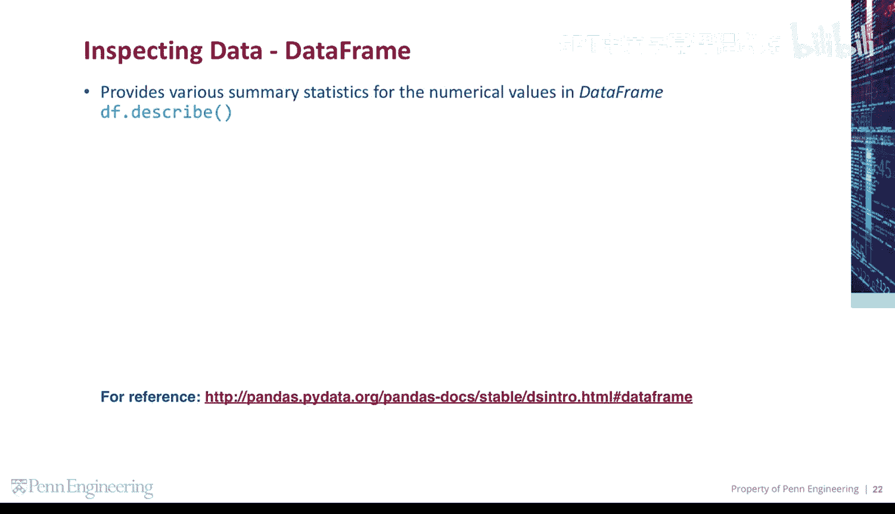

通过访问`dtypes`属性，可以获取每列存储的数据类型。

```python
data_types = df.dtypes
```

---

## 获取数据的统计摘要

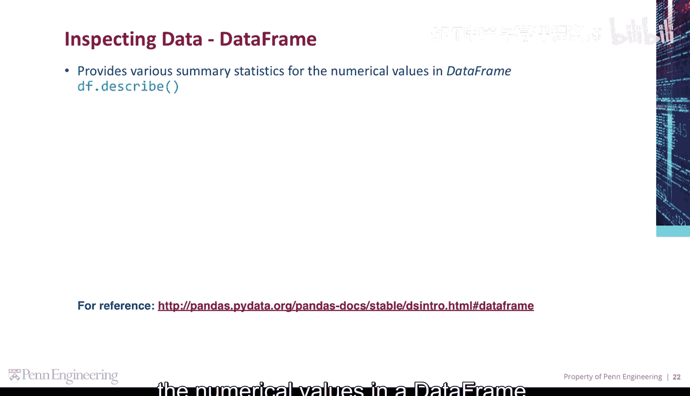

`describe`方法为数据框中的数值提供了各种汇总统计信息。

```python
summary_statistics = df.describe()
```

---

## 查看数据的前几行

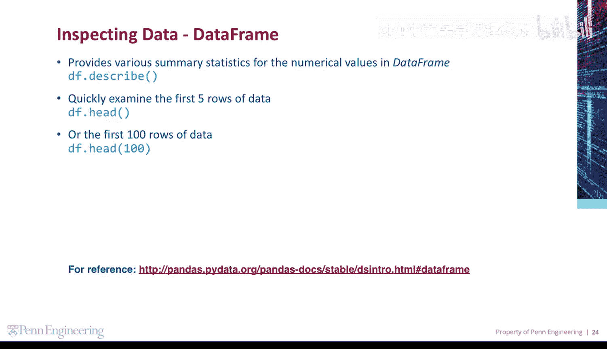

`head`方法默认显示数据的前五行。如果你提供一个参数，它将显示给定数量的行。例如，以下代码显示前100行数据。

```python
first_100_rows = df.head(100)
```

---

## 删除数据中的重复项

你可以使用`drop_duplicates`方法从数据框中删除重复项。默认情况下，此方法会查看所有列以识别并删除数据中的重复行。

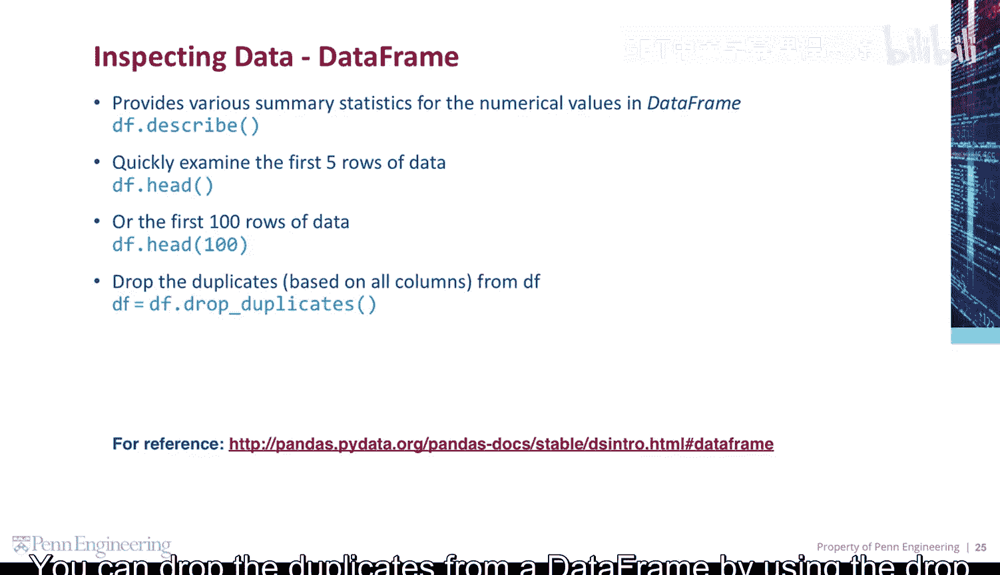

```python
df_no_duplicates = df.drop_duplicates()
```

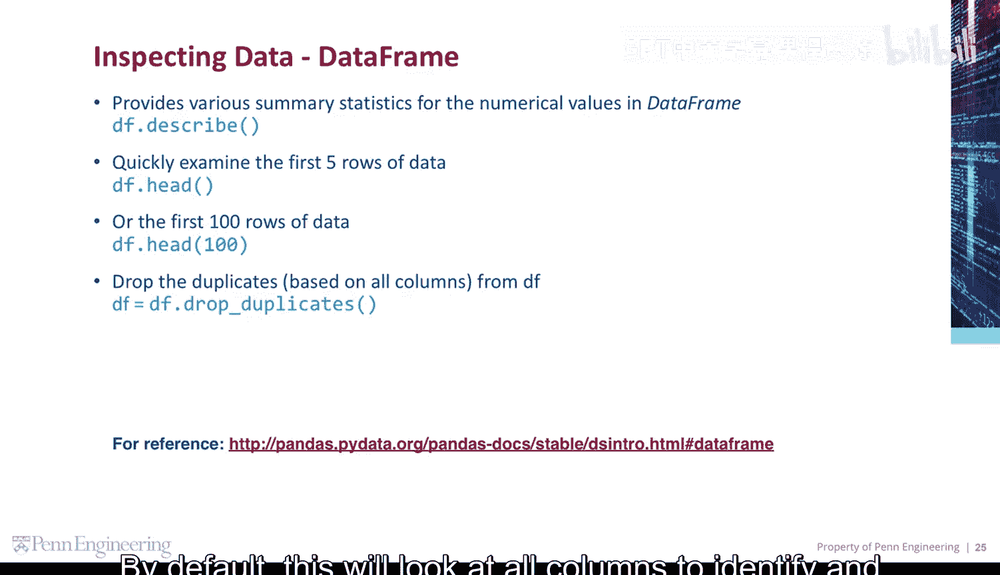

---

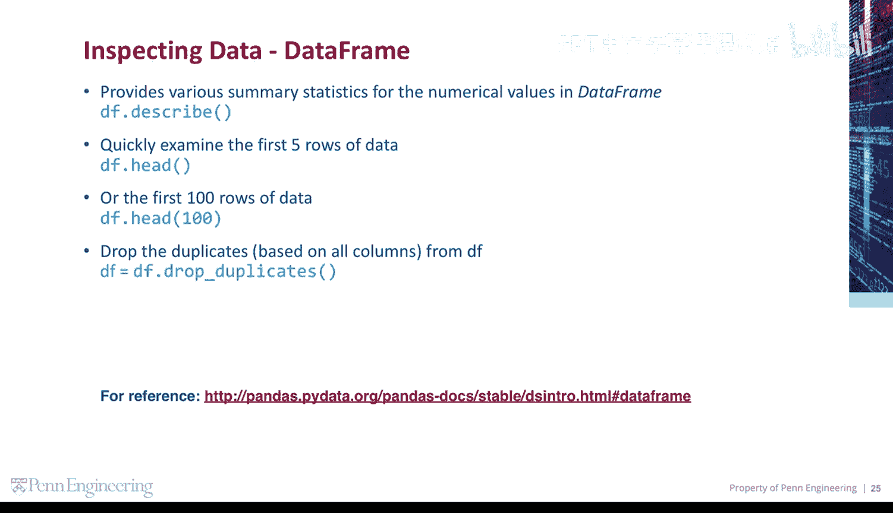

本节课中我们一起学习了如何使用Pandas进行数据检查。我们涵盖了从加载Excel文件、读取工作表到`DataFrame`，再到查看数据维度、统计信息、样本以及处理重复数据的基本步骤。这些是进行任何数据分析前至关重要的准备工作。