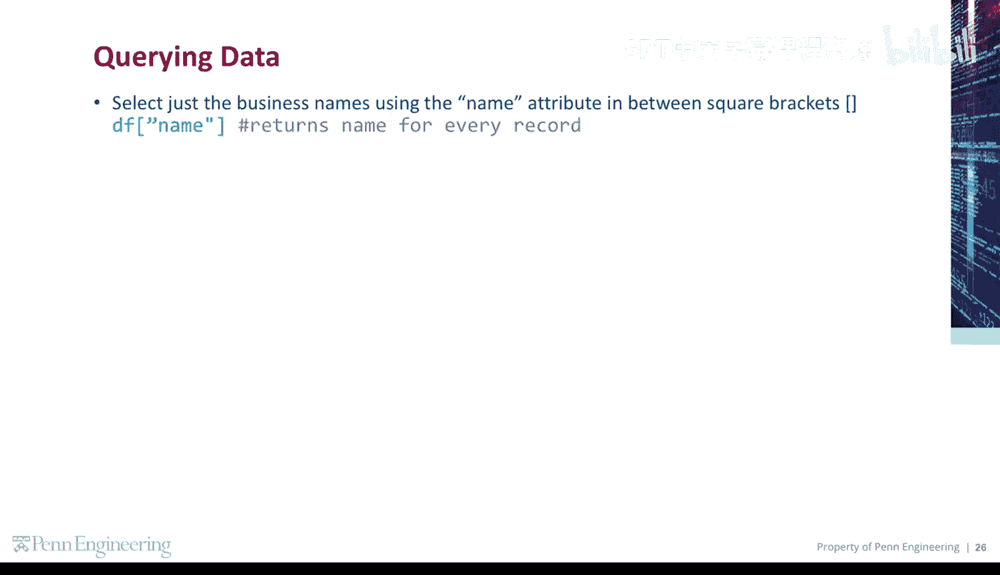
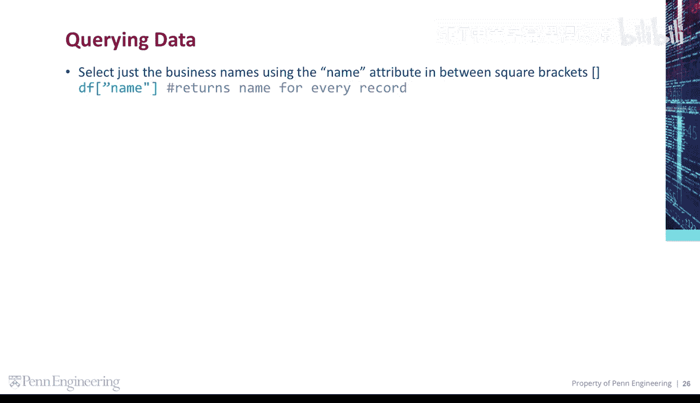
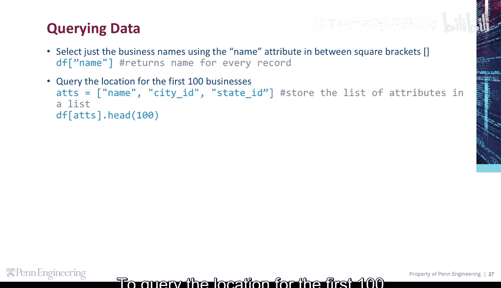
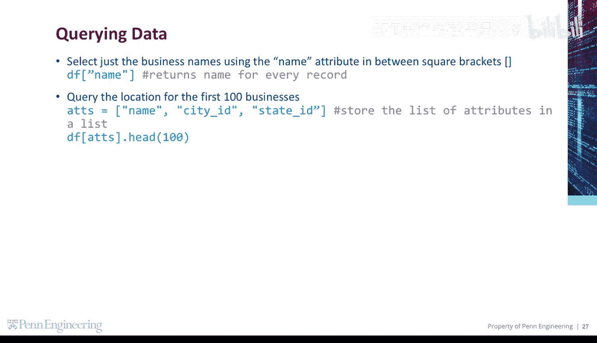
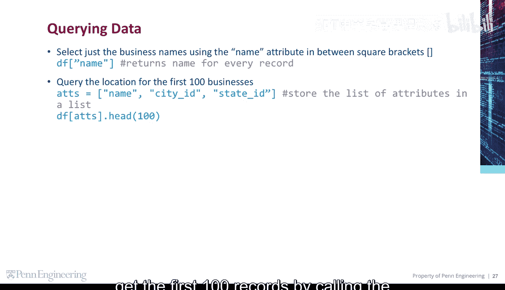
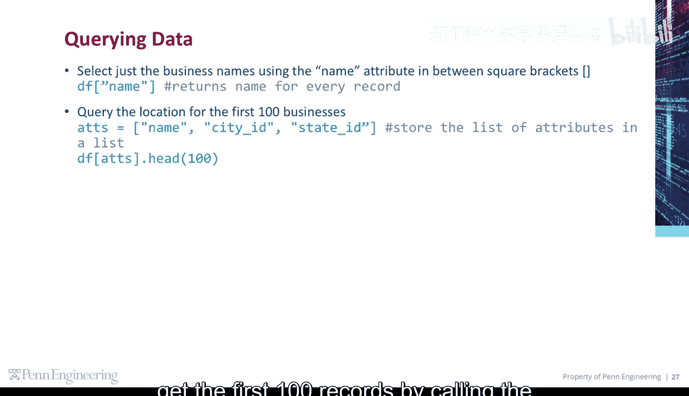
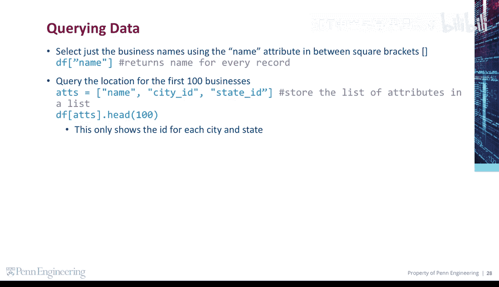
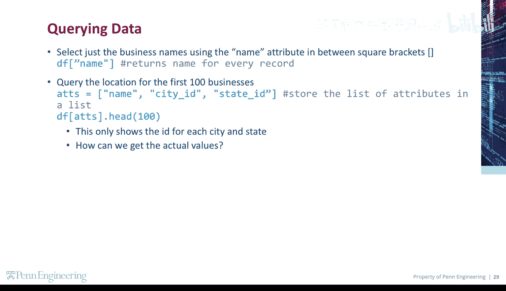

# 118：查询数据

在本节课中，我们将要学习如何使用Pandas库从数据集中查询特定的数据列。我们将重点介绍如何选择单列、多列以及如何查看数据的前几行。



## 选择特定数据列

上一节我们介绍了数据框的基本结构，本节中我们来看看如何从中提取我们感兴趣的列。要选择特定的数据列，需要在方括号内指定列的名称。


例如，如果我们有一个名为 `businesses` 的数据框，其中包含 `name`、`city_id`、`state_id` 等列。

## 选择单列数据



以下是选择单列数据的方法。要仅选择企业的名称，可以使用 `name` 属性。

**代码示例：**
```python
businesses['name']
```

## 选择多列数据



有时我们需要同时查看多个相关的列。要查询前100家企业的位置信息，我们需要创建一个包含所需列名的列表。



以下是创建列名列表的步骤：
1.  确定需要的列，例如 `city_id` 和 `state_id`。
2.  将这些列名放入一个Python列表中。

**代码示例：**
```python
columns_to_select = ['city_id', 'state_id']
```

## 获取数据子集



创建好列名列表后，就可以用它来获取数据的子集了。然后将该列表放入方括号中，并通过调用参数为100的 `head` 方法来获取前100条记录。



**代码示例：**
```python
businesses[columns_to_select].head(100)
```

执行以上操作将只显示每个城市和州的ID。

## 关联数据获取实际值



但是，我们想要看到实际的城市和州名称，而不仅仅是ID。那么，如何才能获取实际的值呢？

我们需要将这个数据集与其他数据集进行关联（Join）。例如，可能存在一个独立的 `cities` 数据框，其中 `city_id` 对应着具体的城市名。通过合并这两个数据框，我们就可以用有意义的名称替换掉ID。这将是后续课程中要深入探讨的内容。



本节课中我们一起学习了如何从Pandas数据框中查询单列和多列数据，以及如何使用 `head` 方法查看数据的前几行。我们还了解到，当数据通过ID关联时，需要连接其他数据集才能获得可读的实际值。