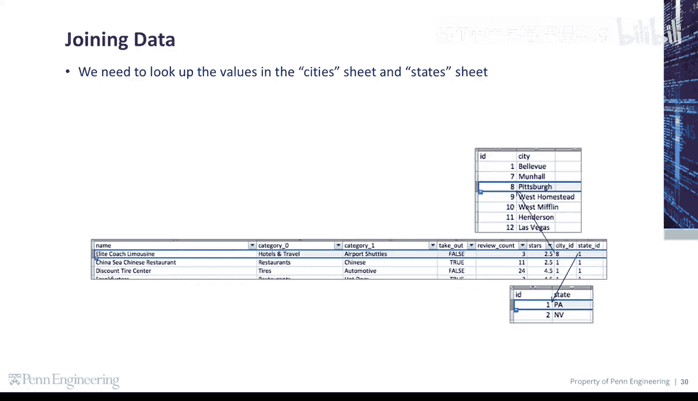
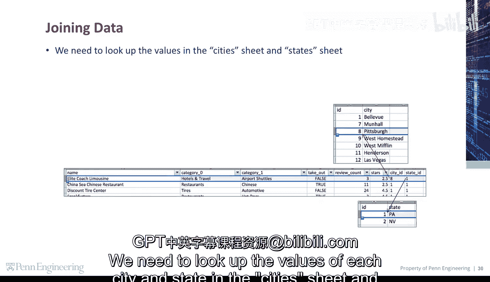
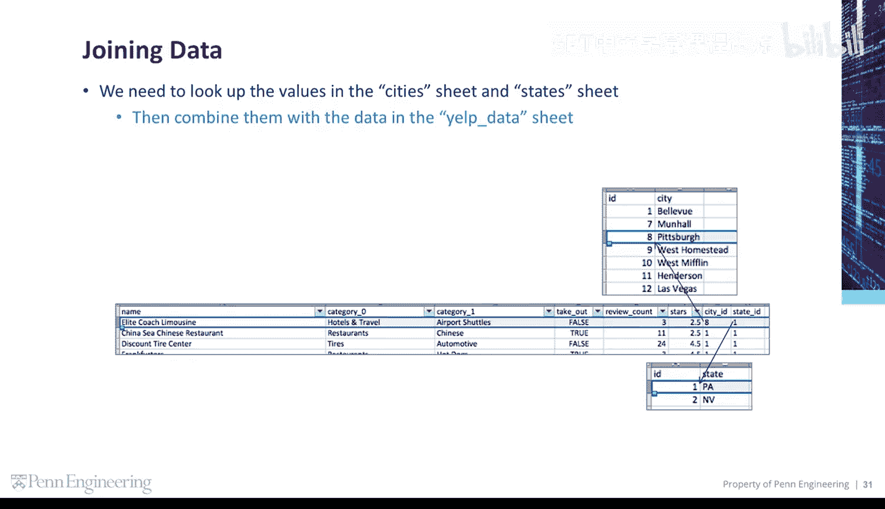
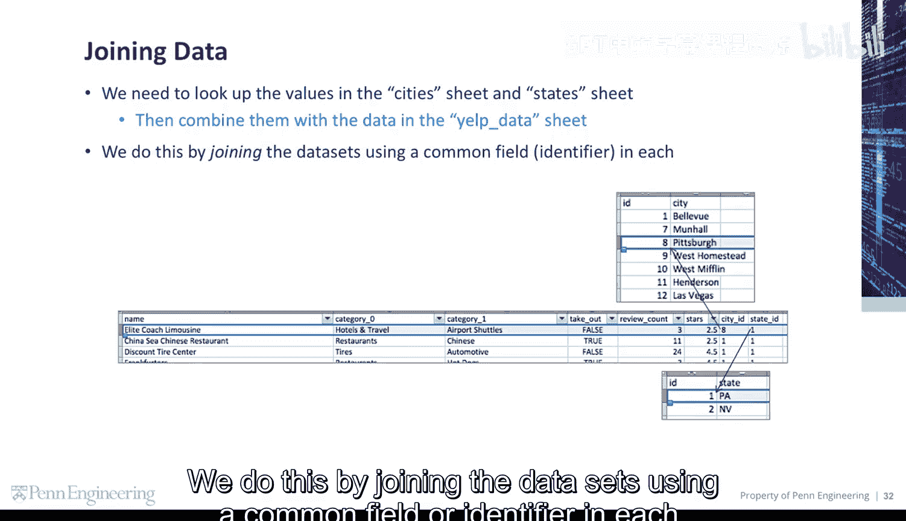
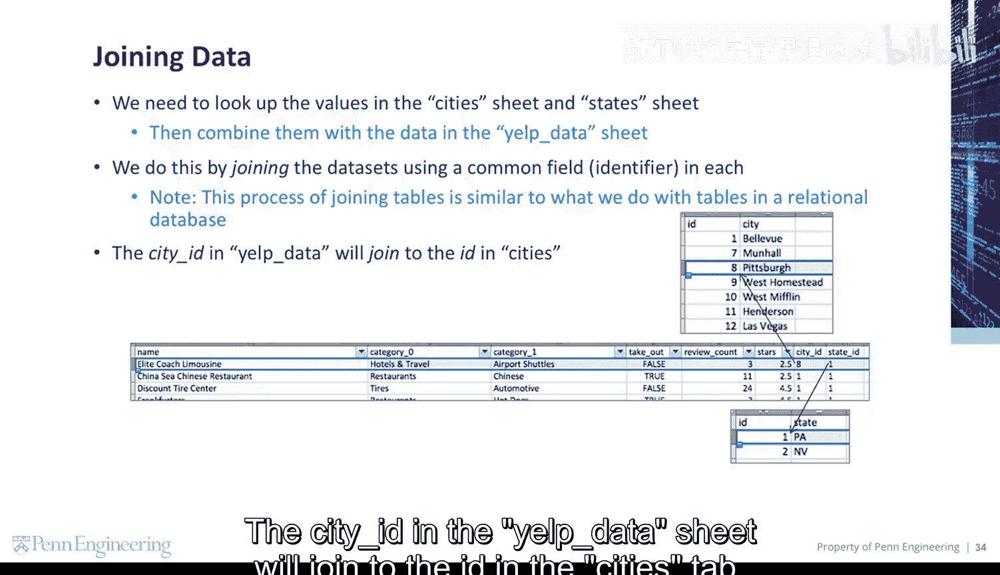
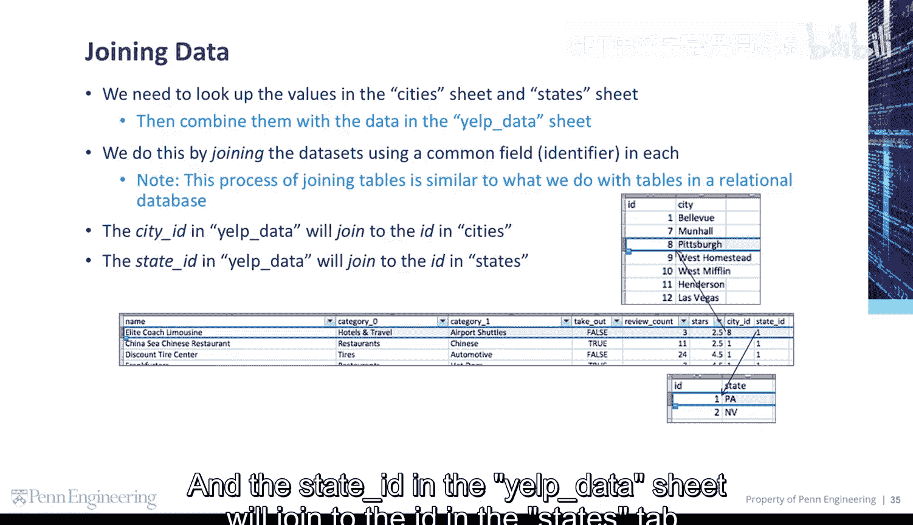
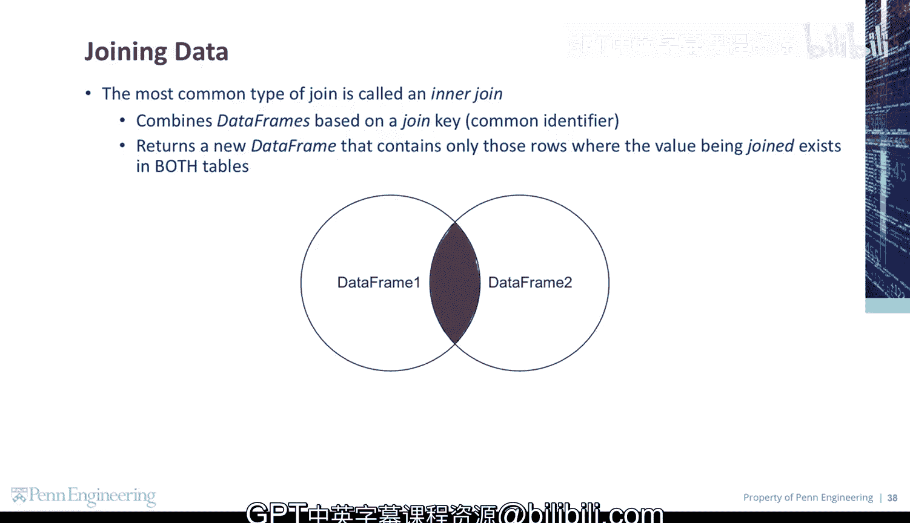

# 119：数据连接 🔗

在本节课中，我们将要学习如何将来自不同表格的数据连接（Join）在一起。这是数据分析中一个非常核心的操作，它允许我们基于共同的字段，将分散的信息整合成一个更完整的数据集。



上一节我们介绍了数据清洗的基本概念，本节中我们来看看如何将清洗后的数据进行合并。

## 数据连接的需求

我们手头有三份数据：一份是Yelp的主要业务数据表，另外两份分别是城市信息表和州信息表。Yelp数据表中只包含了城市和州的ID编号，而没有具体的名称。




我们需要根据这些ID，在城市表和州表中查找出对应的城市名和州名。




然后，将这些查找到的名称与Yelp主数据表中的其他信息结合起来。




## 连接的工作原理

实现这个目标的方法，是通过每个数据集中共有的字段或标识符来连接它们。


这种连接表格的过程，与我们在关系型数据库中对表进行的操作非常相似。



具体来说，连接操作依赖于“键”（Key）：
*   Yelp数据表中的“城市ID”将与“城市”表中的“ID”进行连接。
*   Yelp数据表中的“州ID”将与“州”表中的“ID”进行连接。

## 内连接（Inner Join）

最常用的连接类型称为**内连接**。



它的工作原理是基于一个连接键或公共标识符来合并数据框（DataFrame），并返回一个新的数据框。这个新数据框**只包含**那些连接键的值在**两个原始表格中都存在**的行。

用公式可以这样理解其逻辑：
`结果表 = 表A ∩ 表B （基于连接键）`

或者用伪代码描述其核心过程：
```python
result = []
for row_a in table_a:
    for row_b in table_b:
        if row_a[key] == row_b[key]:  # 连接条件
            result.append( combine(row_a, row_b) )
```



上图直观地展示了内连接的效果：只有两个表格中ID匹配的行才会被保留并合并到最终结果中。

---


本节课中我们一起学习了数据连接的核心概念。我们了解到，为了整合分散在不同表格中的信息，可以使用基于共同字段的连接操作。其中，**内连接**是最基础且最常用的连接类型，它确保最终结果只包含两个数据源中都存在的匹配项。掌握数据连接是进行复杂数据分析的关键一步。