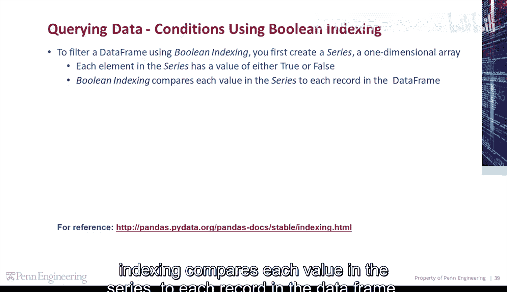
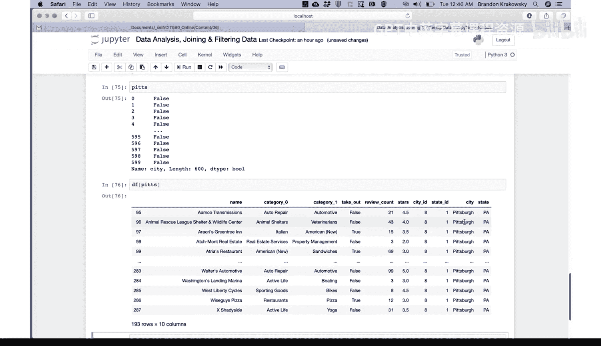
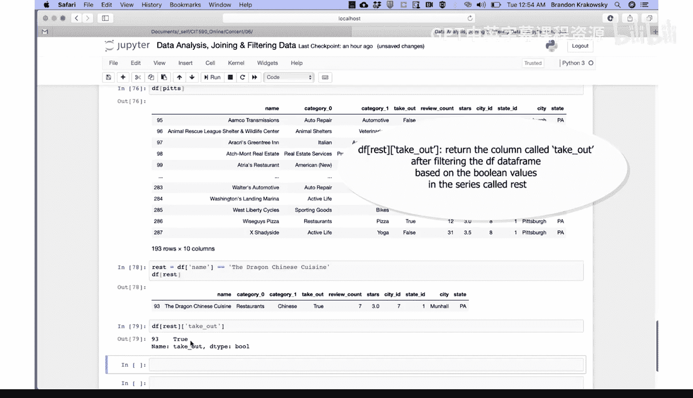
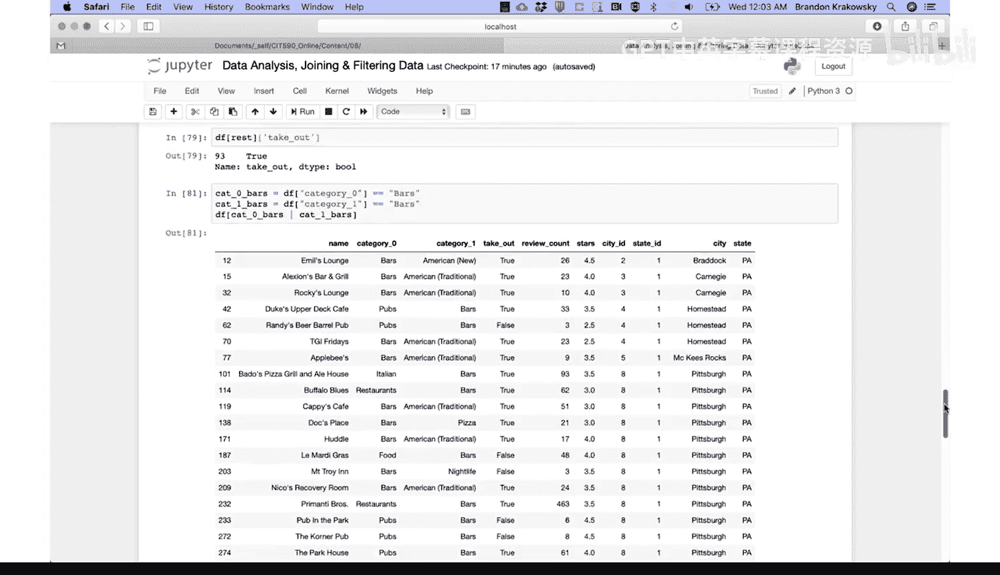
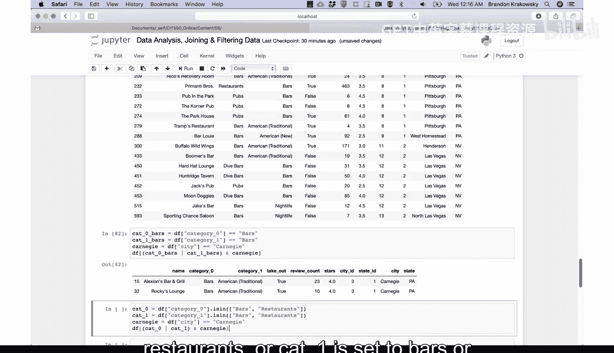
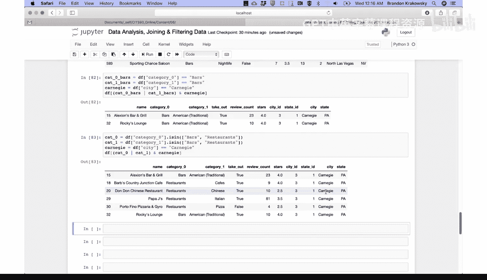

# 122：使用布尔索引查询数据 🎯

在本节课中，我们将要学习如何使用布尔索引（Boolean Indexing）来筛选和查询Pandas数据框（DataFrame）中的数据。这是一种非常强大且直观的数据过滤方法。

## 概述

布尔索引的核心思想是：首先创建一个布尔序列（Series），其中每个元素的值是`True`或`False`。然后，将这个布尔序列与数据框进行比较，从而筛选出满足条件的记录。接下来，我们将通过几个具体的例子来详细讲解这个过程。



## 创建布尔条件序列

要使用布尔索引筛选数据框，首先需要创建一个一维的布尔序列。

这个序列中的每个元素都对应数据框中的一条记录，其值为`True`或`False`。

布尔索引会将这个布尔序列中的每个值与数据框中的每条记录进行比较。

例如，我们想筛选出所有位于匹兹堡（Pittsburgh）的企业。

以下是创建条件序列的步骤：

```python
# 创建一个条件：城市等于“Pittsburgh”
pits = df['city'] == 'Pittsburgh'
```

运行这行代码后，`pits`变量中存储了一个布尔序列。我们可以查看它的类型和内容。

```python
# 查看类型
type(pits)  # 输出：pandas.core.series.Series

# 查看内容
pits  # 输出：一个由True和False值组成的序列
```

## 应用布尔索引筛选数据



现在，我们想用这个布尔序列来过滤数据框本身。

为此，我们可以在数据框名称后的方括号中放入这个条件。

```python
# 使用布尔序列筛选数据框
df[pits]
```

这段代码会根据`pits`序列中的`True`/`False`值来过滤数据框。执行后，我们只会看到城市为“匹兹堡”的记录。

## 查询特定信息

假设我们想查询“The Dragon Chinese Cuisine”这家餐厅是否提供外卖（takeout）服务。

我们需要先筛选出名称为“The Dragon Chinese Cuisine”的企业。

以下是具体步骤：



```python
# 创建条件：名称为“The Dragon Chinese Cuisine”
condition = df['name'] == 'The Dragon Chinese Cuisine'

# 使用条件筛选数据框
df[condition]
```

执行后，我们看到只有一家企业符合条件，并且其`takeout`列的值为`True`，表示提供外卖服务。

如果我们只想查看`takeout`这一列，可以这样做：

```python
# 筛选后只获取‘takeout’列
df[condition]['takeout']
```

输出结果为`True`，确认了该餐厅提供外卖。

## 组合多个条件进行筛选

接下来，让我们尝试更复杂的查询。例如，我们想筛选出数据集中所有的酒吧（bars）。

我们将使用用户定义的`business category`列来创建条件。

以下是具体步骤：

```python
# 条件1：category0列等于‘bars’
cat0_bars = df['category0'] == 'bars'

# 条件2：category1列等于‘bars’
cat1_bars = df['category1'] == 'bars'

# 组合条件：满足条件1 或 条件2
df[cat0_bars | cat1_bars]
```

这段代码会返回那些`category0`或`category1`中任意一列被标记为“bars”的企业。



现在，我们想进一步筛选出位于卡内基市（Carnegie）的酒吧。

我们需要添加第三个条件。

以下是具体步骤：

```python
# 条件3：城市等于‘Carnegie’
carnegie = df['city'] == 'Carnegie'

# 组合所有条件：满足（条件1 或 条件2）并且 满足条件3
df[(cat0_bars | cat1_bars) & carnegie]
```

这段代码会返回那些`category0`或`category1`为“bars”，并且城市为“Carnegie”的企业。

## 使用列表进行多值匹配

最后，我们想筛选出卡内基市（Carnegie）中所有被归类为“酒吧”或“餐厅”的企业。

我们可以使用`.isin()`函数来检查列中的值是否在一个给定的列表中。

以下是具体步骤：

```python
# 创建一个包含目标类别的列表
target_categories = ['bars', 'restaurants']

# 条件1：category0列的值在目标列表中
cat0_in_list = df['category0'].isin(target_categories)

# 条件2：category1列的值在目标列表中
cat1_in_list = df['category1'].isin(target_categories)

# 条件3：城市等于‘Carnegie’
carnegie = df['city'] == 'Carnegie'

# 组合所有条件
df[(cat0_in_list | cat1_in_list) & carnegie]
```

这段代码会返回那些`category0`或`category1`为“bars”或“restaurants”，并且城市为“Carnegie”的企业。

## 总结



本节课中，我们一起学习了如何使用布尔索引在Pandas数据框中进行高效的数据查询。我们掌握了以下核心技能：

1.  **创建布尔条件序列**：通过比较数据框的列与特定值来生成`True`/`False`序列。
2.  **应用单个条件筛选**：使用`df[condition]`的语法来过滤数据。
3.  **组合多个条件**：使用逻辑运算符`|`（或）和`&`（与）来构建复杂的查询逻辑。
4.  **使用`.isin()`函数**：便捷地检查列值是否属于一个预定义的列表。



布尔索引是数据分析中筛选和提取目标数据的强大工具，理解并掌握它将为后续的数据处理工作打下坚实基础。