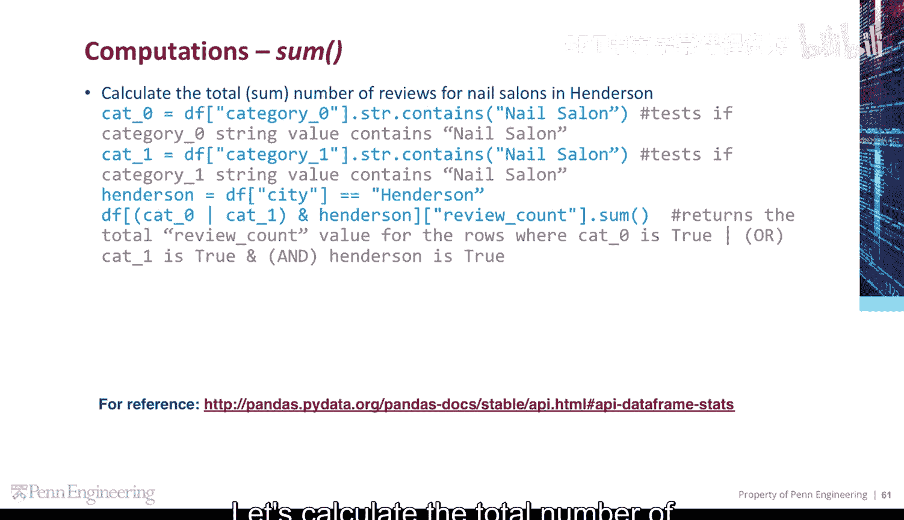
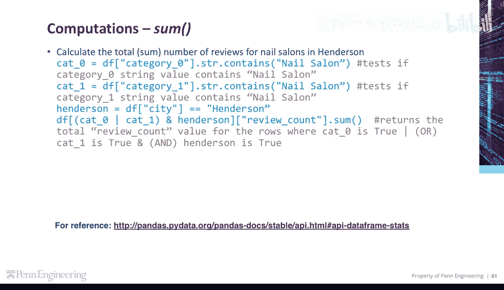
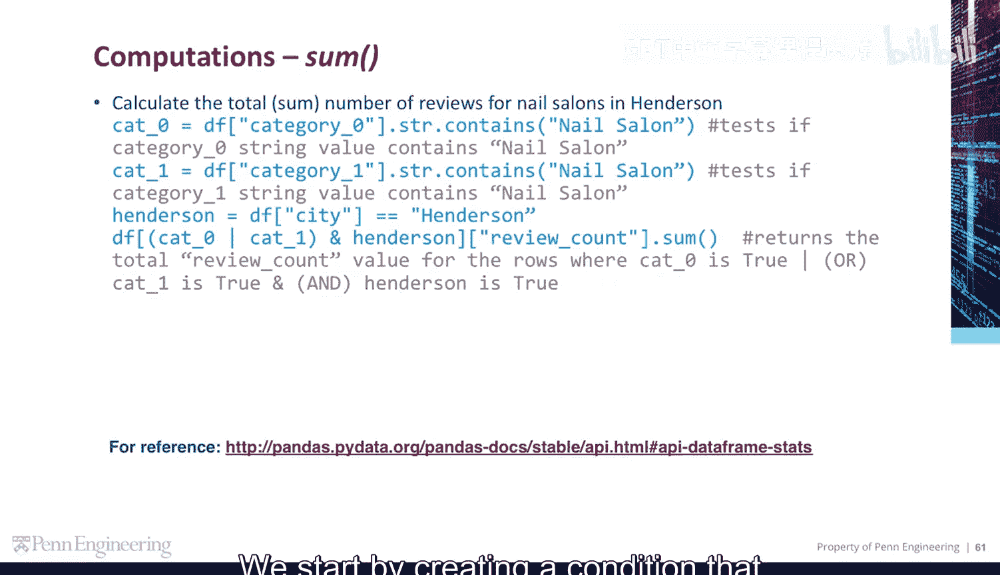
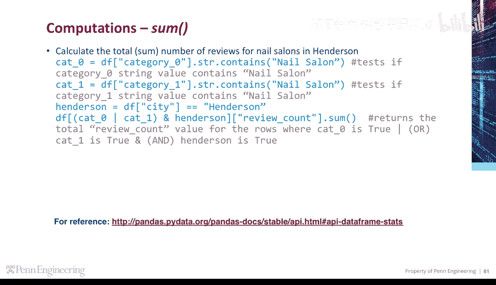
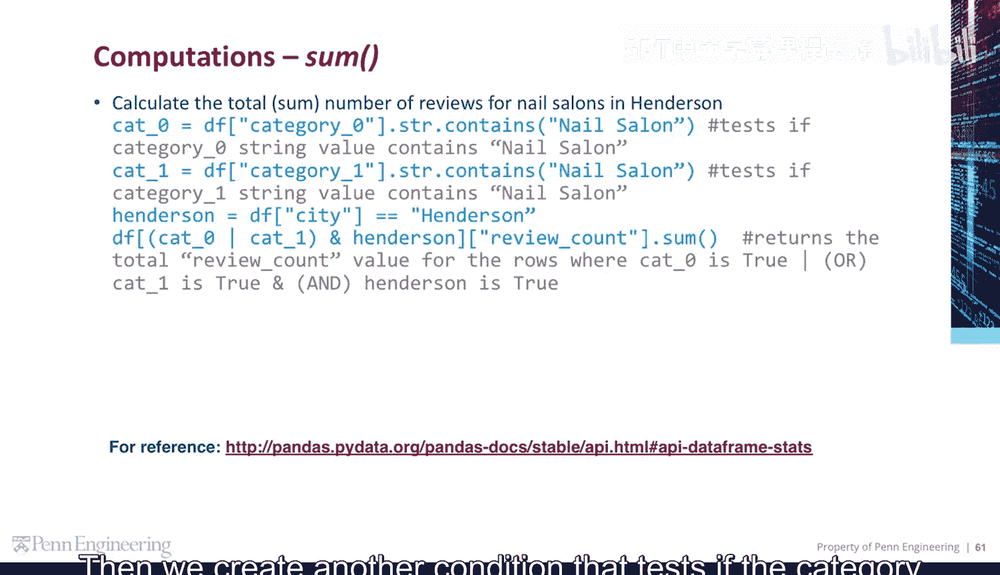
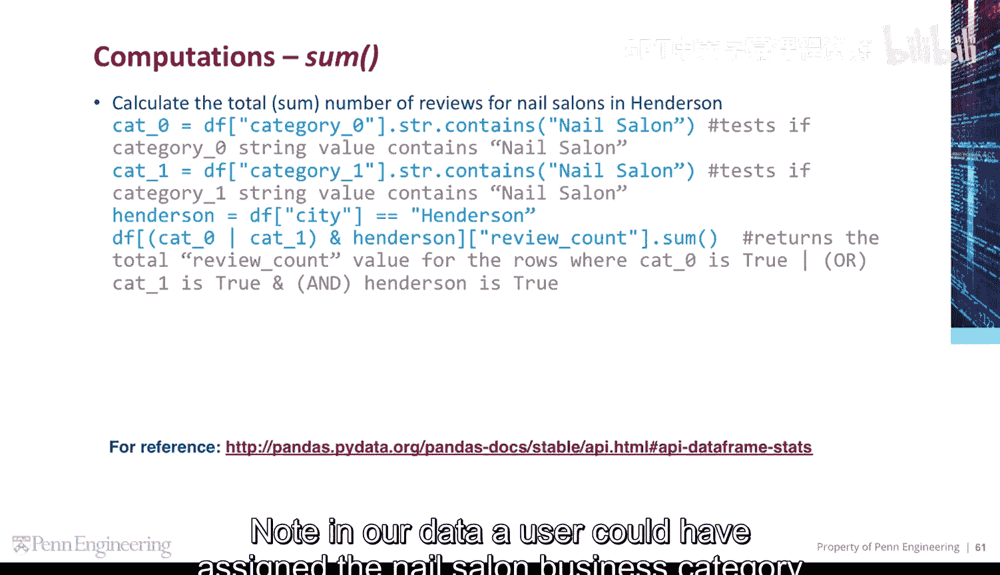
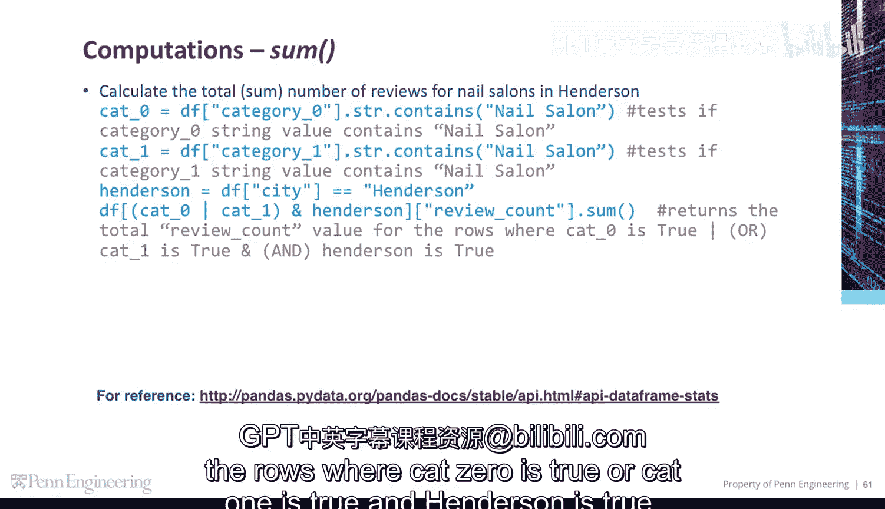
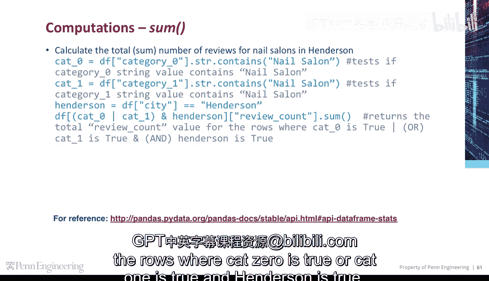
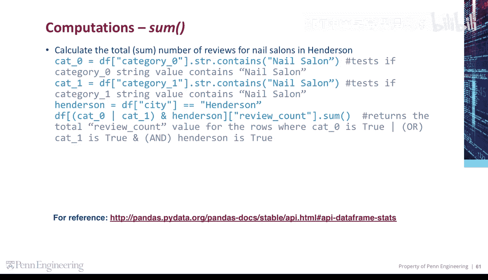

# 124：使用`sum`函数计算数据总和 🧮

在本节课中，我们将要学习如何使用`sum`函数来计算数据行中数值的总和。这是一个非常实用的功能，可以帮助我们快速获取特定条件下的数据总量。


## 概述



为了计算数据行中数值的总和，我们可以使用`sum`函数。这个函数能够对满足特定条件的行中的指定列进行求和。



上一节我们介绍了数据筛选的基本概念，本节中我们来看看如何结合筛选条件与求和函数。

## 计算亨德森市美甲沙龙的总评论数





我们的目标是计算位于亨德森市的所有美甲沙龙的总评论数。

首先，我们需要查询数据并筛选出亨德森市的所有美甲沙龙。



以下是构建筛选条件的步骤：

1.  **创建第一个条件**：测试`category0`字符串值是否包含“nail salon”。
    ```python
    condition1 = df['category0'].str.contains('nail salon')
    ```




2.  **创建第二个条件**：测试`category1`字符串值是否包含“nail salon”。
    ```python
    condition2 = df['category1'].str.contains('nail salon')
    ```
    在我们的数据中，用户可能将“美甲沙龙”这个业务类别分配给`category0`或`category1`，因此我们需要同时考虑这两种情况。

3.  **创建第三个条件**：筛选城市为“Henderson”的行。
    ```python
    condition3 = df['city'] == 'Henderson'
    ```


最后，我们将所有三个条件组合起来，并计算`review_count`列的总和。
```python
total_reviews = df[ (condition1 | condition2) & condition3 ]['review_count'].sum()
```

这段代码返回的是满足以下条件的行的总评论数：`category0`包含“nail salon”**或**`category1`包含“nail salon”，**并且**城市是“Henderson”。



## 总结





本节课中我们一起学习了如何使用`sum`函数对满足复杂条件的数据行进行求和。关键步骤包括：构建多个逻辑条件（使用`|`表示“或”，`&`表示“且”），然后应用`sum()`函数到目标列上。这种方法可以高效地计算数据子集的总和。