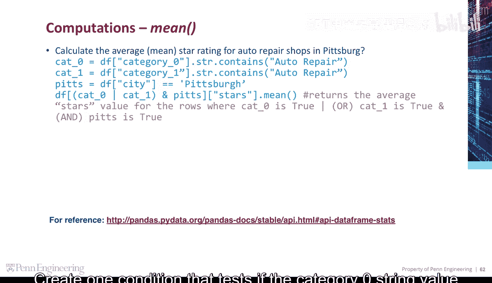
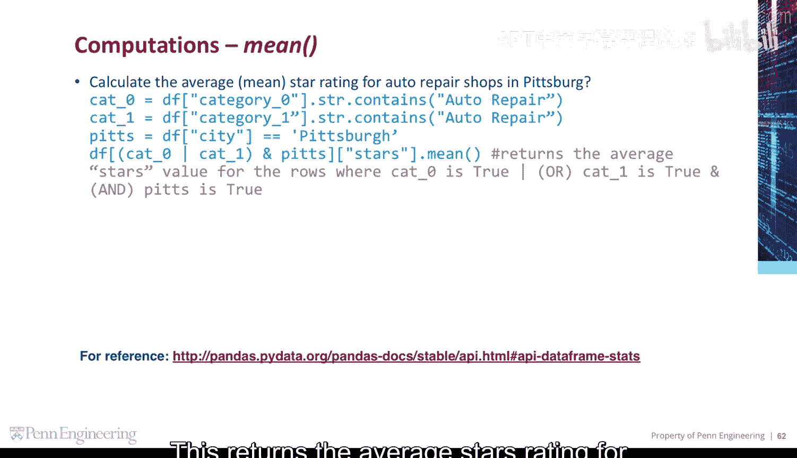
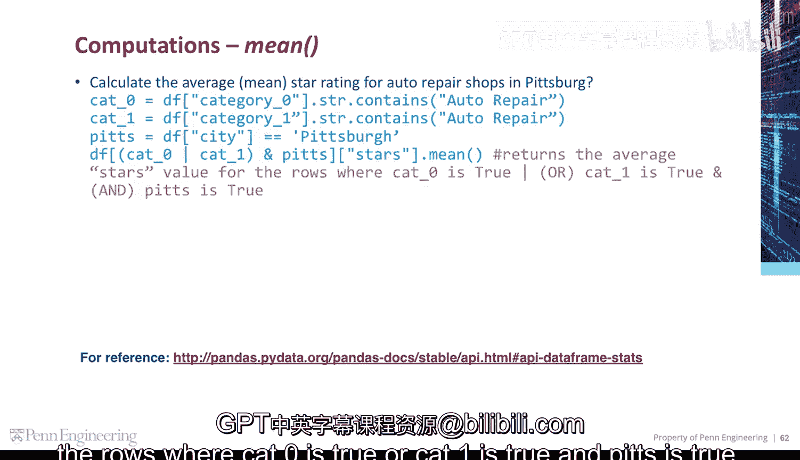
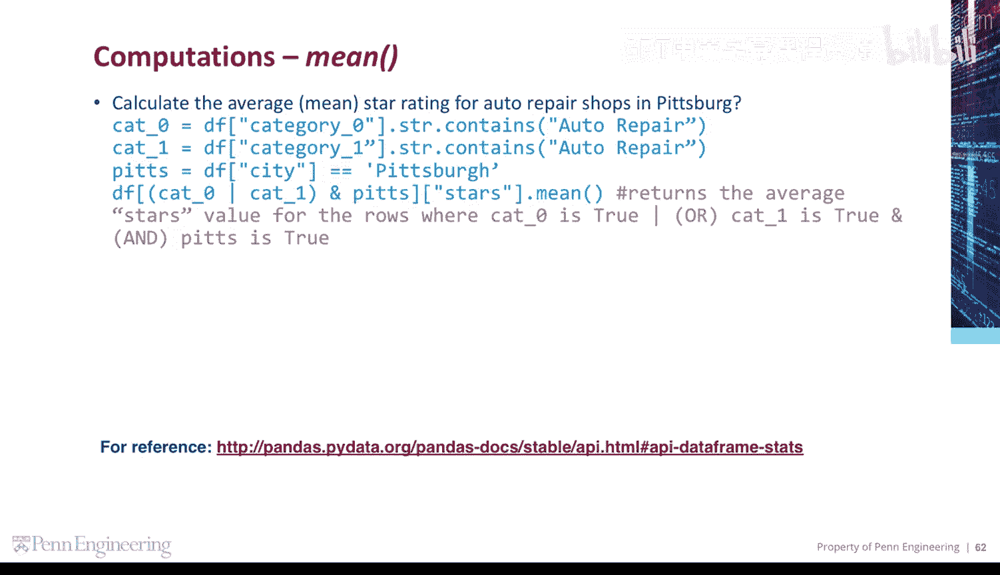

# 125：计算平均值 📊

在本节课中，我们将学习如何使用Python的Pandas库来计算匹兹堡市汽车维修店的平均星级评分。我们将通过数据筛选和聚合操作来完成这个任务。


上一节我们介绍了数据筛选的基本概念，本节中我们来看看如何应用这些概念来计算特定条件下的平均值。

首先，我们需要对数据进行筛选。目标是找出所有位于匹兹堡的汽车维修店。

以下是创建筛选条件的步骤：
*   创建第一个条件，检查`category_0`列中的字符串值是否包含“auto repair”。
*   创建第二个条件，检查`category_1`列中的字符串值是否包含“auto repair”。
*   创建第三个条件，检查`city`列的值是否等于“Pittsburgh”。

```python
condition1 = df['category_0'].str.contains('auto repair')
condition2 = df['category_1'].str.contains('auto repair')
condition3 = df['city'] == 'Pittsburgh'
```

接下来，我们需要将这三个条件组合起来。我们想要的是满足以下所有条件的行：店铺是汽车维修店（即`category_0`或`category_1`包含“auto repair”），并且位于匹兹堡。




以下是组合条件的方法：
*   使用逻辑或运算符`|` 将`condition1`和`condition2`组合，表示“汽车维修店”这个条件。
*   使用逻辑与运算符`&` 将上一步的结果与`condition3`组合，表示同时满足“位于匹兹堡”的条件。


```python
final_condition = (condition1 | condition2) & condition3
```

现在，我们已经有了最终的筛选条件。接下来，我们可以应用这个条件来筛选数据框，并计算目标列的平均值。


以下是计算平均值的步骤：
*   使用`df[final_condition]`筛选出满足所有条件的行。
*   在筛选后的数据子集上，选择`Stars`列。
*   调用`.mean()`方法计算该列的平均值。

```python
average_rating = df[final_condition]['Stars'].mean()
```





这段代码返回的结果，就是那些满足`category_0`为真或`category_1`为真，并且`city`为匹兹堡的行的`Stars`列的平均值。



本节课中我们一起学习了如何通过组合多个条件来筛选Pandas数据框，并计算指定列的平均值。核心步骤包括：创建布尔条件、使用逻辑运算符组合条件、应用条件筛选数据，最后调用`.mean()`方法进行聚合计算。