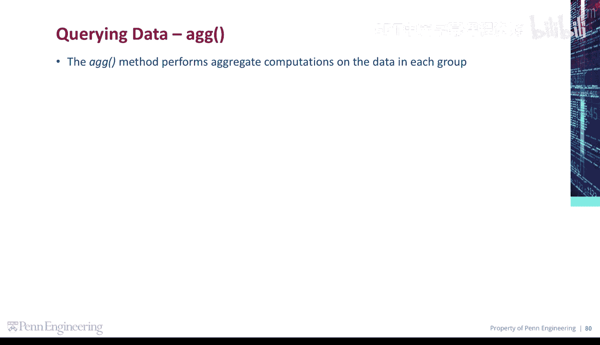
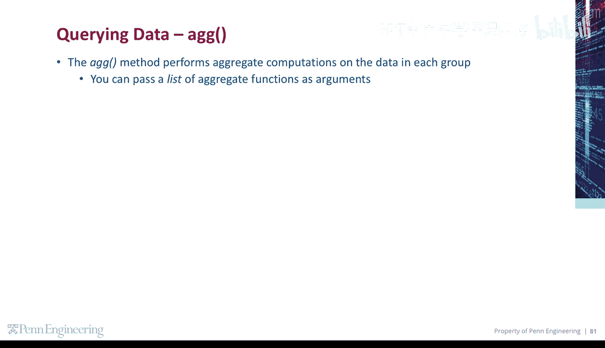
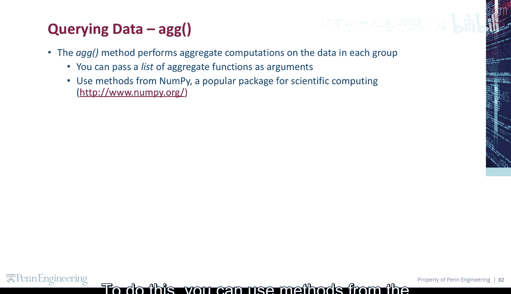
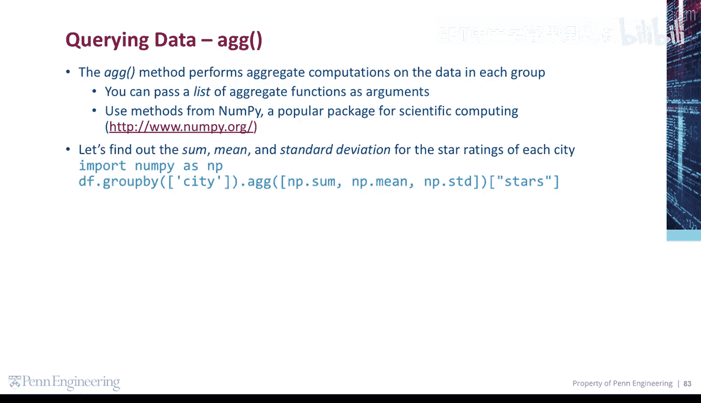
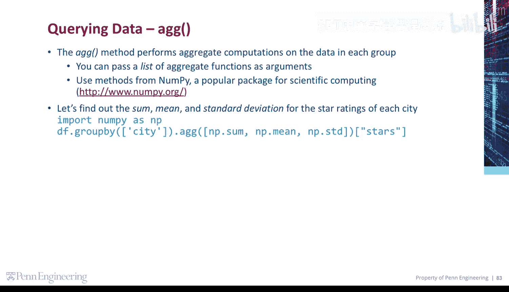

# 130：24_03_02_NumPy库

在本节课中，我们将学习如何利用`agg`方法对分组数据进行聚合计算，并引入强大的科学计算库NumPy来执行多种统计运算。



## 使用`agg`方法进行聚合计算

上一节我们介绍了数据分组的基础知识，本节中我们来看看如何对分组后的数据进行更复杂的聚合计算。`agg`方法允许我们对分组数据执行聚合计算。

## 引入NumPy库进行多函数聚合



为了实现更丰富的统计功能，我们可以借助NumPy模块中的方法。NumPy是一个流行的科学计算包。



以下是使用NumPy进行聚合的步骤：

首先，我们需要导入NumPy库。



```python
import numpy as np
```

然后，我们根据城市对数据进行分组，并调用`agg`方法。作为参数，我们传递NumPy的求和函数、平均值函数和标准差函数。

```python
grouped_data = data.groupby('city')['star_rating'].agg([np.sum, np.mean, np.std])
```

最后，我们展示将这些聚合计算应用于“星级评分”属性的结果。


```python
print(grouped_data)
```



本节课中我们一起学习了如何使用Pandas的`agg`方法结合NumPy库，对分组数据同时进行求和、求平均值和求标准差等多种聚合计算，从而高效地分析数据。