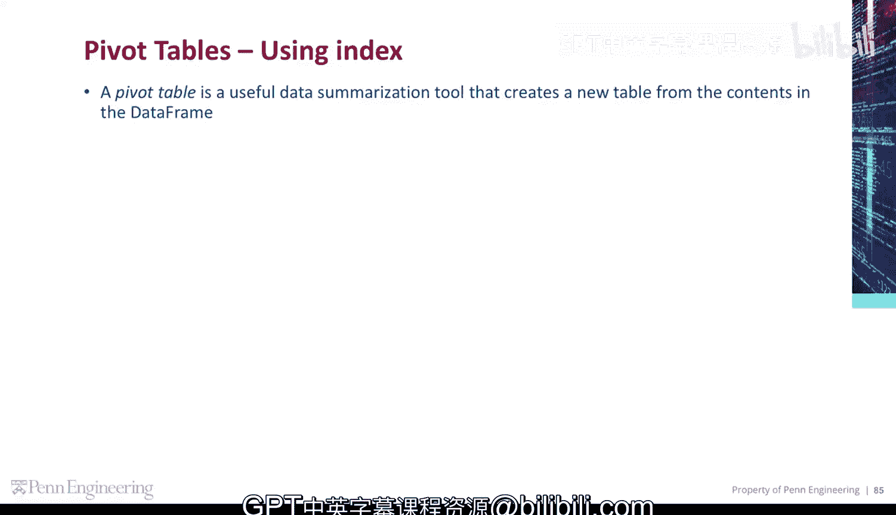
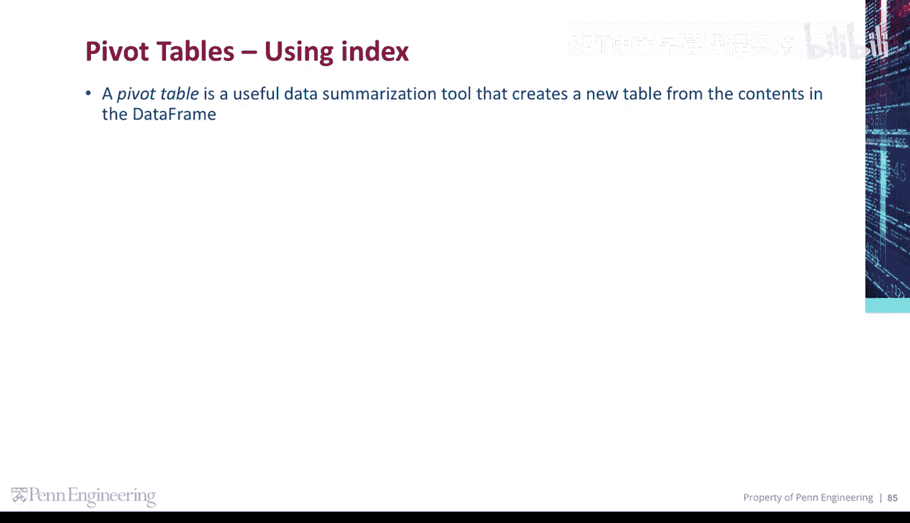
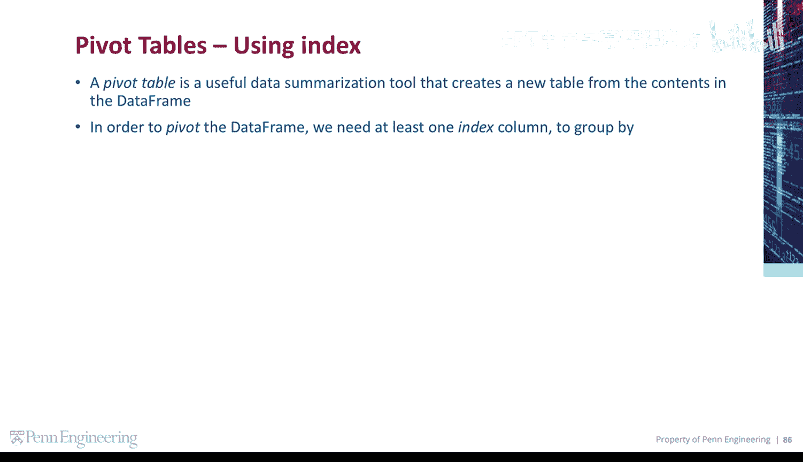
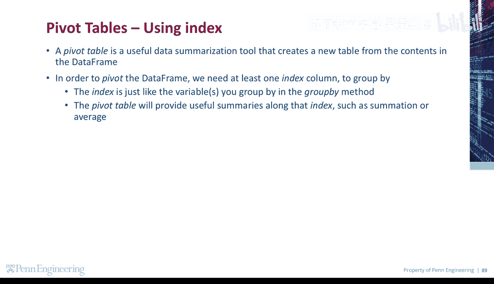
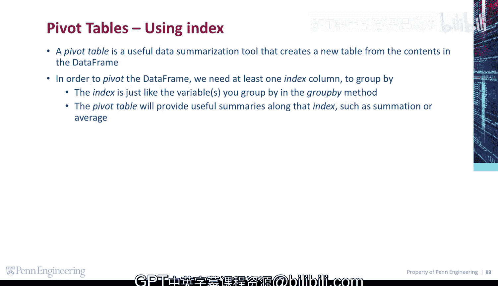

# 131：数据透视表

在本节课中，我们将要学习一个强大的数据汇总工具——数据透视表。我们将了解它的基本概念、工作原理以及如何在数据分析中应用它。

## 什么是数据透视表？ 📊

数据透视表是一种有用的数据汇总工具，它可以根据数据框的内容创建一个新的表格。

上一节我们介绍了数据透视表的基本定义，本节中我们来看看创建它需要哪些要素。

## 数据透视表的核心要素

为了对数据框进行透视，我们至少需要一个索引列来进行分组。

索引就像你在 `group by` 方法中用来分组的变量。数据透视表将沿着该索引为我们提供有用的汇总信息，例如求和或平均值。

以下是创建数据透视表时涉及的几个核心概念：
*   **索引**：用于对数据进行分组的列。
*   **汇总函数**：对分组后的数据执行的操作，例如 `sum()` 或 `mean()`。

## 总结

本节课中我们一起学习了数据透视表。我们了解到，数据透视表是一种基于数据框创建新汇总表格的工具，其核心在于通过指定的索引列对数据进行分组，并应用汇总函数（如求和、求平均值）来生成有意义的摘要信息。