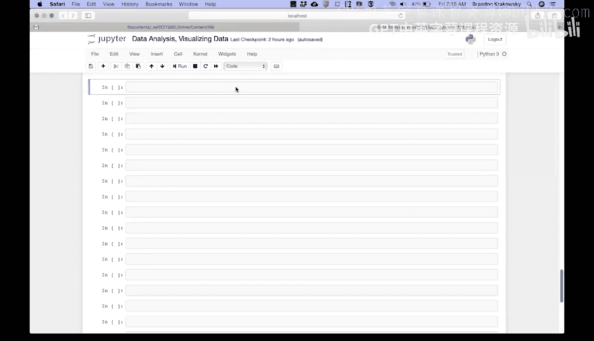
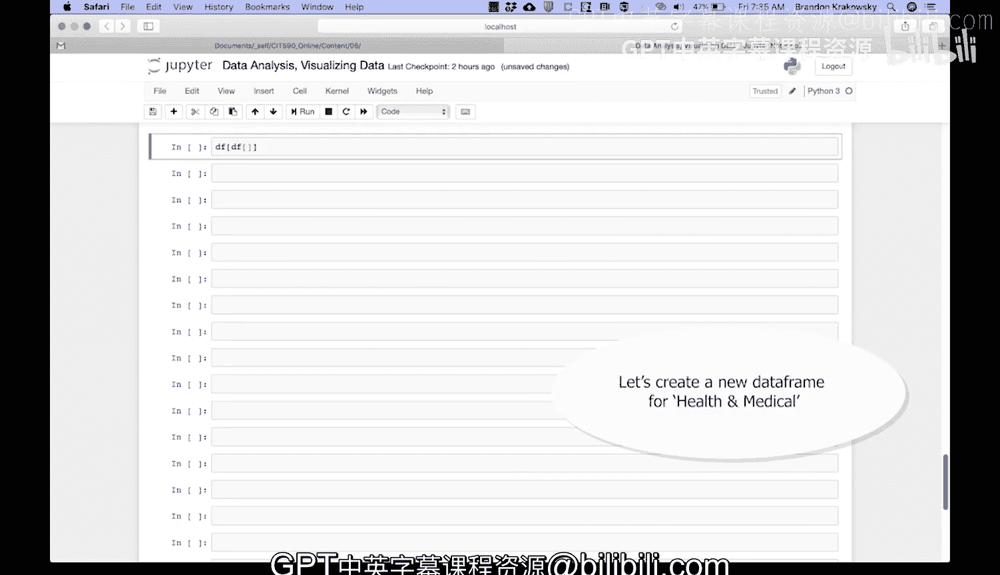
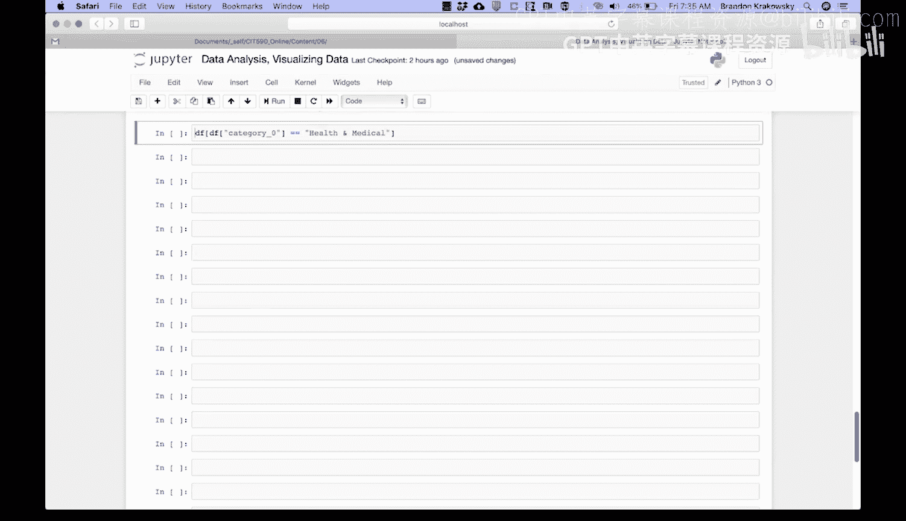
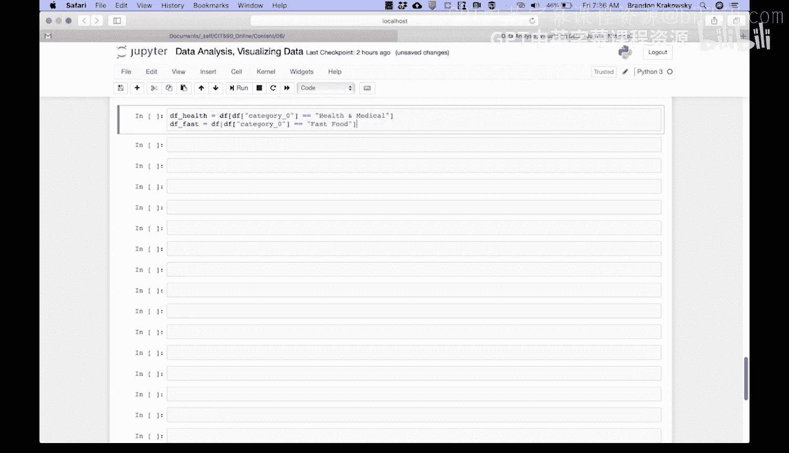
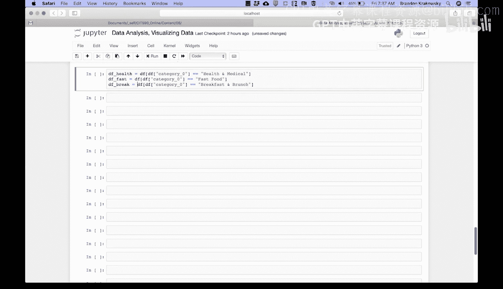
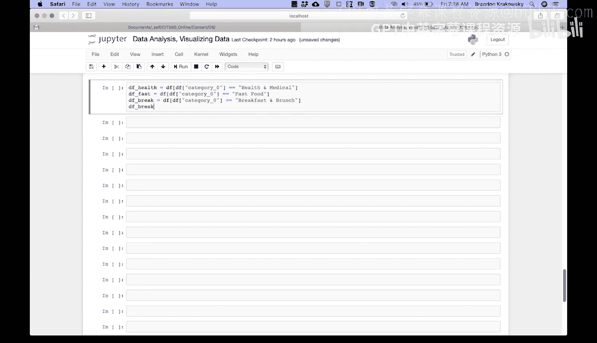
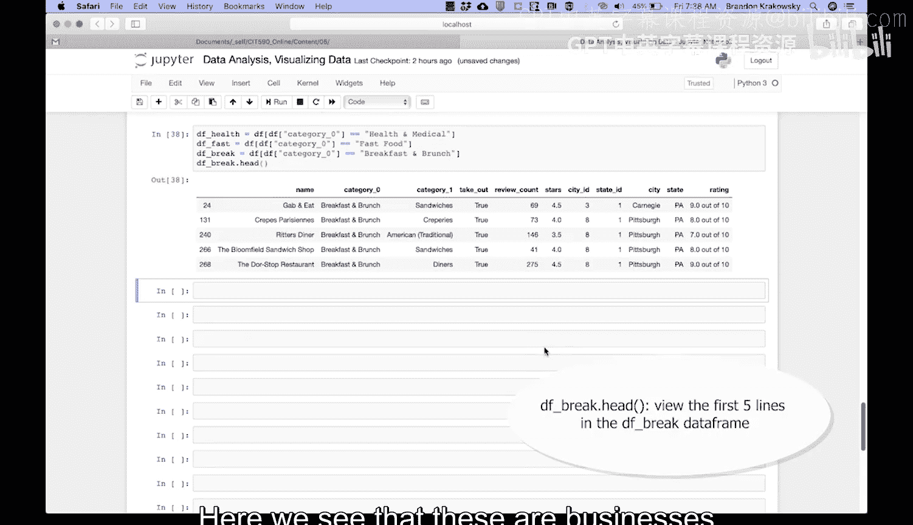
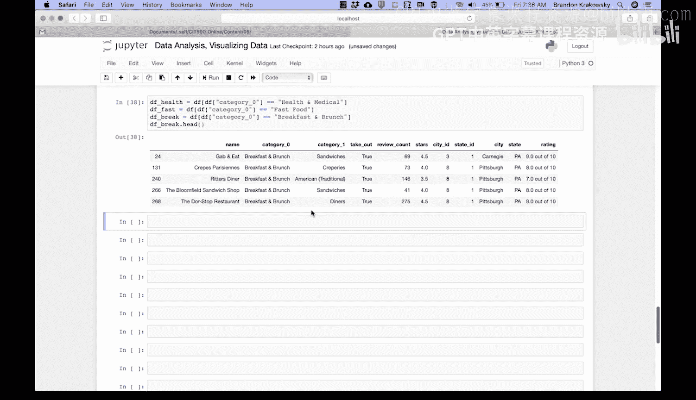
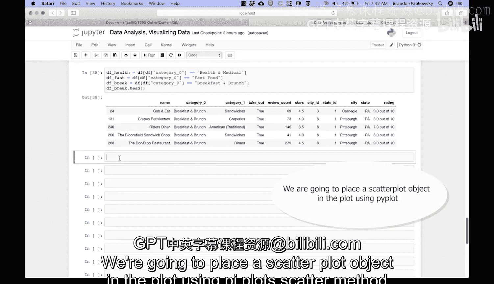

# 144：散点图编码演示-准备数据



在本节课中，我们将学习如何为绘制散点图准备数据。具体来说，我们将从一个数据集中筛选出三个特定类别的数据，为后续的可视化步骤打下基础。

上一节我们介绍了数据集的基本结构，本节中我们来看看如何根据业务类别筛选数据。



首先，我们需要从数据框中筛选出“健康与医疗”类别的数据。以下是具体步骤：



*   创建一个条件，筛选出 `category_0` 列等于“Health and medical”的行。
*   将筛选结果存储在变量 `df_health` 中。

接下来，我们以同样的方式筛选“快餐”类别的数据。



*   创建一个条件，筛选出 `category_0` 列等于“Fast food”的行。
*   将筛选结果存储在变量 `df_fast` 中。

最后，我们来筛选“早餐与早午餐”类别的数据。



*   创建一个条件，筛选出 `category_0` 列等于“Breakfast and brunch”的行。
*   将筛选结果存储在变量 `df_break` 中。

为了验证数据筛选是否正确，我们可以查看一下“早餐与早午餐”数据的前几行。



以下是查看数据前五行的代码：

```python
df_break.head()
```





运行 `head` 函数后，我们可以看到这些行的 `category_0` 列确实都是“Breakfast and brunch”。这表明我们的数据筛选是成功的。

数据准备完成后，我们就可以进入下一步：绘制散点图。我们将使用 `pyplot` 的 `scatter` 方法在图表中放置散点图对象。



本节课中我们一起学习了如何为绘制散点图准备数据。我们通过条件筛选，从原始数据框中分离出了“健康与医疗”、“快餐”以及“早餐与早午餐”三个类别的数据子集，并验证了筛选结果的正确性。这些准备好的数据子集将是下一节绘制多类别散点图的基础。