# 146：散点图编码演示-显示可视化 📊

在本节课中，我们将学习如何使用Python的matplotlib库创建和显示散点图，并了解如何通过调整坐标轴比例（例如使用对数刻度）来优化数据可视化效果，以便更清晰地展示数据分布。

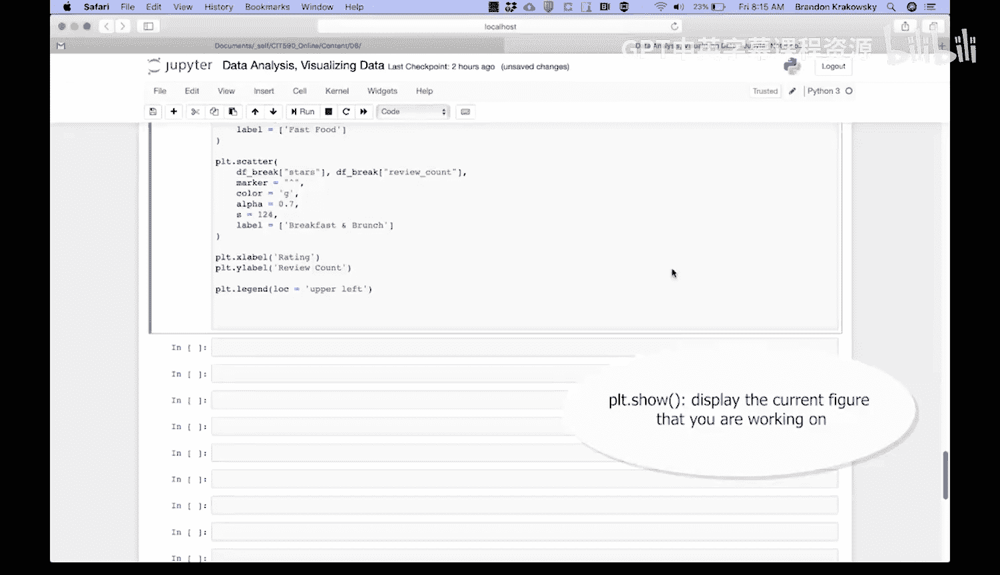

## 概述

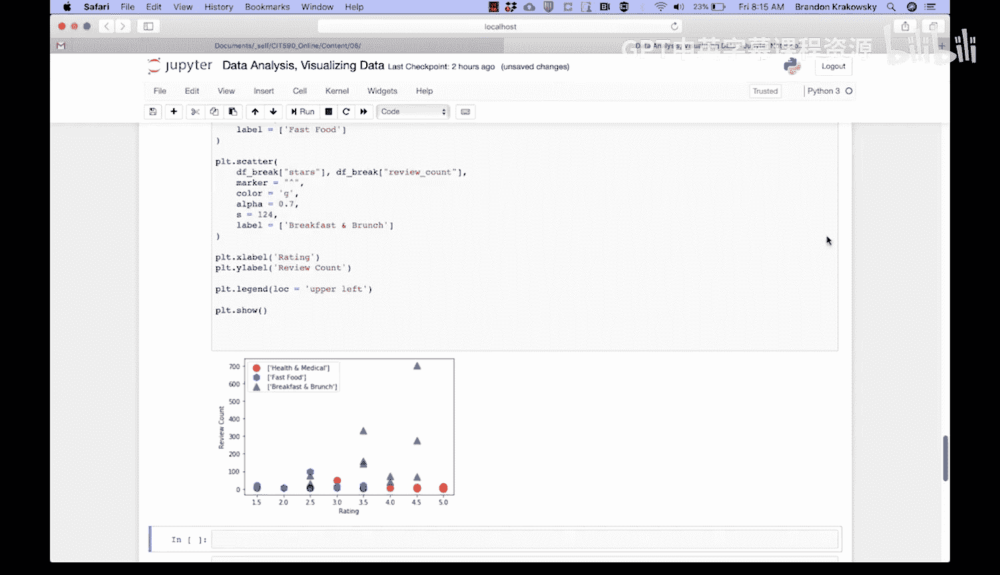

上一节我们介绍了如何准备数据并创建散点图。本节中，我们将重点讲解如何显示和优化这个可视化图表。

## 显示散点图

要显示我们创建的散点图，需要使用 `plt.show()` 函数。

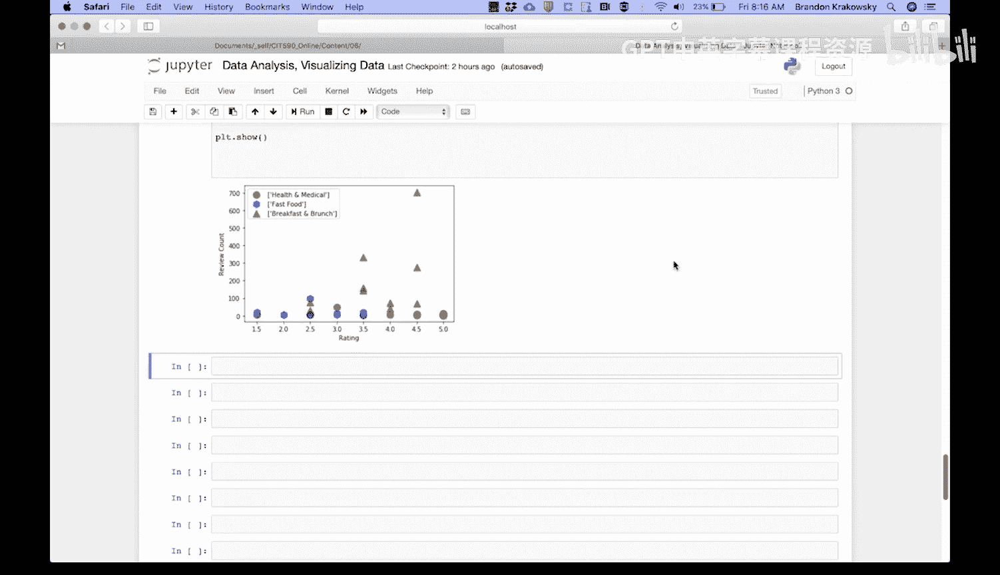

```python
plt.show()
```

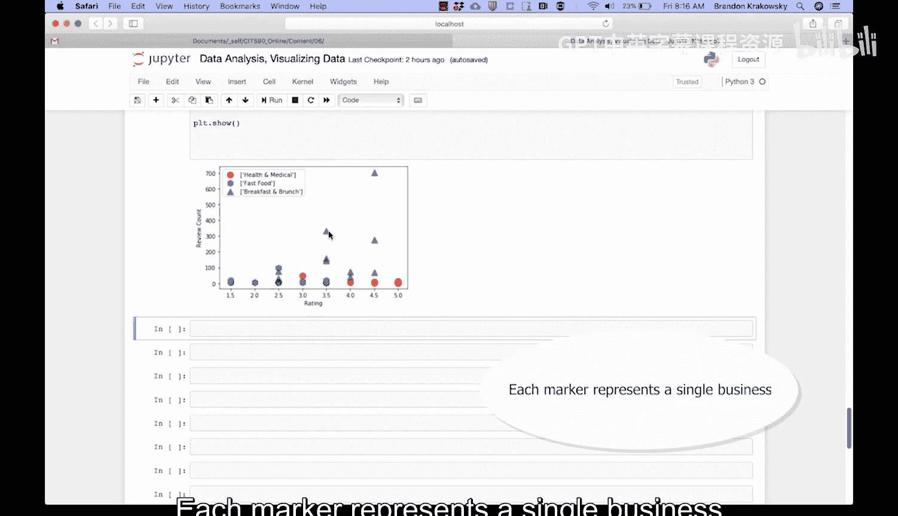

运行代码后，我们将得到一个可视化图表。

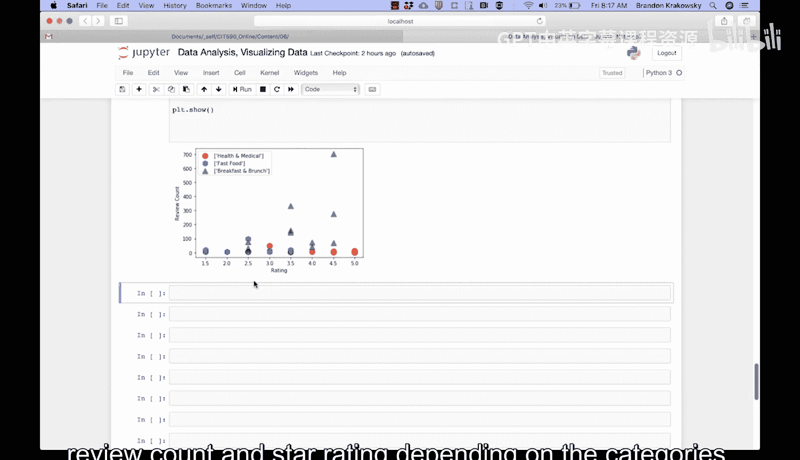


该图表展示了每个类别的评论数量和星级评分。每个标记点代表一个独立的商家。我们可以观察到，根据类别的不同，评论数量和星级评分呈现出一定的聚类现象。


## 优化坐标轴比例

在当前的图表中，Y轴（代表评论数量）上的一些异常值（离群点）挤压了其他数据点的显示空间，使得大部分数据点聚集在图表底部，难以观察。

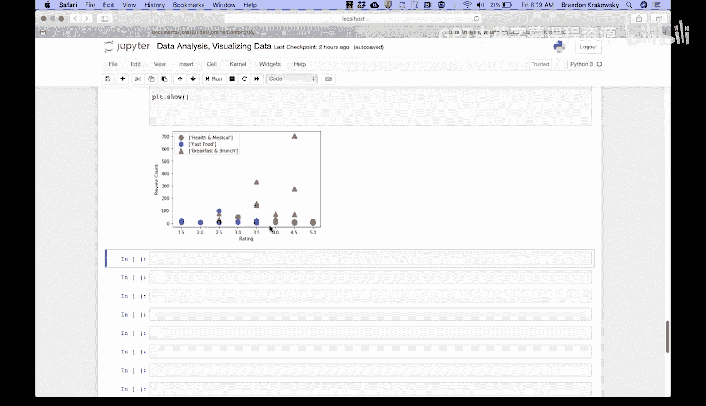

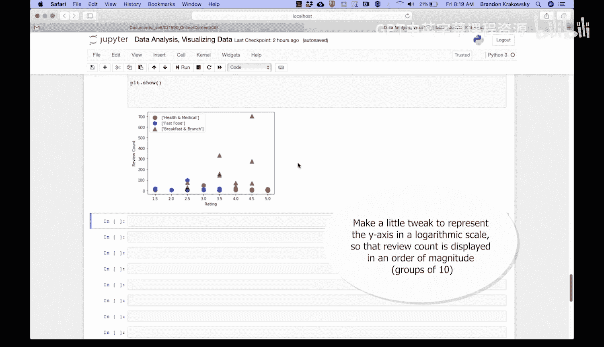

为了解决这个问题，我们可以对图表进行一个小调整：将Y轴设置为对数刻度。这样，评论数量将以10的幂次（数量级）来显示，所有数值将在一个更易于管理的范围内呈现，从而改善可视化效果。

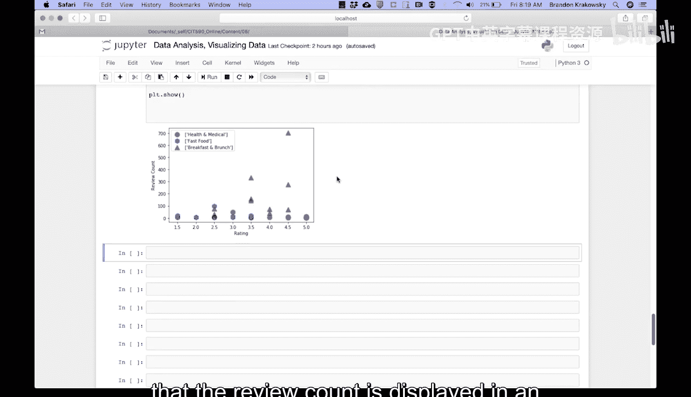


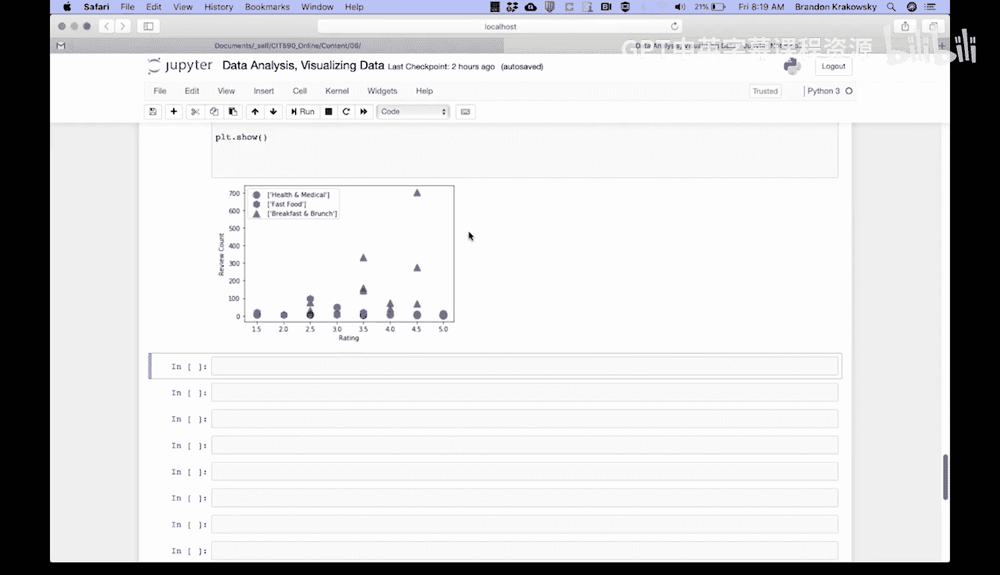


以下是实现步骤：

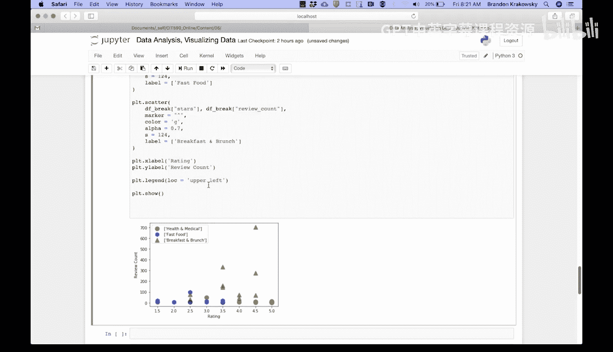

首先，我们需要从绘图对象中获取坐标轴属性。使用 `plt.gca()` 函数来获取当前坐标轴对象。

```python
axes = plt.gca()
```

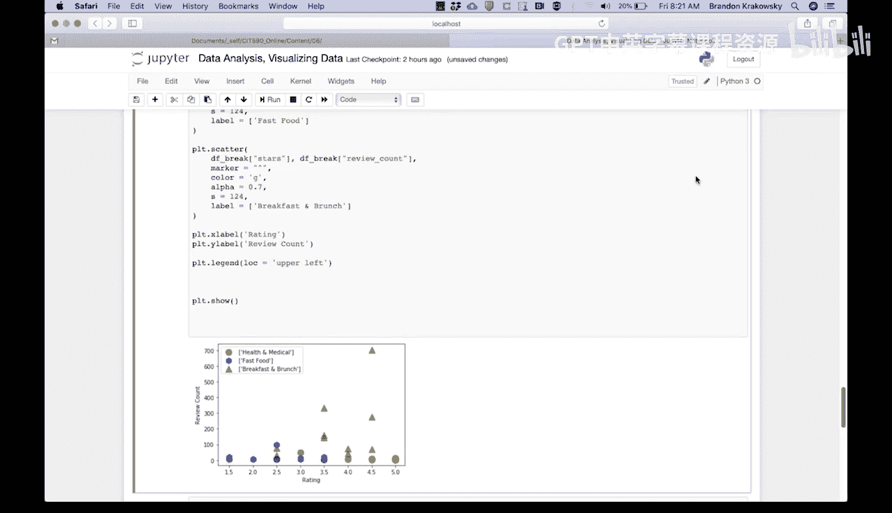

然后，我们将设置Y轴的刻度为对数刻度。使用坐标轴对象的 `set_yscale` 方法。

```python
axes.set_yscale('log')
```

现在，让我们重新运行代码，查看更新后的可视化效果。

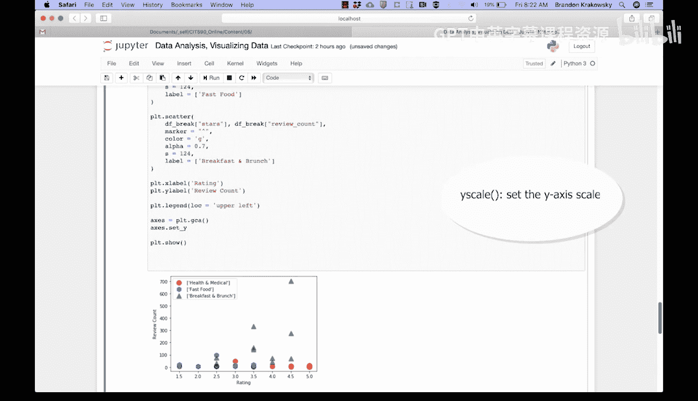

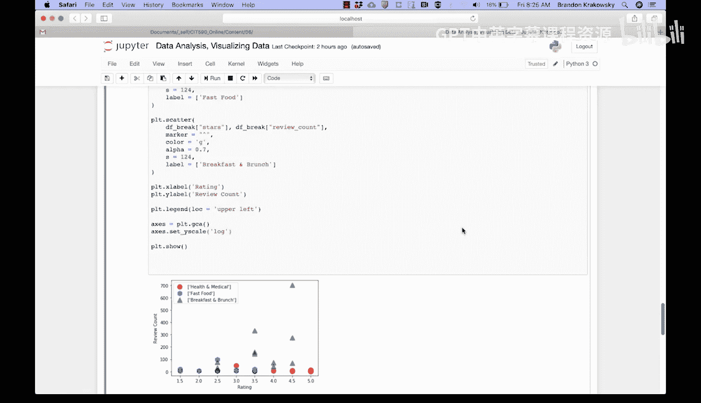
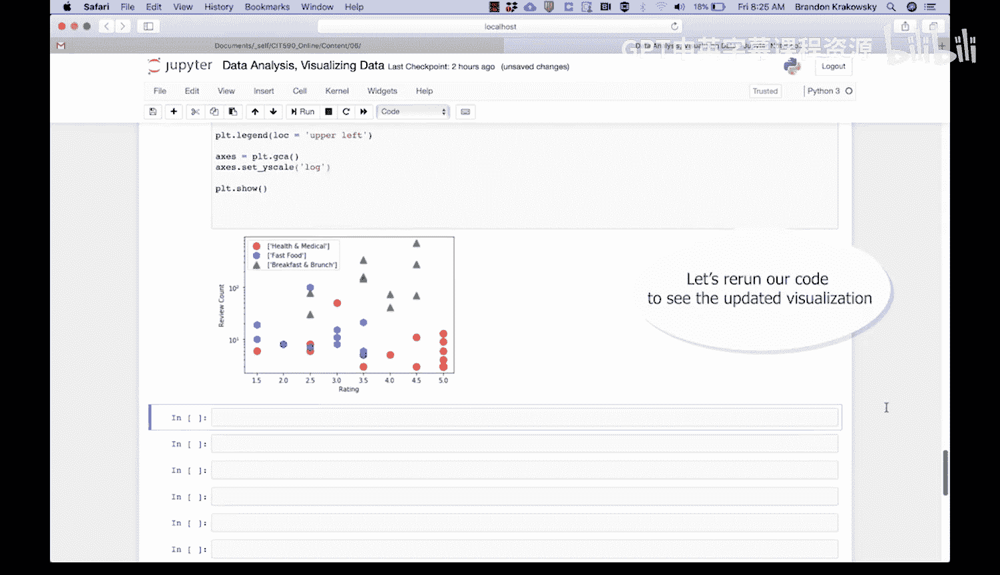


图表看起来好多了，也更易于分析。异常值不再影响其他数据点的显示，数据的分布模式变得更加清晰。


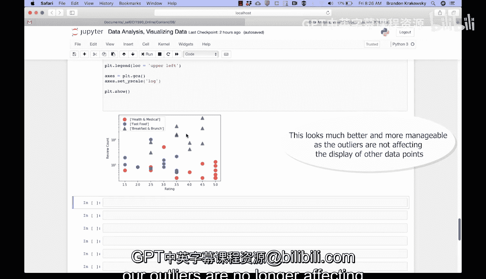

## 总结


本节课中我们一起学习了如何显示散点图，并掌握了通过设置对数刻度来优化图表显示的关键技巧。当数据范围差异巨大时，使用对数刻度可以有效避免异常值对整体可视化效果的干扰，使数据分布更直观。