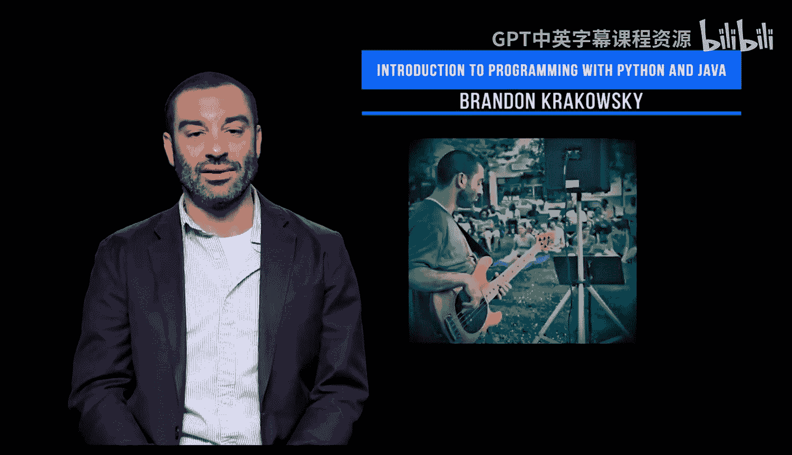

# 宾夕法尼亚大学《Python和Java编程入门1-2｜Introduction to Programming with Python and Java》中英字幕 p01 001_01_01_关于讲师-Brandon-Krakowsky.zh_en -BV13E421M7FF_p1-

Hi。My name is Brandon Krkowski， and I'm the instructor for this programming languagegus and Tech course。

For a bit of background， I started out as a musician and then worked in radio broadcasting and audio production。

My experience in programming began with Adobe Flash。

 a tool I used to develop a live web conferencing platform for big pharma。😡。

I received my master's in computer and information technology from the University of Pennsylvania and worked as a programmer at Penn's School of Design。

I then worked as an application developer for Wharton Computing。

 working with faculty and staff to build technology to advance several student programs。

Somewhere in the middle， I started my own company， Bak LLC。

 doing programming and freelance application development for a variety of companies。

I transitioned into data and analytics and became the research and education director at WhartonCustom Analytics。

 managing large scale research projects with students and academic researchers from around the world。

And most recently， I became a lecturer at Penn Engineering。A bit more about me， I play bass。

 I like my dog， and I'm a family man。

