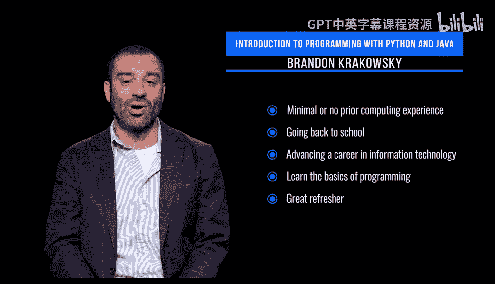

# 宾夕法尼亚大学《Python和Java编程入门1-2》课程：p02：本课程学习预期

在本节课中，我们将了解这门课程的目标受众、学习投入要求以及你将掌握的核心编程技能。这有助于你判断课程是否适合自己，并明确学习方向。

## 课程目标受众

这门课程面向**几乎没有或完全没有计算经验**的学生和专业人士，也适用于**没有接受过编程或计算机科学正式培训**的人群。

它同样适合**离开学术界一段时间后重返校园**的求学学生，以及**正在开始或推进信息技术领域职业生涯**的专业人士。

总的来说，这门课程是**希望学习编程基础知识且从未编程过的人**的绝佳入门课。

它也是**曾经编程过但已有一段时间未使用该技能的人**的优秀复习课程。

## 学习投入与课程结构

在课程工作量方面，这门课程**每周大约需要4到6小时**，持续约四周。

除了观看制作好的音视频内容，**每周都会有计分的编程作业**。

课程还包含**用于评估你对课程材料理解程度的定期测验**，以及**用于建立你作为程序员信心的实践编码练习**。

## 你将学到的核心内容

在本课程中，你将学习使用Python进行编程，包括以下方面：

以下是Python编程的核心组成部分：

*   **语言语法**：即构成有效Python代码的规则。
*   **代码风格**：编写清晰、易读代码的惯例。
*   **编程技巧**：解决问题和实现功能的方法。
*   **编码规范**：行业内广泛接受的代码编写标准。

你还将学习以下重要概念：

以下是成为优秀程序员的关键实践：

*   **最佳实践与良好的代码设计**：如何构建高效、可维护的程序。
*   **代码和程序文档**：如何为代码添加说明，使其易于理解和使用。
*   **计算思维**：像计算机科学家一样分析和解决问题的方法。

---

本节课中，我们一起了解了这门编程入门课程的适用人群、需要投入的时间以及涵盖的核心学习内容。明确这些预期将帮助你更好地规划学习，为接下来的编程之旅做好准备。