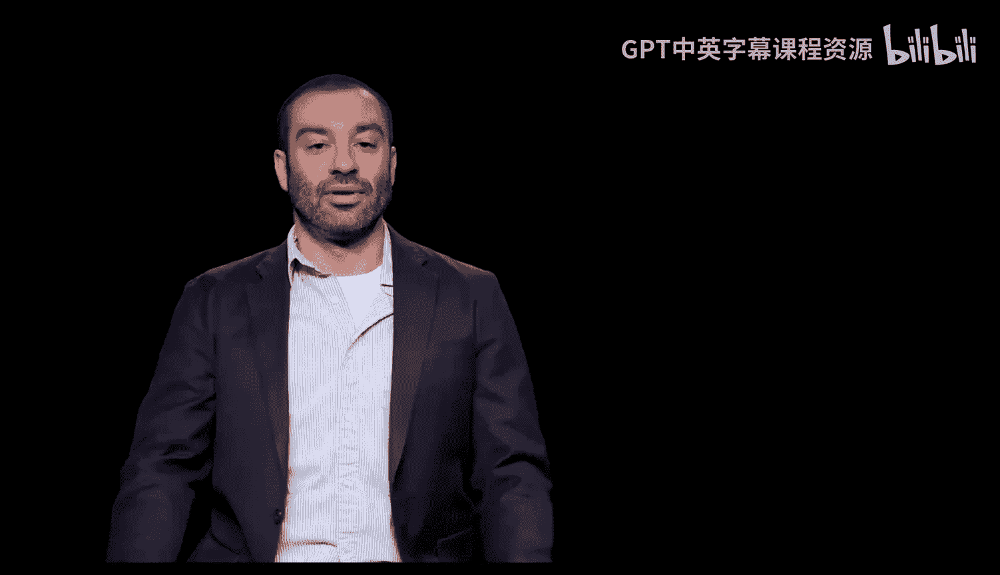
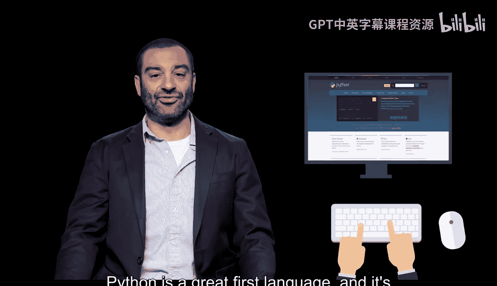
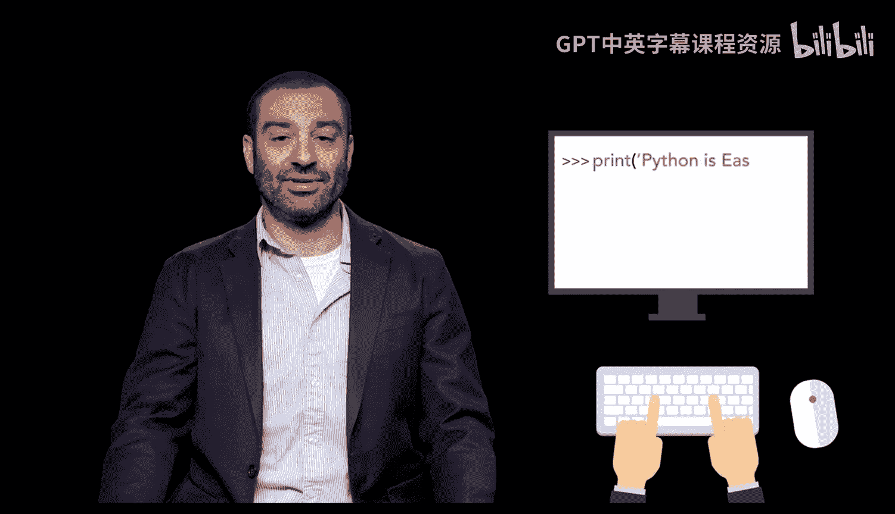
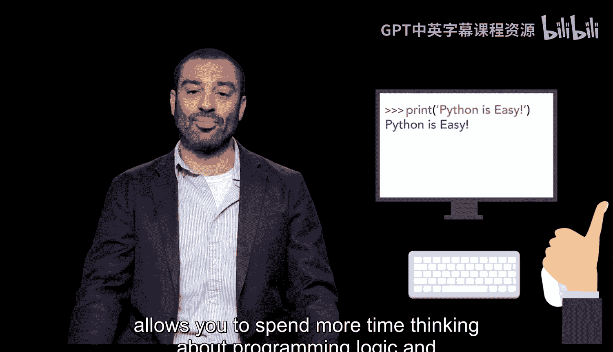
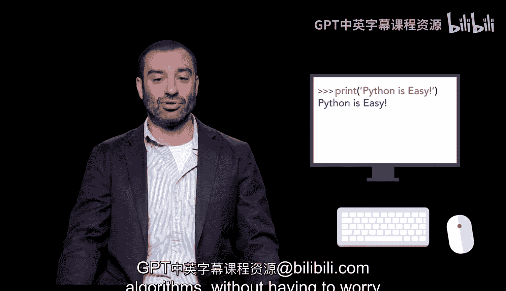

# 宾夕法尼亚大学《Python和Java编程入门1-2》课程：p03：为什么从Python开始 🐍

在本节课中，我们将要学习这门课程选择Python作为入门编程语言的原因。我们将探讨Python作为第一门编程语言的优势，以及它如何帮助我们更顺畅地开启编程学习之旅。

---



## 为什么从Python开始

Python是一门优秀的入门语言。它能让你非常快速地上手并开始运行程序。通常，你可以在几分钟内就开始编写代码。

与Java相比，Python的学习难度要低得多。这使你能够将更多时间用于思考编程逻辑和算法，而不必担心学习复杂的代码语法。

上一节我们介绍了课程的整体安排，本节中我们来看看选择Python作为起点的具体考量。

---

## Python作为第一语言的优势

以下是Python作为初学者第一门编程语言的几个关键优势：

*   **快速上手**：安装和配置环境简单，可以迅速进入编码实践。
*   **语法简洁**：代码结构清晰，更接近自然语言，降低了初学者的认知负担。
*   **专注于逻辑**：减少在复杂语法规则上的精力消耗，让学习者能更集中于问题解决和算法设计。

---

## 与Java的初步对比

虽然本课程后续也会学习Java，但以Python开始有一个重要目的：建立编程思维。Python简洁的语法就像一副“训练轮”，帮助你在掌握平衡（编程逻辑）时，不必同时费力地蹬车（记忆复杂语法）。



例如，一个简单的“Hello World”程序，在两种语言中的区别直观体现了语法的简繁：

**Python代码示例:**
```python
print("Hello, World!")
```



**Java代码示例:**
```java
public class HelloWorld {
    public static void main(String[] args) {
        System.out.println("Hello, World!");
    }
}
```



通过对比可以看出，Python允许初学者用更直观的代码表达意图。



---

本节课中我们一起学习了选择Python作为编程入门起点的原因。我们了解到Python因其易于安装、语法简洁而能帮助初学者快速建立信心，并专注于核心的编程逻辑与算法思维，为后续学习Java等更复杂的语言打下坚实基础。