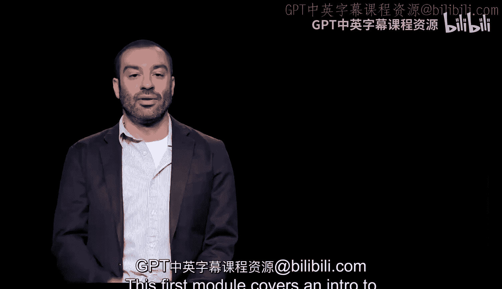
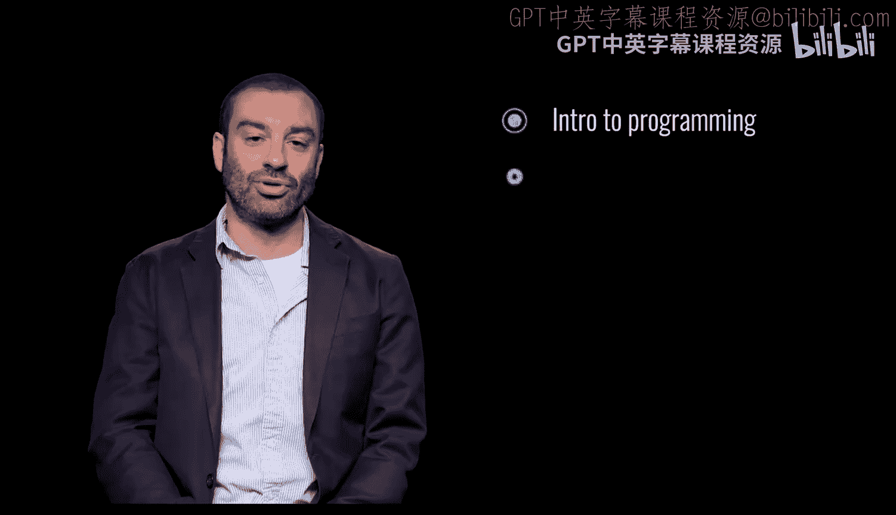
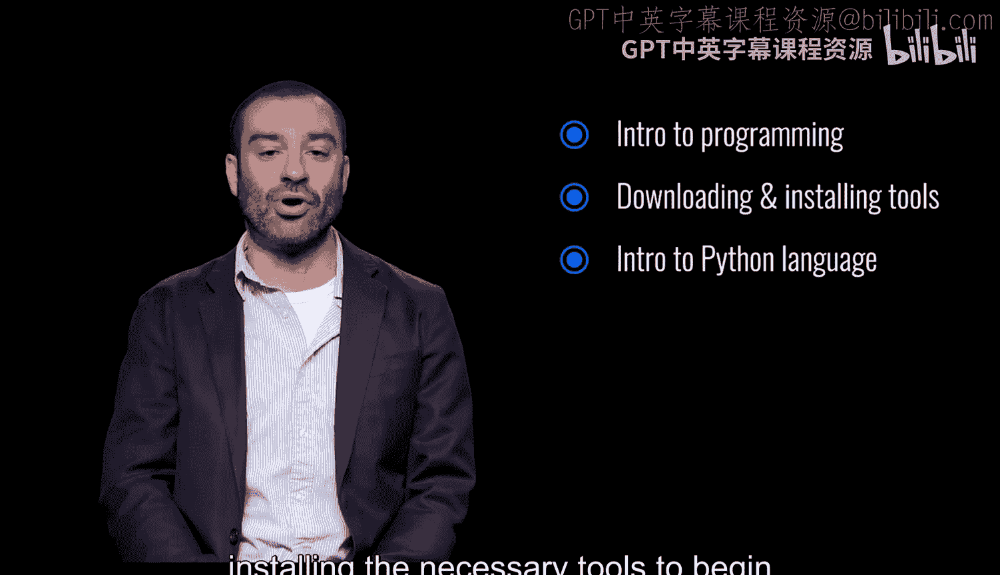
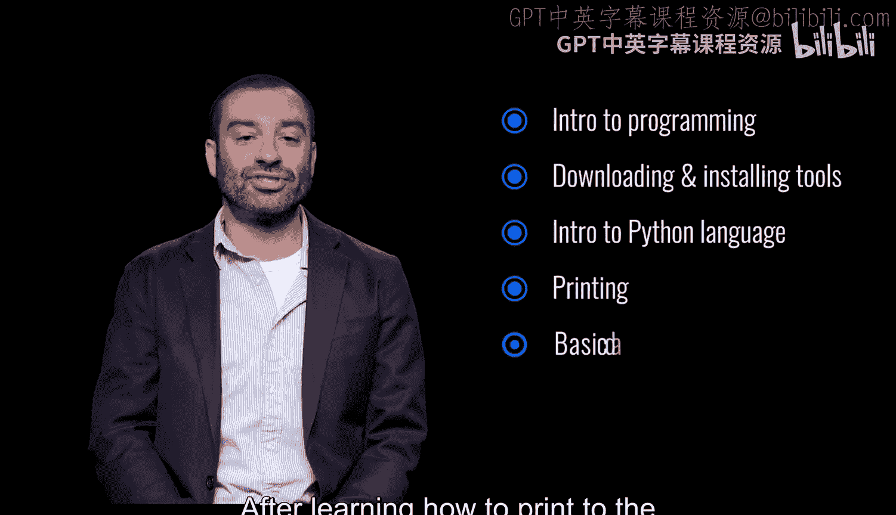
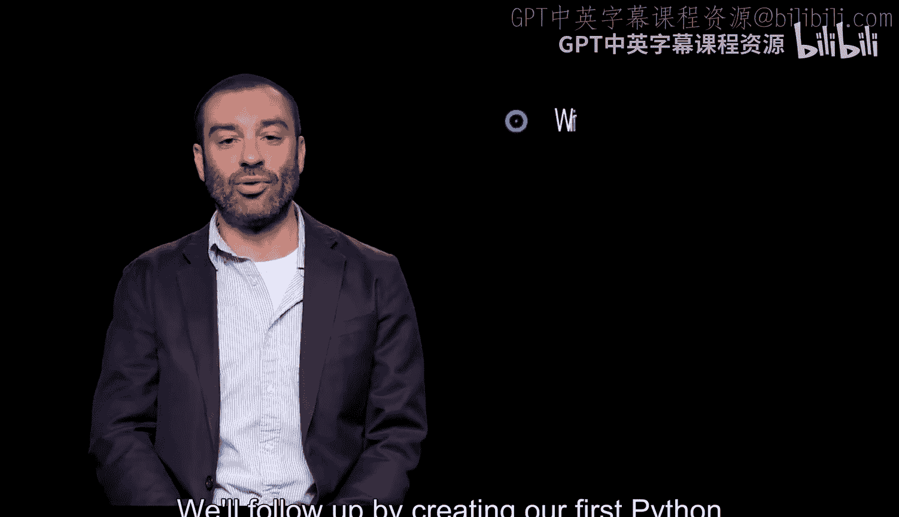
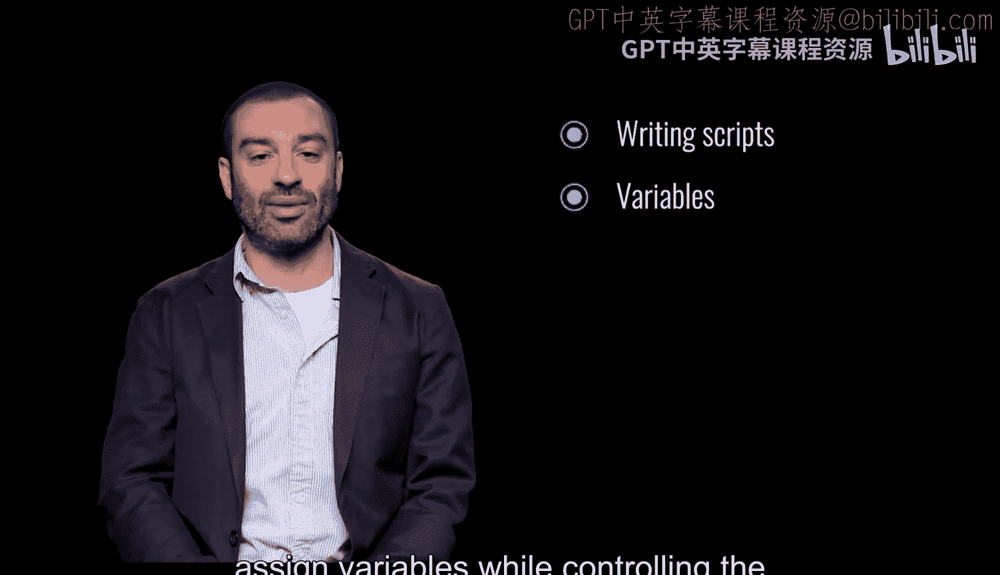
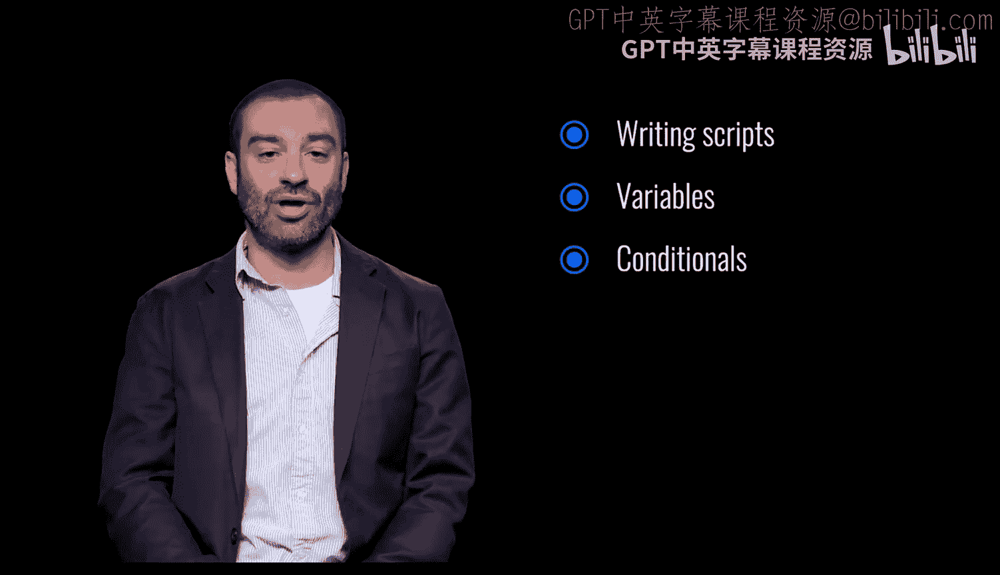
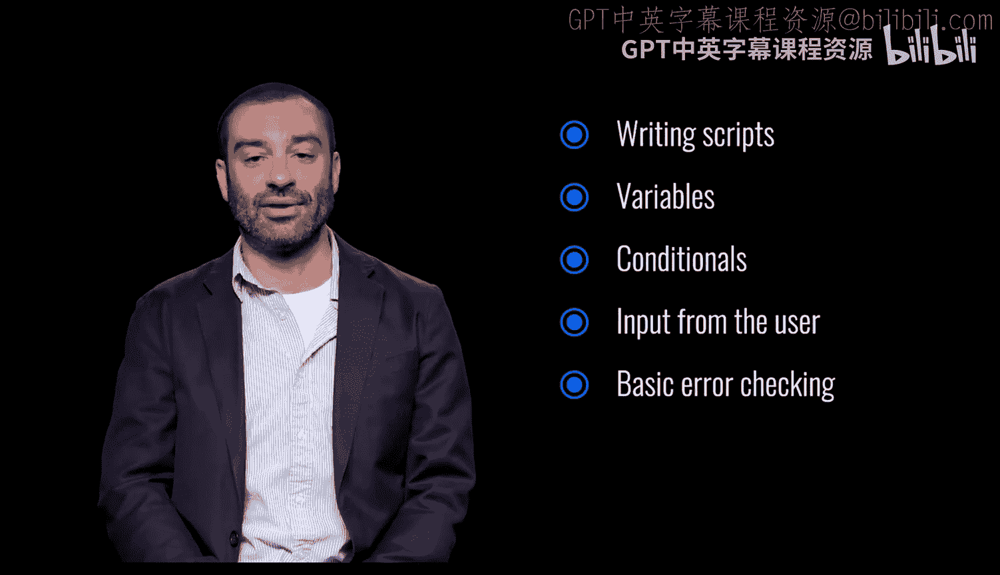

# 宾夕法尼亚大学《Python和Java编程入门1-2｜Introduction to Programming with Python and Java》中英字幕 p04 004_01_01_模块介绍_1.zh_en -BV13E421M7FF_p4-

This first module covers an intro to programming in the Python language。

 We'll start by downloading and installing the necessary tools to begin programming and writing code in Python。

After learning how to print to the console， we'll get an understanding of Python's basic data types and how to do simple math。

We'll follow up by creating our first Python script and learn how to define and assign variables while controlling the flow of our program using conditionals。

😡。

We'll also learn how to get input from the user， including some very basic error checking。

 so let's get started。😡。

