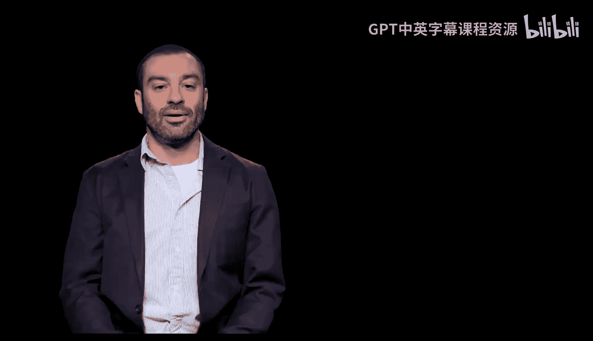
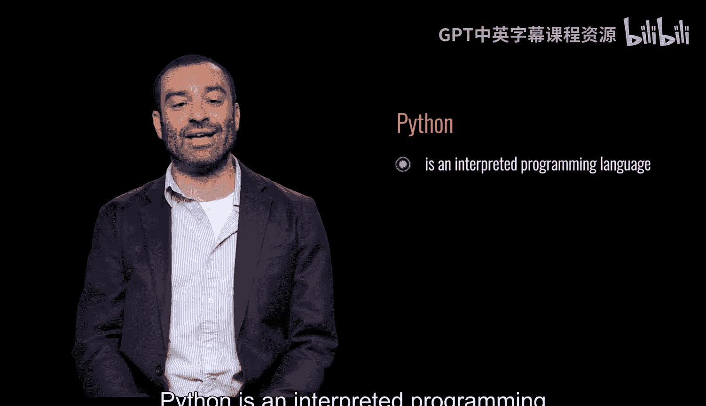
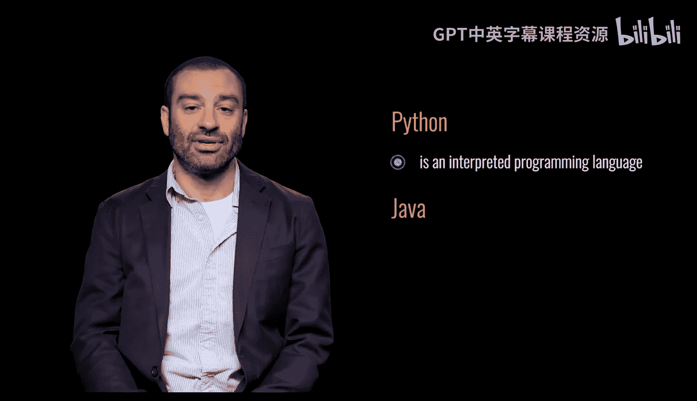
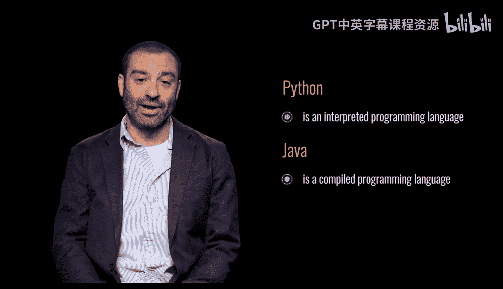
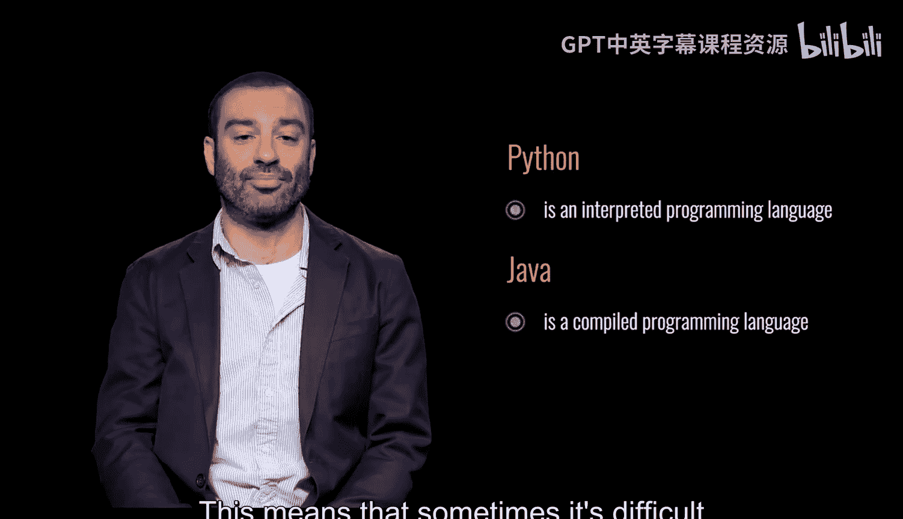
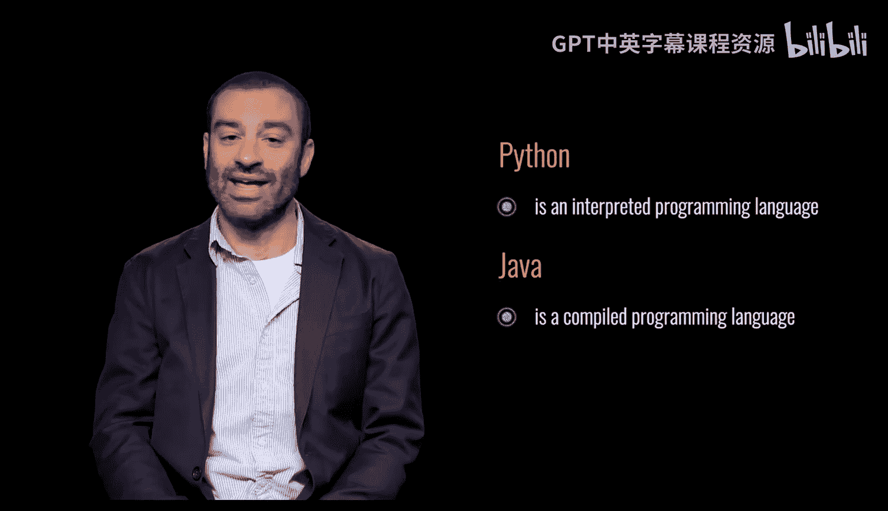

# 宾夕法尼亚大学《Python和Java编程入门1-2》：009：Python是解释型语言 🐍

在本节课中，我们将要学习Python作为一种解释型编程语言的核心特性，并将其与Java等编译型语言进行对比，同时探讨解释型语言在调试方面的特点。

## 解释型语言与编译型语言

上一节我们介绍了编程语言的基本概念，本节中我们来看看Python语言的执行方式。

Python是一种解释型编程语言。这意味着Python代码不需要被编译或从一种语言转换为另一种语言才能执行。Python解释器会直接读取源代码，并逐行解释和执行。

相比之下，Java是一种编译型编程语言。Java源代码需要先被编译成一种称为字节码的中间格式，然后由Java虚拟机（JVM）执行。

以下是两种语言执行流程的核心区别：

*   **Python（解释型）**：源代码 -> Python解释器 -> 直接执行。
*   **Java（编译型）**：源代码 -> 编译器 -> 字节码 -> JVM -> 执行。

## Python解释器与调试

由于Python代码由解释器逐行执行，这有时会使调试程序变得困难。错误可能直到解释器运行到有问题的代码行时才会被发现。

因此，在编写Python代码时，遵循一个良好的实践至关重要：**不要一次性编写大段代码而不进行任何测试**。😡

正确的做法是采用增量开发和测试的方法。以下是推荐的步骤：

1.  **编写少量代码**：每次只添加或修改一小部分功能。
2.  **立即运行测试**：运行程序，检查当前代码是否按预期工作。
3.  **重复过程**：如果代码工作正常，再继续添加下一小部分功能并测试。

这种方法可以帮助你快速定位和修复错误，因为问题很可能就出在你刚刚新增或修改的那几行代码中。

## 总结

本节课中我们一起学习了Python作为解释型语言的特点。我们了解了它无需编译、由解释器直接执行的特性，并将其执行流程与Java的编译过程进行了对比。同时，我们也认识到解释型语言在调试上的潜在挑战，并掌握了通过“编写少量代码并立即测试”的增量方法来有效应对这一挑战的核心实践。