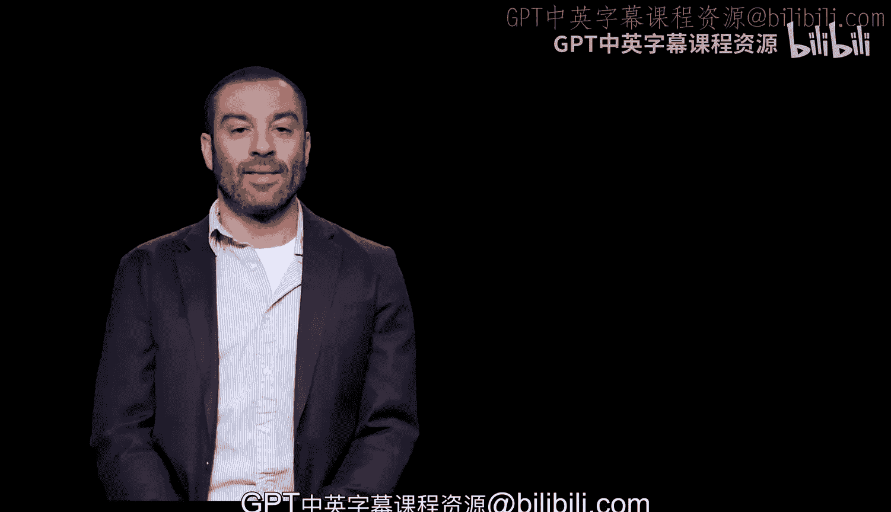
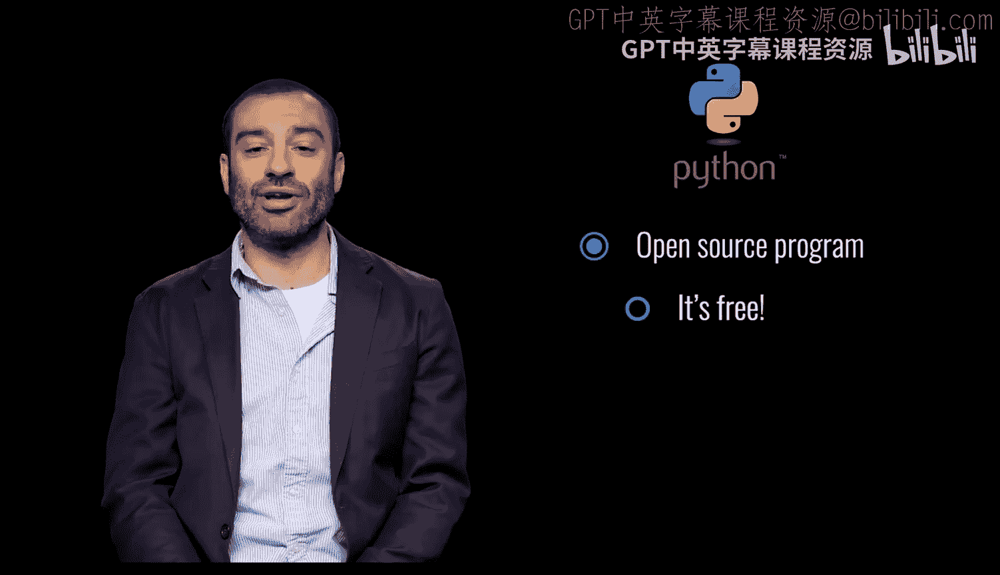
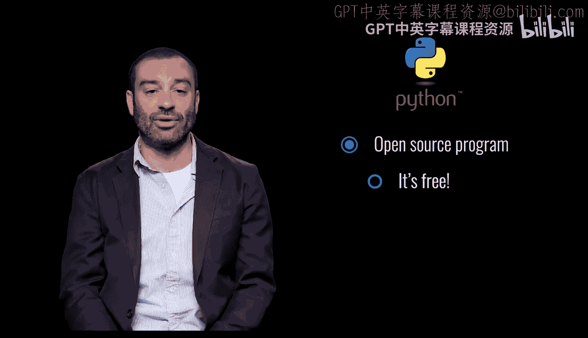
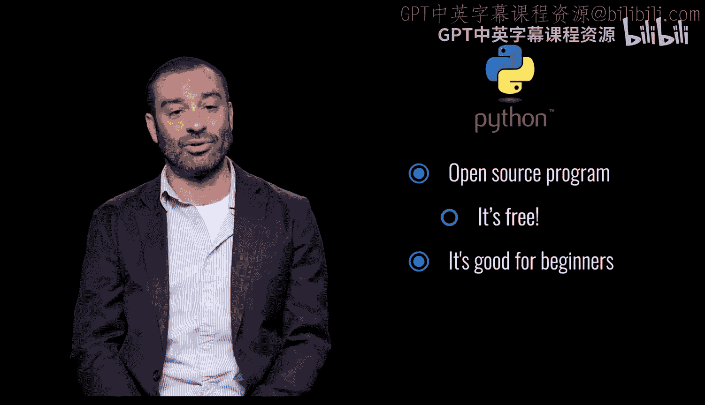
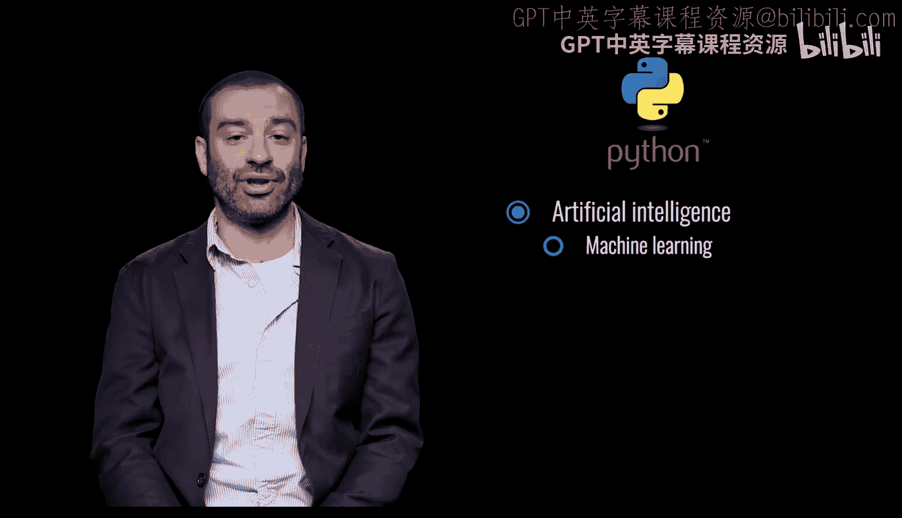
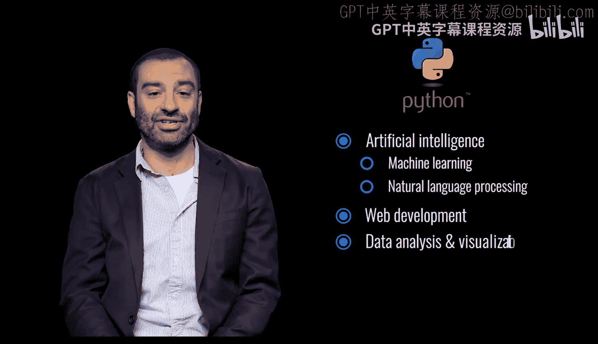
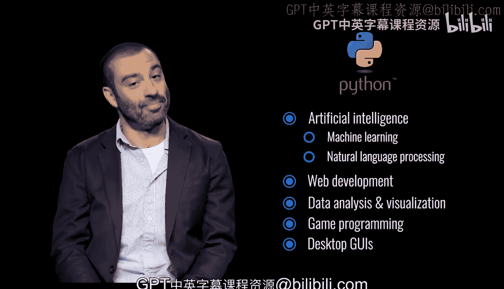

# 宾夕法尼亚大学《Python和Java编程入门1-2｜Introduction to Programming with Python and Java》中英字幕 p10 010_01_03_为什么选择Python.zh_en -BV13E421M7FF_p10-

Python is an open source programming language， which means it's free。

Python is powerful， flexible and intuitive。 There are many libraries and resources available online。

 and Python closely resembles the English language。

It's good for beginners and a great foundation for other programming languages。

Python can be used for artificial intelligence， machine learning， natural language processing。

 web development， data analysis and visualization， game programming， desktop Gos。

 and many other purposes。

