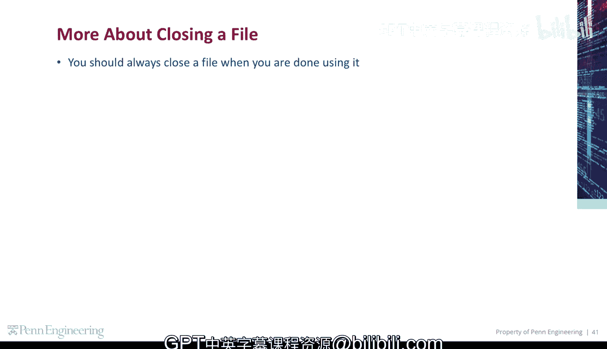
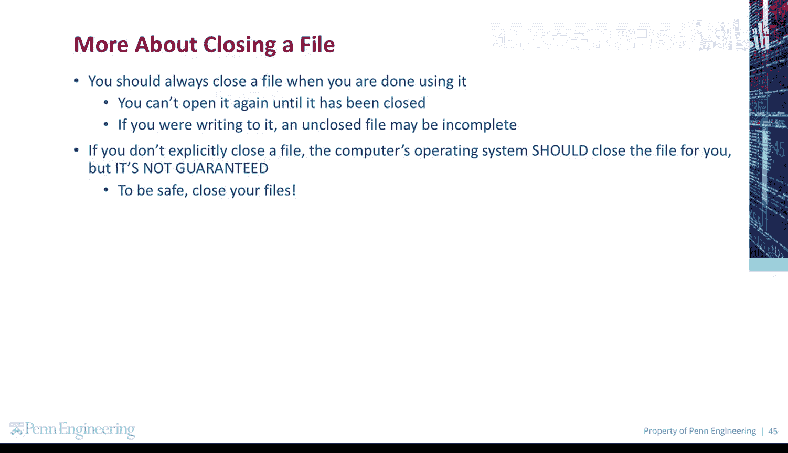
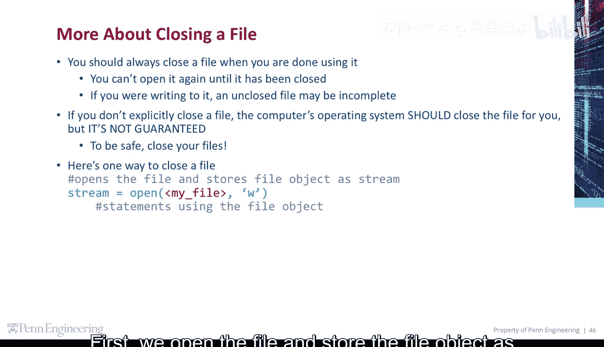
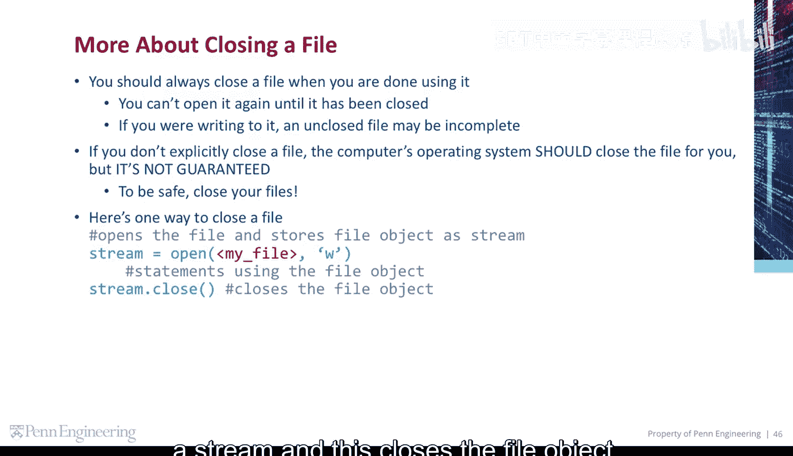
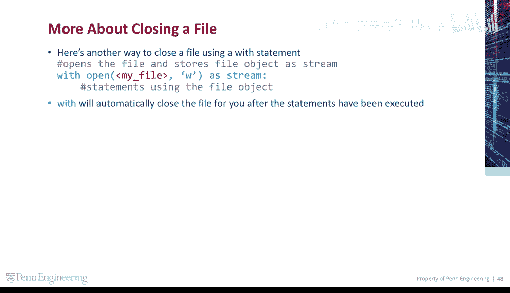
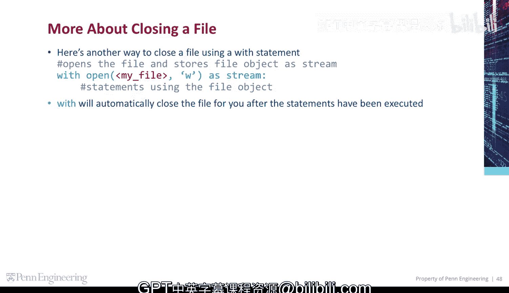

# 宾夕法尼亚大学《Python和Java编程入门1-2｜Introduction to Programming with Python and Java》中英字幕 p100 100_04_06_关闭文件.zh_en -BV13E421M7FF_p100-

You should always close a file when you're done using it。

 you can't open it again until it's been closed。If you are writing to it。

 an unclosed file may be incomplete。If you don't explicitly close a file。

 the computer's operating system should close the file for you， but it's not guaranteed。To be safe。

 close your files。

Here's one way to close a file。 first， we open the file and store the file object as a stream。😡。

And this closes the file object。

Here's another way to close a file using a with statement。

 This opens the file and stores the file object as a stream here。

 with will automatically close the file for you after the statements have been executed。😡。

