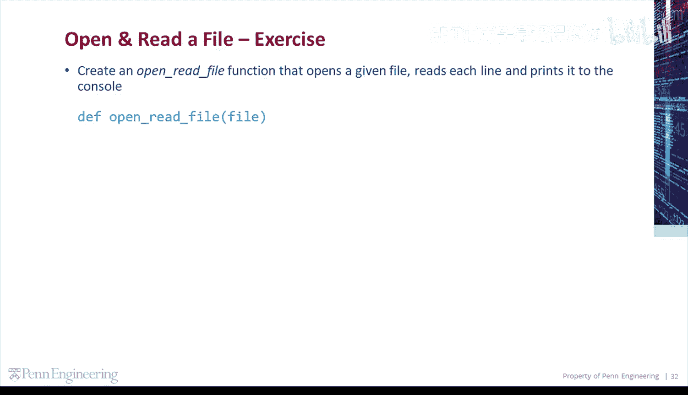
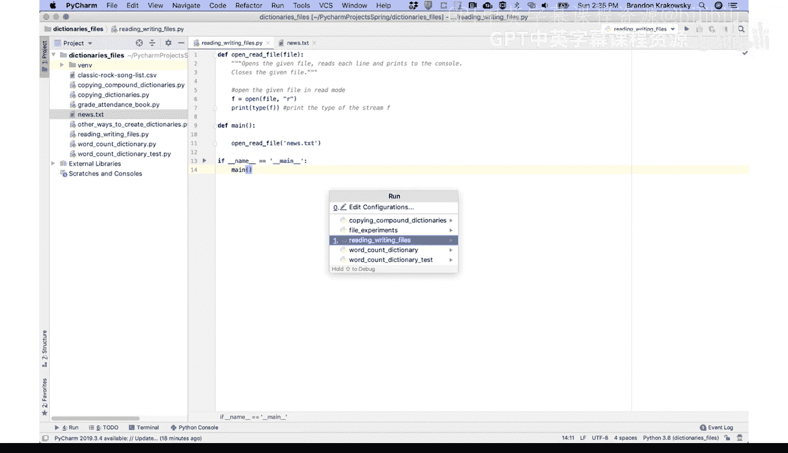
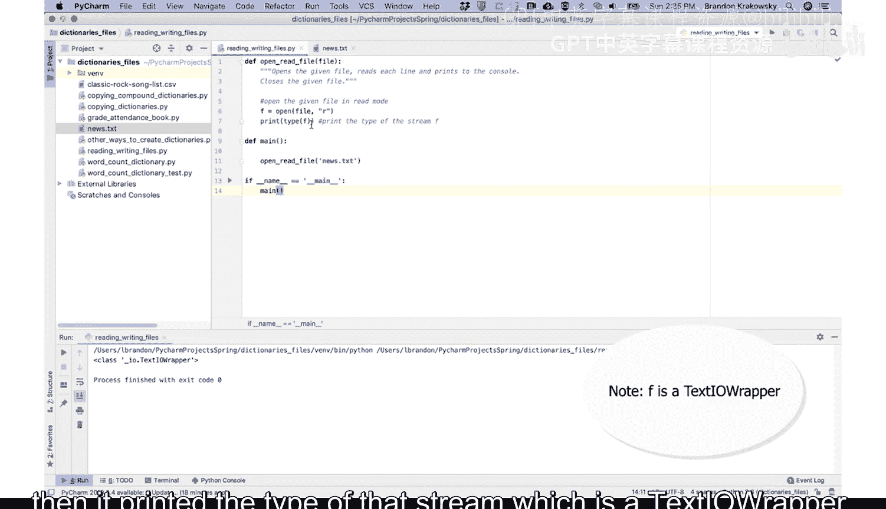
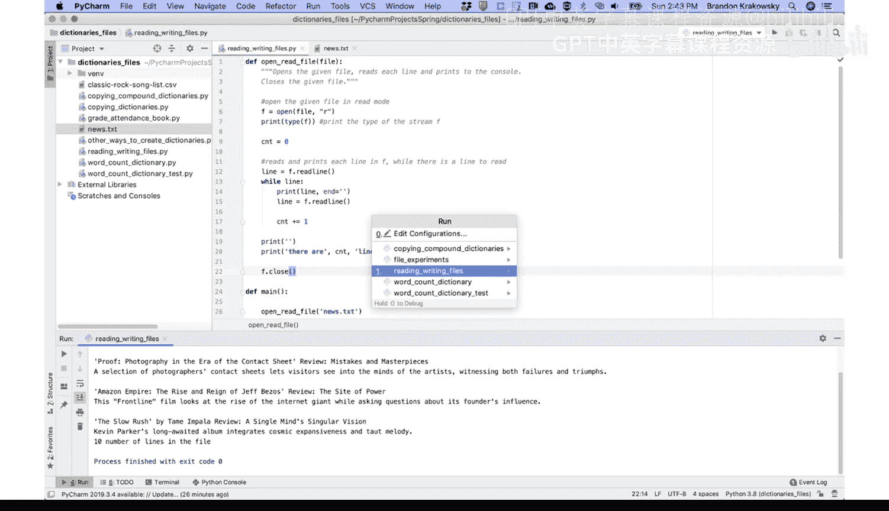
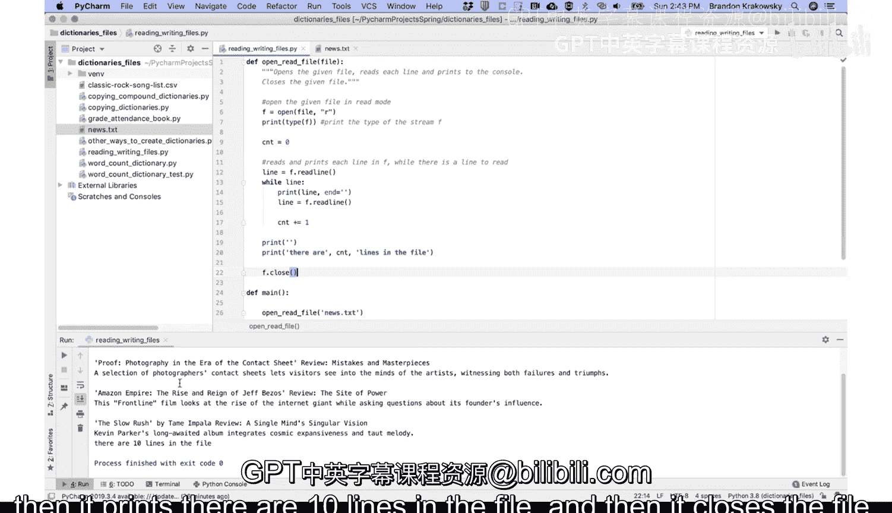
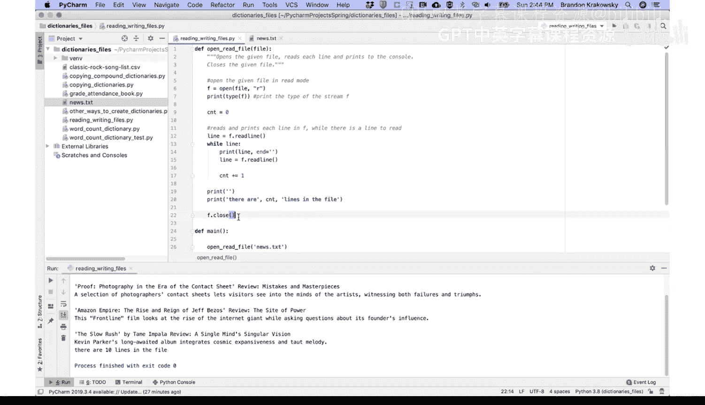

# 宾夕法尼亚大学《Python和Java编程入门1-2｜Introduction to Programming with Python and Java》中英字幕 p101 101_04_07_编程演示-打开并读取文件.zh_en -BV13E421M7FF_p101-

Let's do some exercises， working with files。Create an open Read file function that opens a given file。

 reads each line， and prints it to the console。😡。

So let's define the open Read file function。For a given file。Opens the given file。

 reads each line and prints to the console。Also closes the given file。

And we're going to use the open function。To open the file。Give it the name of the file。

 and then we're going to open it in read mode。This will return a stream。 We'll call that F。

 So opens the given file in Read mode。And just for fun， let's go ahead and print the type of F。

Print the type of the stream。F。Before we actually read and print each line in the file。

 let's just see if we can open the file。So I'm going to define a main function。

And then I'm going to call open Read file。And I'm going to provide the name of a file here in my same directory。

 my project directory。 I have a news do TxT file。 So take a look at that。

This is some news from the Wall Street Journal。 we're going to open and read this file。

So if I go back here， I can specify the name of that file， newss TXT。

I don't need to provide a full path to the file because it's in the same directory。And then， if name。

Equals。Main。Koming。😔，Run my program。

I see it open the file， and then it printed the type of that stream， which is a text I O wrapper。

Let's add the rest of the code in our function。I'm going to create a count， set it to 0。

 This is going to be used for counting the lines in the file。

And then I'm going to read and print each line of the file， F while there is a line to read。

 So F dot read line， this reads one line in the file。 So it's the first line。Store that in line。

Whiled line。Is not null。Print the line。Get the next line。And then increment the count。

Reads and prints each line in F。 While there is a line to read。Once we get outside of the loop。

Let's print the count of lines， print。There are。CN lines in the file。😔。

And then we're just going to close the file。Run our program。

Print out each line。In the file。 and then it prints， there are 10 lines in the file。

 and then it closes the file。

