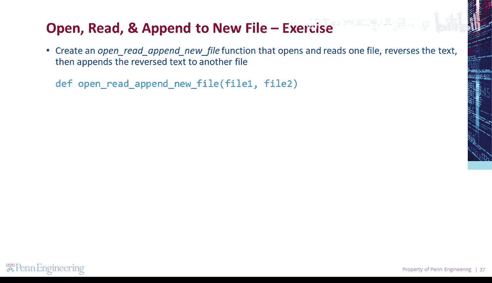
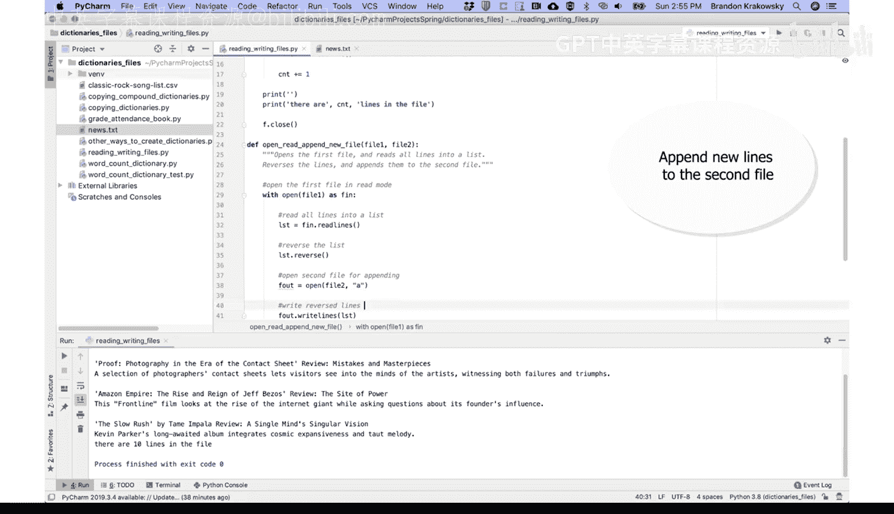
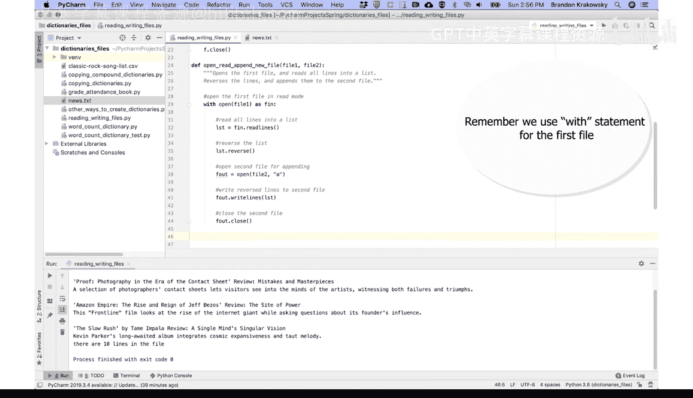
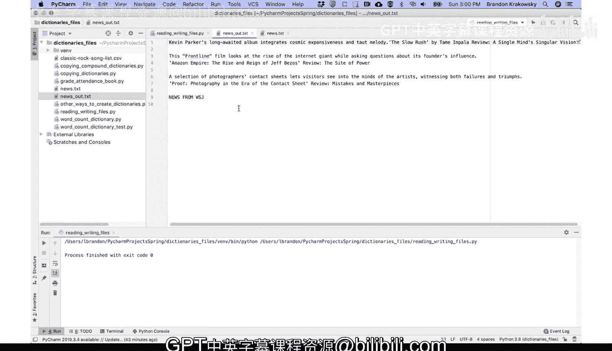

# 宾夕法尼亚大学《Python和Java编程入门1-2｜Introduction to Programming with Python and Java》中英字幕 p102 102_04_08_编程演示-打开读取并追加到新文件.zh_en -BV13E421M7FF_p102-

Create an open Read， append new file function that opens and reads one file， reverses the text。

 then appends the reverse text to another file。😡。

Let's go ahead and define open。😔，Read， append new file。

Which takes one file to read and another file to write to。Opens the first file。

And reads all lines into a list。Orverse is。😔，The lines， and appends them。To the second file。

Let's open the。First file in read mode。 we'll use the width command open file 1 that'll use read mode by default。

 We'll store that as F I N。And then we'll read all lines into a list。 So we'll call F I N dot。

 read lines。Store that in a list。Then we're going to reverse the list。So say LST dot reverse。

Then we're going to open the second file for app。Open。😔，Second file for app。

So we'll say open file to in append mode。😔，We'll store that in FO UT。

Then we're going to append the reverse lines to the second file。

 So we'll use right lines to write a list， LST。Right。😔，Reversed lines to second file。

Then we'll close the second file。 So F O U T close， and then we're outside of this width code block。

 We don't need to close the first file， because we're using width。

All our function from the main function。I'm going to comment this out。

 Then we're going to call open Read aends new file。

 The file that I'm going to open and read is newss。 Txt。

 and the file that I'm going to write to is news out TXT。 This doesn't exist yet。

 but opening that file in aend mode will automatically create the file if it doesn't exist。

And let's run our program， reading， writing files。I see here now there's a second file in my directory。

 If I open that， I can see that it's the news in reverse。

