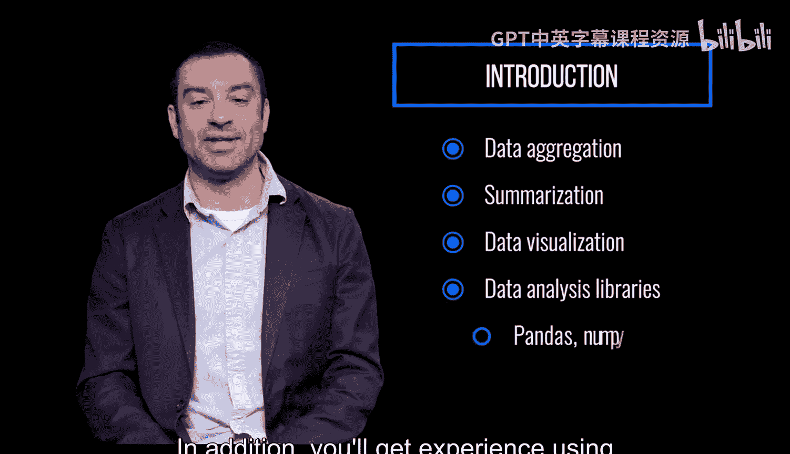

# 宾夕法尼亚大学《Python和Java编程入门1-2｜Introduction to Programming with Python and Java》中英字幕 p107 01_01_01_课程介绍.zh_en -BV13E421M7FF_p107-

This course provides an intro to basic data science techniques using Python。

 it introduces core concepts like the data frame， which is a two dimensionional labeled data structure and joining data。

 which is combining multiple data frames into a single structure。😡。

This module will provide an overview of how to load， inspect， and query real world data。

 and how to answer basic questions about that data。

You'll gain skills in data aggregation and summarization， as well as data visualization。 In addition。

 you'll get experience using data analysis libraries like Padas， Numpy and Mattplotlibb。

